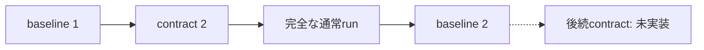

# 通常runに基づくbaseline更新

固定UC-CIのcontract generation 2による完全な通常runを、baseline generation 1から2への更新候補にする。既存の要求・初期閾値・予算は維持する。契約が固定したbaselineは更新後も同じ完全参照で照合し、current pointerの移動によって既存CIの比較条件を変えない。

## 入力と役割

| 操作 | OS主体 | 入力と意味 |
|---|---|---|
| baseline_propose | manager | proposal_id、series_id、run_id、expected_generation=1。完全な通常runから候補を生成 |
| baseline_validate | validator | proposal_id、validation_id。現在有効なsourceと提案内容を再照合 |
| baseline_adopt | manager | proposal_id、validation_id、expected_generation=1。提案者・世代・有効性を再照合して採択 |
| baseline_current | manager / validator / operator | series_idの最新世代と現在有効性を取得 |
| baseline_use | manager / validator / operator | 最新世代とexpected_baseline_ref、expected_contract_refが完全一致するときに現在利用を確認 |
| baseline_resolve | manager / validator / operator | 指定した保存世代を完全参照で解決し、その根拠の現在有効性を確認 |
| baseline_revoke_ref | operator | 完全なbaseline参照と対応契約参照で、撤回する保存世代を指定 |

全操作にschema_version=1、action、request_idが必要である。基準更新へ任意のrecordや役割の自己申告を渡せない。expected_generationのbool、未知field、不正な参照は拒否する。baseline_current、baseline_use、baseline_resolveは同じrequest_idでも現在状態を再検査する。既存baseline_revokeは最新世代の撤回として維持する。

## 採択の根拠と原子性

sourceはpurpose=regressionの保存された正常terminalに限り、contract generation 2、全30入力の充足、現在利用できるDecision/Evidence、停止・精算、固定実装とbindingを確認する。取消しや違反・不足を新しい正常基準へ昇格させない。validationと採択は同じ元runを再検査し、古いvalidationだけで有効性を得ない。

比較contextはsourceが実際に使ったbaseline generation 1とcontract generation 2を参照する。元runの作成が前baseline採択より前なら拒否する。baselineのvalid_untilは元Evidenceから生成し、採択によってEvidenceの寿命を延長しない。

提案・検証・採択の全てで、更新前のcurrent本文・digest・世代・採択履歴を照合する。currentが破損している場合に正常な更新で上書きして隠さず、STORAGE_CORRUPTで拒否する。

generation 2の履歴追加、currentのgeneration 1から2への条件付き更新、冪等応答を同じtransactionで保存する。競合・保存失敗では全てrollbackし、期待世代が古い別候補を採択しない。元Decision、Evidence、Finding、Plan、receiptは変更しない。

## 固定参照と依存失効

矢印は根拠から利用先を表す。新しいbaselineを採択しても、既存契約の矢印を付け替えない。



既存contract generation 2はbaseline generation 1を固定している。この契約の通常runを開始・利用するときだけ、保存世代をbaseline_resolveで確認する。最新pointerを過去条件にすり替えない。新しい基準が採択されても、既存runのmanifest、比較対象、現在のCI問い合わせ条件は変わらない。

baseline generation 2を単独で撤回しても、基準1だけに依存する既存runのCIは利用できる。基準1または元Evidenceが撤回・失効したときは、それに依存する通常runと基準2の現在利用も拒否する。過去の健康な判定は履歴として保持する。破損・欠落・不明な撤回世代を現在の合格に読み替えない。

## 移行と限定

既知の取消し復帰版からは明示migrationで移行する。旧版に存在しない更新形式を持つ保存DBは拒否し、許可する既知履歴を検査してからextension digestを変更する。自動migrationは行わない。

今回実装した更新はbaseline 1→2、固定contract 2、条件差なしに限る。contract 3以降・基準2を固定した新契約・対象や条件を変える更新は[完了監査](mvp-completion-audit.md)の残件である。

## 検証入口

```sh
python -m unittest discover -s tests -p test_baseline_refresh.py -v
python -m tools.prepare_authority_runtime
python -m tools.verify_baseline_runtime --baseline-refresh --output .ga/baseline-refresh-check
```

出力先は未存在のrepo内directoryを指定する。後二つはローカルDockerが必要であり、固定・無害なfixtureだけを使う。--baseline-refreshは--recovery以下の経路を含む。追加のモデル送信はなく、通常runを更新候補に使う。検証末尾は元baselineへの照会をbaseline_resolve、撤回をbaseline_revoke_refへ切り替え、固定参照の意味を保つ。

[親レビュー](reviews/mvp-baseline-refresh-20260912.md)と[工程証跡](evidence/mvp-baseline-refresh-20260912/README.md)に実行結果を記録する。
