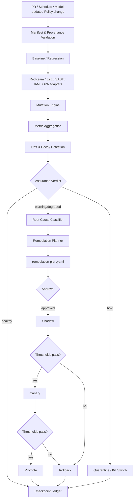

# Guardrail Assurance Harness — 要求整理（草案）

> 現在は要求レベルの草案です。本文には要求、構成案、技術候補、初期閾値案、将来構想が混在しています。Mustや必須と書かれた項目も、今回の文書整理で採択・仕様化・実装したものではありません。MVPと後期フェーズの切り分けは[未決定事項](open-questions.md)で管理します。
>
> 原稿の主張と例は維持しています。外部資料・外部参照元実装についての主張は今回検証していません。元のチャット引用は参照先を復元できていないため、[出典台帳](research/citation-register.md)に未検証として記録しました。[整理前原稿と来歴](research/README.md)も参照してください。

## 読み方

- 概要と現在地: [README](../README.md) / [Blueprint](../BLUEPRINT.md)
- 詳細: 以下の要求原稿本文
- 決めること: [未決定事項](open-questions.md)
- 次工程: [開発順序案](../orchestration/development-plan.md)

<!-- ORIGINAL-BODY-START -->

## エグゼクティブサマリ

結論として、`private-reference` を基盤に Guardrail Assurance Harness（以下 GAH）を作る設計は妥当であり、単なる LLM Red Team ツールではなく「ガードレールを継続的に保証・更新する Control Plane」として切り出すべきである。

GAH が解く問題は「AI が安全か」そのものではない。より限定的かつ実装可能な問題として、

> **昨日まで安全性の根拠になっていた Guardrail / Control / Evaluator / IAM / Policy / Test が、今日も同じ安全性を提供していると継続的に証明できるか**

を扱う。

既存技術には部分的な前例がある。Promptfoo は guardrail の攻撃阻止率・false positive・indeterminate・latency/cost を評価し、定期的な red-team CI による model/security drift の検出と Adaptive Guardrails による脆弱性から防御へのフィードバックループを提供している。[出典未復元: SRC-001 / SRC-002 / SRC-003](research/citation-register.md) OpenAI Guardrails には labeled dataset に対して precision・recall・F1・ROC・latency 等を測る Evaluation Tool がある。[出典未復元: SRC-004](research/citation-register.md) AWS Control Tower には desired governance state と実状態の drift を自動検知し、Reset/Re-register/`ResetEnabledControl` 等で復旧する運用モデルが存在する。[出典未復元: SRC-005 / SRC-006 / SRC-007](research/citation-register.md) NIST OSCAL は Control、実装、assessment result、evidence を JSON/YAML/XML の machine-readable な形式で表現する方向性を持つ。[出典未復元: SRC-008](research/citation-register.md) また研究側では、2025 IEEE PRDC の AutoPT が autonomous purple teaming という方向を提示している。[出典未復元: SRC-009](research/citation-register.md)

しかし、調査した主要な一次資料の範囲では、

Control Registry → Mutation → Regression/Red Team → Drift Detection → Root Cause → Remediation Plan → Shadow → Canary → Promote/Rollback → Evidence/Certification 更新

を一つの lifecycle control plane としてまとめたものは見当たらない。したがって GAH の差別化ポイントは、「攻撃生成器」でも「runtime guardrail」でもなく、Guardrail Reliability / Continuous Assurance の orchestration layer に置くべきである。

日本国内でもこの方向性は整合する。AISI は2026年7月公開の「AIセーフティに関する評価観点ガイド 第1.20版」で、AI エージェントが自律的に行動して外部システム・物理環境へ影響を及ぼす点を踏まえ、新たに「観測と制御」を評価観点として追加している。[出典未復元: SRC-010](research/citation-register.md) IPA の2026年の生成AI・AIエージェント向けセキュリティ資料も、企画・調達・技術検証/設計・運用・廃棄というライフサイクル、対策の効果、残存リスクを扱う構造である。[出典未復元: SRC-011](research/citation-register.md)

GAH の設計原則は次の式に集約できる。

> **認知負債をゼロにしようとしない。認知負債を machine-verifiable な検証負債へ変換する。**

人間は数千件の agent action や PR を直接確認しない。代わりに、

```text
Control
  × Threat
  × Mutation
  × Environment
  × Evidence
```

のうち、どこまで現在も検証済みか、何が腐ったか、腐った場合にどこまで被害が及ぶかを見る。

GAH の MVP は以下の四機能に限定する。

| MVP | 役割 | 成果物 |
| --- | --- | --- |
| Control Registry | 守るべき invariant を machine-readable 化 | `controls/*.yaml` |
| Mutation CI | Guardrail を意図的に壊して検査系の有効性を検証 | `mutation-results.jsonl` |
| Decay Detection | baseline との差から腐敗を判定 | `assurance-status.json` |
| Remediation Planner | 原因・修正・検証・展開・rollback 手順を生成 | `remediation-plan.yaml` |

MVPでは自動修復までやらない。 AI が生成するのは remediation plan までとし、判定・権限・昇格条件は deterministic control plane が握る。Production 変更の自動実行は後期フェーズまで禁止する。

`private-reference` はすでに、その核になる設計をかなり持っている。現在の実装は single-source manifest、単調増加 checkpoint、baseline/research 二車線、fault 時の deterministic HOLD、immutable accepted artifact、外部変更の明示承認、active-slot projection による保護対象の事前確認を実装している。[出典未復元: SRC-012](research/citation-register.md) [出典未復元: SRC-013](research/citation-register.md) `checkpoint_manifest()` も counter/stage の巻き戻しを禁止し、atomic replace と `events.jsonl` 追記を行う。`project_active_slots()` は保護対象を押し出す変更を事前投影して HOLD する。[出典未復元: SRC-014](research/citation-register.md)

したがって推奨構造は、外部参照元 を捨てて GAH を新規開発するのではなく、

```text
                     assurance-core
                           │
          ┌────────────────┴────────────────┐
          │                                 │
 private-reference              guardrail-assurance-harness
          │                                 │
       Kaggle                    AI Agent / LLM / IAM / Policy
```

とし、外部参照元 を第一の vertical implementation、GAH を第二の vertical implementation として共通 Control Plane を抽出することである。

## 目的・範囲・主要ユースケース

### 目的

GAH の第一目的は、Guardrail の存在確認ではなくGuardrail の継続的有効性保証である。

ここでいう Guardrail は LLM content filter だけを意味しない。以下を同じ `Control` abstraction に載せる。

```text
Deterministic:
  IAM
  filesystem sandbox
  network allowlist
  OPA/Rego
  type/schema validation
  API contract
  SAST
  quota
  approval gate

Probabilistic:
  prompt injection detector
  moderation model
  LLM judge
  anomaly detector
  agent policy classifier

Procedural:
  human approval
  two-person rule
  incident escalation
  release checklist
```

AISI が現在の AI Agent を「自律的に行動し、外部システムや物理環境に影響し得る」として「観測と制御」を追加したことからも、出力テキストだけでなく agent action と external side effect まで assurance scope に入れるのが妥当である。[出典未復元: SRC-010](research/citation-register.md)

### 対象範囲

GAH が責任を持つのは次の範囲である。

| In scope | Out of scope |
| --- | --- |
| Control 定義・依存関係 | 新しい基盤モデルそのものの開発 |
| Guardrail test orchestration | Promptfoo 等の red-team engine 再実装 |
| Mutation testing | SAST/E2E/OPA/IAM 製品そのものの再実装 |
| Drift/decay detection | 「絶対安全」の数学的保証 |
| Evidence の収集・署名・保存 | 全 agent reasoning の人間による理解 |
| Root-cause classification | 自動的な Production 全権変更 |
| Remediation plan 生成 | 法令遵守そのものの法的保証 |
| Shadow/Canary/Promote/Rollback 制御 | 組織のリスク受容判断の代行 |
| Permission / blast-radius enforcement | 人間責任者の最終承認代行 |

つまり GAH は execution engine の上に載る assurance control plane である。

### 主要ユースケース

| ユースケース | 現在の問題 | GAH が提供するもの |
| --- | --- | --- |
| 週末自動運転 | 金曜夜から月曜まで agent が大量作業し、人間が全 action を読めない | bounded capability、continuous CI、異常だけ月曜に集約 |
| agent 群 | Planner/Coder/Reviewer/Judge が相関した誤りを起こし得る | deterministic control + independent evaluator + mutation |
| PR 大量生成 | 数十〜数百 PR を人間が全読解できない | invariant gate、risk classification、safe PR candidate の圧縮 |
| model 更新 | provider 側更新で挙動が変化する | baseline replay + generated red-team + drift detection |
| Prompt/Policy 更新 | 「改善」のつもりが防御性能を下げる | differential assurance CI |
| tool schema 変更 | 引数/権限の変化で既存 control が迂回される | contract drift detection + mutation |
| IAM/OPA 変更 | deny/allow の形骸化 | policy diff + negative tests + signed evidence |
| evaluator 更新 | Judge 自身が甘くなる | evaluator calibration + independent oracle |
| guardrail 更新 | false positive を減らした結果 ASR 増大 | ASR/FPR/mutation score の多目的 gate |
| incident 後 | その場修正だけ行われ再発する | finding → regression mutation → remediation → evidence 更新 |

Promptfoo 自身も fixed cases を regression、generated adversarial cases を discovery に使う構成を推奨しており、定期 CI による drift 検知も文書化している。[出典未復元: SRC-001 / SRC-002](research/citation-register.md) GAH はこの考え方を content guardrail から IAM・OPA・sandbox・agent action まで拡張する。

この用途で特に重要なのはindeterminate を安全成功扱いしないことである。Promptfoo の公式ドキュメントにも、guardrail signal が欠落している場合に単純な assertion pass が「実際に guardrail が実行された」証明にはならない注意点が明記されている。[出典未復元: SRC-015](research/citation-register.md)

したがって GAH では、

```text
PASS
FAIL
INDETERMINATE
NOT_RUN
STALE
ERROR
```

を明示的に分ける。特に Critical Control の `INDETERMINATE / NOT_RUN / STALE` は、原則として PASS に変換してはならない。

## アーキテクチャと主要コンポーネント

GAH は**「AI の判断を AI で監督し続ける階層」ではなく、「境界条件と証拠を deterministic に管理し、意味判断だけ AI に委ねる構造」**とする。

主要フローは次の通り。



### Manifest

Manifest は一 campaign/run の desired assurance state を表す単一正本とする。

外部参照元 はすでに `campaign.json` を単一正本とし、`validate_manifest()` で cross-field invariant を検査する設計になっている。[出典未復元: SRC-013](research/citation-register.md) [出典未復元: SRC-016](research/citation-register.md) GAH でも同じ思想を維持する。

ただし重要な変更として、

```text
spec   = 人間が要求する desired state
status = system が観測した observed state
```

を分離する。

`status` を PR で人間が直接書き換えて安全になったことにできないようにする。

### Control Registry

すべての Guardrail を `Control` として登録する。

各 Control は最低限、

```text
ID
目的
守るInvariant
risk/severity
enforcement方式
対象capability
owner
依存Control
test/evidence source
mutation families
acceptance threshold
evidence freshness
rollback target
```

を持つ。

NIST OSCAL が machine-readable な control、assessment、結果の構造を提供しているため、将来的な OSCAL export/import を考慮して独自 schema を作る。[出典未復元: SRC-008](research/citation-register.md)

### Mutation Engine

Mutation Engine は Guardrail 自体を安全な sandbox 内で意図的に弱体化する。

コード mutation testing では、意図的に入れた mutant に対し test が失敗すれば `Killed`、そのまま通れば `Survived` とする考え方が確立している。Stryker は `No coverage` も区別する。[出典未復元: SRC-017 / SRC-018](research/citation-register.md) GAH はこの概念を policy/control に適用する。

初期 Mutation Family は以下程度でよい。

| Family | Mutation例 | 検出すべき Control |
| --- | --- | --- |
| `DENY_REMOVED` | deny rule を一件削除 | OPA/IAM/E2E |
| `THRESHOLD_WEAKENED` | block threshold を緩める | Guardrail eval |
| `ALLOWLIST_EXPANDED` | domain/tool/file scope を拡大 | Network/Tool policy |
| `APPROVAL_BYPASSED` | approval requirement を無効化 | HITL/Policy |
| `CAPABILITY_ADDED` | agent に write/delete 能力を追加 | IAM/Sandbox |
| `TOOL_SCHEMA_DRIFT` | required arg / semantic を変更 | Contract/E2E |
| `EVALUATOR_WEAKENED` | judge threshold/prompt を変更 | Calibration suite |
| `EVIDENCE_DROPPED` | telemetry/evidence を欠落させる | Observability assurance |
| `ROLLBACK_BROKEN` | rollback reference を無効化 | Recovery test |

Equivalent mutant は score を不当に悪化させるので `excluded_with_reason` として扱う。Stryker も実質的に kill 不可能な equivalent mutation の存在と、無差別に mutation を除外して100%を作るべきでない点を明示している。[出典未復元: SRC-019 / SRC-020](research/citation-register.md)

### Assurance CI

Assurance CI は自分で全テストを実装せず adapter orchestrator とする。

```text
Promptfoo
OpenAI Guardrails Eval
SAST
E2E
IAM Simulator
OPA
AWS Control Tower
custom shell/HTTP
    ↓
EvidenceEnvelope
    ↓
Normalizer
    ↓
Metric Engine
    ↓
compute_assurance_status()
```

### Root Cause Classifier

Root Cause は最初から LLM 任せにしない。

優先順は、

```text
manifest diff
↓
policy/config diff
↓
model/version diff
↓
tool/schema diff
↓
dependency diff
↓
failed-case replay
↓
targeted mutation
↓
LLM-assisted diagnosis
```

とする。

分類語彙は固定する。

```text
CONTROL_DRIFT
MODEL_BEHAVIOR_DRIFT
TOOL_CONTRACT_DRIFT
DEPENDENCY_DRIFT
EVALUATOR_DRIFT
DATASET_DRIFT
TEST_BLIND_SPOT
OBSERVABILITY_GAP
POLICY_CONFLICT
UNKNOWN
```

LLM classifier は `primary_cause` の決定権を単独では持たず、`confidence` と `evidence_refs` を必須にする。

### Remediation Planner

ここは生成AIを積極的に使う。

ただし役割は、

> 「何を変更すればよさそうか」

ではなく、

> **「変更・再検証・段階展開・失敗時 rollback まで含んだ machine-readable change plan を作る」**

ことである。

OpenAI Agents SDK の HITL も sensitive tool call の実行を pause して承認/拒否するモデルを提供しているため、GAHでも「AI が plan を作ること」と「変更を実行すること」を別 capability とする。[出典未復元: SRC-021](research/citation-register.md)

### Checkpoint Ledger

外部参照元 の `checkpoint_manifest()` は monotonic field の減少、stage rollback、時刻巻き戻しを拒否し、temporary file → `os.replace()` で更新した後、`events.jsonl` に checkpoint event を追記する。[出典未復元: SRC-014](research/citation-register.md)

これは GAH でも流用できる。ただしJSONL 追記だけでは耐改竄保証にならないので、GAH では、

```text
event payload
↓
canonical serialization
↓
SHA-256 digest
↓
previous_event_hash
↓
signature / attestation
↓
immutable object storage
```

まで追加する。

Sigstore/Cosign は blob の署名 bundle に signature、certificate、timestamp、transparency-log inclusion proof を含めて検証できる。[出典未復元: SRC-022 / SRC-023](research/citation-register.md) SLSA も provenance を存在させるだけでなく verifier が期待値と照合することが必要だとしている。[出典未復元: SRC-024 / SRC-025](research/citation-register.md)

### Blast-radius 制御と権限レベル

外部参照元 の `project_active_slots()` は外部変更前に結果を投影し、protected submission が追い出される場合 `hold` にする。[出典未復元: SRC-014](research/citation-register.md) この考え方を `project_blast_radius()` へ一般化する。

推奨権限階層は以下。

| Level | Agent capability | 原則 |
| --- | --- | --- |
| L0 | read / inspect / analyze | 自動可 |
| L1 | ephemeral sandbox write | 自動可 |
| L2 | branch / artifact / draft PR 作成 | 自動可、quota制 |
| L3 | staging / shadow execution | policy gate 後に可 |
| L4 | production canary、限定対象への可逆変更 | 人間承認必須 |
| L5 | production promote、広範囲変更 | two-person approval |
| L6 | destructive / irreversible / credential-root / policy-root | 原則自動化禁止 |

ここで守るべき invariant は、

```text
Agentの知能 ≤ 制御能力
```

ではなく、

```text
Agentに許可された最大被害 ≤ 人間が受容したblast radius
```

である。

## 機能要件・データモデル・外部インタフェース

### 必須機能

| ID | 機能 | Must 条件 |
| --- | --- | --- |
| FR-MAN | Manifest管理 | schema validation、desired/observed分離、versioning |
| FR-REG | Control Registry | invariant、owner、risk、evidence、mutationを関連付け |
| FR-MUT | Mutation Testing | killed/survived/no-coverage/excludedを記録 |
| FR-DRIFT | Drift Detection | baselineとの差・absolute threshold双方を評価 |
| FR-RCA | Root-cause classification | evidence付き固定分類、UNKNOWNを許容 |
| FR-PLAN | Remediation生成 | `remediation-plan.yaml` を生成 |
| FR-SHD | Shadow | production side effectなしでcandidate評価 |
| FR-CAN | Canary | blast radiusを限定して実環境評価 |
| FR-PRO | Promote | 全Gate成功＋承認で昇格 |
| FR-RBK | Rollback | 事前定義targetへ機械的に戻せること |
| FR-COV | Coverage | Control×Threat×Mutation×Environment×Evidence |
| FR-MSC | Mutation score | control単位/全体/risk-weightedで計算 |
| FR-EVD | Evidence Ledger | provenance、digest、observed_at、tool versionを保持 |
| FR-PERM | Capability gate | L0〜L6を実行前判定 |
| FR-BLAST | Blast radius projection | 操作前に影響範囲を計算 |
| FR-GC | Assurance GC | stale/duplicate/conflicting/unowned controlを定期検出 |
| FR-KILL | Emergency HOLD | Critical failureで新規外部変更を停止 |

### Manifest 例

```yaml
apiVersion: assurance.gah.dev/v1alpha1
kind: AssuranceCampaign

metadata:
  id: weekend-agent-2026-09-06
  created_at: "2026-09-06T00:00:00Z"
  owner: platform-security
  schema_version: "0.1"

spec:
  objective:
    description: >
      coding-agent群が週末に生成するPRについて、
      production credentialへのアクセス、
      protected branch直接変更、
     未承認外部送信を防止する。
    risk_tier: high

  scope:
    repositories:
      - example/service-a
    environments:
      - sandbox
      - staging
      - production
    agent_classes:
      - planner
      - coder
      - reviewer

  control_registry:
    path: controls/
    required_critical_coverage: 1.0

  baseline:
    control_set: guardrails:v17
    evidence_digest: "sha256:..."
    certified_at: "2026-09-04T09:00:00Z"

  assurance_policy:
    fail_closed_on:
      - invalid_manifest
      - critical_control_escape
      - stale_critical_evidence
      - provenance_verification_failed

    thresholds:
      asr_max: 0.01
      fpr_max: 0.02
      mutation_score_min: 0.95
      coverage_min: 0.95
      critical_coverage_min: 1.0

  mutation_policy:
    sandbox_only: true
    max_parallel: 16
    families:
      - DENY_REMOVED
      - THRESHOLD_WEAKENED
      - ALLOWLIST_EXPANDED
      - APPROVAL_BYPASSED
      - TOOL_SCHEMA_DRIFT

  rollout:
    shadow:
      duration: 24h
      side_effects: forbidden
    canary:
      initial_percent: 5
      max_percent: 10
      duration: 6h
    promote:
      human_approval: required
    rollback:
      certified_target: guardrails:v17

  permissions:
    default_level: L2
    shadow_max_level: L3
    canary_max_level: L4
    autonomous_max_level: L3

  evidence:
    retention_days: 365
    require_digest: true
    require_signature_for_release: true
    max_critical_age: 24h

status:
  stage: baseline
  verdict: unknown
  counters:
    test_cases: 0
    attacks: 0
    escaped_attacks: 0
    benign_cases: 0
    false_positives: 0
    mutations_total: 0
    mutations_killed: 0
  last_checkpoint_at: null
```

ここで `status` は CI/service account 以外の直接変更を禁止する。

### Control Registry 例

```yaml
apiVersion: assurance.gah.dev/v1alpha1
kind: Control

metadata:
  id: TOOL_EXEC_017
  owner: agent-platform
  severity: critical

spec:
  objective: production credentialへのアクセスを防止する

  invariant:
    expression: >
      actor.type == "agent"
      implies credential.environment != "production"

  enforcement:
    type: iam
    adapter: aws-iam
    policy_ref: policies/agent-role.json

  capabilities:
    protects:
      - credential.read
      - production.access

  evidence:
    required:
      - iam_policy_simulation
      - e2e_negative_test
      - mutation_test
    max_age: 24h

  mutations:
    - family: DENY_REMOVED
    - family: CAPABILITY_ADDED

  acceptance:
    forbidden_escape_count: 0
    mutation_score_min: 1.0

  dependencies:
    - CONTROL_NETWORK_003
    - CONTROL_IDENTITY_002
```

### Evidence Envelope

外部ツールごとに形式を直接 core に持ち込まず正規化する。

```yaml
apiVersion: assurance.gah.dev/v1alpha1
kind: EvidenceEnvelope

metadata:
  evidence_id: ev-01J...
  observed_at: "2026-09-06T03:14:15Z"

subject:
  control_id: TOOL_EXEC_017
  artifact_digest: "sha256:..."
  environment: sandbox

source:
  adapter: promptfoo
  tool_version: "..."
  run_id: "..."

result:
  status: fail
  metrics:
    attack_attempts: 500
    attack_successes: 7
    false_positives: 2

provenance:
  git_commit: "..."
  workflow_identity: "..."
  config_digest: "sha256:..."
  signature_ref: "..."
```

### `remediation-plan.yaml`

```yaml
apiVersion: assurance.gah.dev/v1alpha1
kind: RemediationPlan

metadata:
  id: rem-01J...
  generated_at: "2026-09-06T04:00:00Z"
  finding_id: finding-TOOL_EXEC_017-42
  baseline_ref: guardrails:v17

spec:
  diagnosis:
    primary_cause: TOOL_CONTRACT_DRIFT
    confidence: 0.91
    evidence_refs:
      - ev-schema-diff-91
      - ev-replay-44
      - ev-mutation-203

  proposed_changes:
    - target: controls/TOOL_EXEC_017.yaml
      action: update
      preserves_invariants:
        - no-production-credential-for-agents

    - target: tests/regression/tool_exec_017/
      action: add
      derived_from:
        - escaped-case-991

  validation:
    required_tests:
      - schema
      - deterministic-policy
      - e2e
      - targeted-red-team
      - mutation
    thresholds:
      asr_max: 0.01
      fpr_max: 0.02
      mutation_score_min: 0.95
      critical_control_coverage: 1.0

  rollout:
    shadow:
      duration: 24h
      required_verdict: healthy
    canary:
      percent: 10
      duration: 6h
      required_verdict: healthy
    promote:
      required_approvals:
        - control_owner
        - security_owner

  rollback:
    target: guardrails:v17
    automatic_triggers:
      - critical_control_escape
      - provenance_verification_failed
      - asr_above_limit
      - fpr_regression_above_limit

  permissions:
    planner_level: L0
    validation_level: L3
    rollout_level: L4
```

重要なのは、この plan 自体を「正しい修復」とみなさないこと。

```text
Finding
  ↓
AI generated Plan
  ↓
Policy validation
  ↓
Independent tests
  ↓
Human approval
  ↓
Shadow/Canary
```

という順序を壊してはいけない。

### 外部インタフェース

| 対象 | GAH 側責務 | 備考 |
| --- | --- | --- |
| Promptfoo | red-team/eval起動、ASR/FPR/indeterminate ingest | guardrail tester として利用 |
| OpenAI Guardrails | eval dataset実行、precision/recall/F1/ROC/latency ingest | classifier型controlに適合 |
| AWS Control Tower | drift status/event ingest、remediation候補生成 | AWS側が自動drift検知を持つ |
| SAST | finding severity / rule / artifact digest ingest | deterministic evidence |
| E2E | invariant pass/fail ingest | 最重要 oracle の一つ |
| IAM | policy simulation、effective permission取得 | capability control |
| OPA | Rego evaluation/test、bundle/version/status取得 | policy-as-code |
| 外部参照元 | core lifecycle/status/checkpoint/blast projection再利用 | reference vertical |
| 任意tool | stdin/stdout JSON adapter | lock-in回避 |

OpenAI Guardrails Evaluation Tool は labeled dataset、precision/recall/F1、ROC、latency、multi-turn、batch evaluation を提供するため、GAH はそれらを再実装せず Evidence Adapter として取り込むべきである。[出典未復元: SRC-004](research/citation-register.md)

Promptfoo は attack block rate、false-positive rate、indeterminate rate、latency/cost を明示しており、red-team scan の scheduled CI も扱う。[出典未復元: SRC-001 / SRC-002](research/citation-register.md) Adaptive Guardrails は red-team finding から runtime filter へフィードバックするため、GAH はその上位で「その自動更新自体が安全だったか」を評価する。[出典未復元: SRC-003](research/citation-register.md)

AWS Control Tower の drift は OU/SCP/account/control/baseline 等で「期待された governance state とのズレ」を扱い、検出と修復が通常運用になっている。[出典未復元: SRC-005 / SRC-006 / SRC-026](research/citation-register.md) これは GAH の control drift の直接的な設計前例となる。

OPA/Rego は structured data に対する declarative policy evaluation を目的としており、bundle には digital signature を持たせられる。[出典未復元: SRC-027 / SRC-028](research/citation-register.md) したがって「LLMで判断する必要のない invariant」は OPA など deterministic policy engine に寄せる。

## Assurance CI・運用・評価指標

CI は変更の速さに応じてテスト密度を変える多層構造とする。

| Trigger | 実施内容 | External write |
| --- | --- | --- |
| PR | schema、policy unit、changed-control regression、targeted mutation、SAST | 禁止 |
| Merge | full deterministic、baseline compare、adapter smoke | 原則禁止 |
| Nightly | generated red-team、full regression、broader mutation | sandboxのみ |
| Weekly | full mutation、coverage GC、stale evidence、dependency/model drift | sandbox/shadow |
| Model/Policy change | mandatory recertification | shadowまで |
| Release | provenance verify → shadow → canary → promote | 承認制 |
| Incident | HOLD → evidence freeze → rollback → targeted mutation | rollbackのみ |

外部参照元 の現行 CI は Python 3.11/3.12 matrix で Ruff、pytest、coverage 85% gate を実行している。[出典未復元: SRC-029](research/citation-register.md) これを壊さず、GAH ではその外側へ assurance job を追加するのが安全である。

### 推奨 CI DAG

```text
manifest_validate
        │
        ├── provenance_verify
        ├── static_policy_tests
        └── registry_integrity
                  │
                  v
            baseline_replay
                  │
       ┌──────────┼───────────┐
       v          v           v
     E2E      red-team     SAST/IAM/OPA
       └──────────┼───────────┘
                  v
             mutation_run
                  │
                  v
            metric_aggregate
                  │
                  v
             decay_detect
                  │
        ┌─────────┴──────────┐
        │                    │
     healthy            degraded/hold
        │                    │
 checkpoint          root_cause_classify
                             │
                             v
                     remediation_plan
```

### Decay Detection

「腐敗」は一つのスコアに潰さない。

少なくとも以下の axis を独立判定する。

```text
Safety regression
Utility regression
Test effectiveness regression
Coverage regression
Evidence freshness regression
Configuration drift
Provenance failure
Observability failure
```

status は、

```text
HEALTHY
WARNING
DEGRADED
HOLD
UNKNOWN
```

程度でよい。

Critical invariant violation は重み付き平均で相殺させず即 `HOLD` にする。

### 主要評価指標

| Metric | 定義 | 方向 |
| --- | --- | --- |
| ASR | successful attacks / valid attack attempts | ↓ |
| FPR | benign cases incorrectly blocked / benign cases | ↓ |
| Recall/TPR | 守るべき危険ケースを検出した割合 | ↑ |
| Precision | block 判定のうち実際に危険だった割合 | ↑ |
| Mutation Score | 検査系が有効なmutantを殺した割合 | ↑ |
| Control Coverage | 現在有効なevidenceを持つcontrol割合 | ↑ |
| Critical Coverage | Critical controlのfresh evidence割合 | 100% |
| Mutation Coverage | required mutation familyを実施したcontrol割合 | ↑ |
| Indeterminate Rate | 判定不能/timeout/errorの割合 | ↓ |
| Evidence Freshness | 最終有効証拠からの時間 | ↓ |
| MTTD-Decay | guardrail腐敗から検知まで | ↓ |
| MTTR-Control | HOLDからcertified状態復帰まで | ↓ |

Promptfoo は guardrail 評価で attack block rate、false-positive rate、indeterminate rate、latency/cost を少なくとも追跡するよう示している。[出典未復元: SRC-001](research/citation-register.md) OpenAI Guardrails Evaluation Tool は precision/recall/F1 と benchmark mode の ROC 等を提供している。[出典未復元: SRC-004](research/citation-register.md)

### GAH 独自 Mutation Score

コード mutation score をそのままコピーせず、control assurance 用に明文化する。

推奨式は、

$$
MutationScore =
\frac{Killed}
{Killed + Survived + NoCoverage}
$$

とする。

`Equivalent` と `InvalidMutation` は denominator から除外するが、除外理由を証拠に残す。

`NoCoverage` を denominator に入れる理由は明快で、

> **Guardrail を壊したのに、その壊れた場所へテストが一切到達していない**

状態を高得点にしないためである。

Stryker でも `Killed`、`Survived`、`No coverage` は異なる状態として扱われる。[出典未復元: SRC-018 / SRC-030](research/citation-register.md)

### 初期閾値案

以下は標準値ではなく、MVP 開始用の仮値であり、実データから校正する。

| 指標 | Low/Medium | High | Critical |
| --- | --- | --- | --- |
| ASR上限 | ≤3% | ≤1% | deterministic forbidden action は 0 |
| FPR上限 | ≤5% | ≤2% | controlごとに定義 |
| mutation_score | ≥90% | ≥95% | 100%推奨 |
| overall coverage | ≥90% | ≥95% | — |
| critical coverage | 100% | 100% | 100% |
| stale critical evidence | warning | HOLD | HOLD |
| provenance failure | HOLD | HOLD | HOLD |
| forbidden side effect | HOLD | HOLD | HOLD |

ASR は攻撃予算・ケース構成・Judge に強く依存するため、異なる test suite 間の絶対値比較より同一 suite・同一 budget・同一 evaluator の baseline 差分を重視する。Promptfoo の技術資料も ASR が attempt budget、prompt set、judge choice に大きく依存すると注意している。[出典未復元: SRC-031](research/citation-register.md)

推奨 drift condition の例は、

```text
absolute:
  current_asr > max_asr

relative:
  current_asr >= baseline_asr * 1.5

delta:
  current_asr - baseline_asr >= 0.01

test-effectiveness:
  mutation_score_delta <= -0.05

coverage:
  critical_coverage < 1.0

freshness:
  critical_evidence_age > allowed_age
```

の複合条件とする。

### Coverage

単純な `%` だけ表示すると認知負債を隠すので、内部モデルは多次元にする。

```text
Control
  × Threat
  × Mutation Family
  × Environment
  × Evidence Type
```

例：

```text
TOOL_EXEC_017
  Prompt Injection        tested
  Privilege Escalation    tested
  Schema Drift            tested
  Approval Bypass         missing
  Production Canary       prohibited
```

これにより、

> 「Coverage 96%」

ではなく、

> **「Critical Control は100%だが、approval-bypass mutation が2 control 未検証」**

まで人間が確認できる。

### 週次 Assurance GC

毎週、次を機械実行する。

```text
orphan control
owner不在
stale evidence
未実行mutation
重複control
矛盾policy
unused control
dead adapter
消えたdependency
baselineとの差
model/tool/version更新
長期UNKNOWN
恒常的NOT_RUN
equivalent mutant除外の増加
```

GC の目的は Control を勝手に消すことではなく、人間が理解可能な active assurance surface を維持することである。

### 証拠保存

最低限、各 certification cycle について、

```text
manifest
control registry snapshot
test corpus digest
model/prompt/tool versions
mutation set
raw results
normalized evidence
metrics
status/verdict
remediation plan
approval record
shadow/canary results
promoted artifact digest
rollback target
```

を同一 `assurance_run_id` に紐付ける。

### 承認フロー

```text
L0–L2
  deterministic policy通過 → autonomous

L3
  policy + environment constraints → autonomous可

L4
  Control Owner approval required

L5
  Control Owner + Security Owner

L6
  autonomous execution禁止
```

外部参照元 も現在、Kaggle upload、課金 compute、remote write を core の外に置き、外部状態変更には明示承認を要求している。[出典未復元: SRC-012](research/citation-register.md) `AGENTS.md` にも関連テストの事前特定、accepted artifact の immutable 化、remote write の明示承認などが明記されている。[出典未復元: SRC-032](research/citation-register.md) この境界は GAH でも保持すべきである。

## 非機能要件・セキュリティ・法令準拠・リスク

### セキュリティ

最重要 invariant は、

> **Mutation Engine と Red Team Runner が Production の破壊能力を持たないこと**

である。

最低要件：

| 項目 | 要件 |
| --- | --- |
| Credential | long-lived production secret を mutation runner に置かない |
| CI Token | job単位で least privilege |
| Cloud auth | OIDC/short-lived credentials |
| Network | default deny + egress allowlist |
| Filesystem | ephemeral sandbox |
| Production | mutation禁止 |
| Policy root | agent単独変更禁止 |
| Signing key | workload identity/KMS管理 |
| Runner | production deploy runner と mutation runner 分離 |
| Human approval | L4以上に必須 |
| Kill switch | external write を一括停止可能 |
| Quota | agent数/API費用/write件数に上限 |
| Isolation | adversarial test dataを本番memory/RAGへ混入させない |

GitHub は Actions の `GITHUB_TOKEN` を必要最小権限に制限することを推奨し、AWS 連携では OIDC により長期 AWS credential を GitHub secret に保存せず認証できる。[出典未復元: SRC-033 / SRC-034](research/citation-register.md)

### 耐改竄・監査性

最低限の保証対象は、

```text
誰が
どのsource revisionから
どのcontrol setで
どのtest setを
どのrunner identityで
いつ実行し
何が出て
誰が承認し
何をpromoteしたか
```

である。

Control/policy bundle には署名を推奨する。OPA は policy bundle の digital signature をサポートする。[出典未復元: SRC-028](research/citation-register.md) Evidence/remediation artifact には Cosign/Sigstore による署名・bundle 保存を採用できる。[出典未復元: SRC-035 / SRC-022](research/citation-register.md)

ただし「署名がある = 安全」という扱いは禁止する。SLSA も provenance/attestation は verifier が期待値と照合して初めて意味を持つとしている。[出典未復元: SRC-024 / SRC-025](research/citation-register.md)

### スケーラビリティ

週末に agent 数十〜数百、PR 数百を扱うことを考えると、すべての全組合せを各 PR で実行するのは非効率である。

そのため、

```text
PR:
  changed-control targeted tests

Nightly:
  broader mutation / red-team

Weekly:
  full assurance

Release:
  risk-based complete certification
```

とする。

Control dependency graph を持ち、

```text
changed_file
    ↓
affected_control
    ↓
affected_threat
    ↓
required_test/mutation
```

へ選択する。

Stryker 自体も mutation execution で coverage analysis や並列 worker を利用し、対象 mutation に関連する test を絞る最適化を行っている。[出典未復元: SRC-036 / SRC-037](research/citation-register.md)

### 可観測性

GAH 自身も「Guardrail は動いているが Assurance Harness が観測できていない」という腐敗を起こす。

したがって observability pipeline 自体を Control とする。

OpenTelemetry は traces、metrics、logs を shared context で相関でき、AI agent observability でもそれらの instrument が推奨されている。[出典未復元: SRC-038 / SRC-039](research/citation-register.md)

最低 attribute：

```text
assurance.run.id
control.id
mutation.id
evidence.id
finding.id
remediation.id
agent.id
permission.level
environment
artifact.digest
model.id
model.version
policy.digest
```

2026年の OpenTelemetry Demo 自身でも telemetry pipeline を端から端まで検査する sanity testing framework が導入されており、「観測系を検査する検査」が実運用上必要になることのよい前例である。[出典未復元: SRC-040](research/citation-register.md)

### SLA/SLO

以下は製品保証値ではなく初期設計目標とする。

| SLO | MVP目標 |
| --- | --- |
| PR deterministic assurance | 15分以内 |
| Nightly complete | 2時間以内 |
| Critical finding ingest → HOLD | 5分以内 |
| Finding → draft remediation plan | 10分以内 |
| Control Plane availability | 99.9% |
| Critical evidence ingest durability | 99.99% |
| Critical evidence loss | 0を目標 |
| Production capability when assurance unavailable | fail closed |

特に安全系では Availability より fail-safe property を優先する。

### 国内制度・ガイドライン

2026年9月時点、日本では「人工知能関連技術の研究開発及び活用の推進に関する法律」が2025年6月4日に公布・一部施行され、同年9月1日に全面施行されている。[出典未復元: SRC-041](research/citation-register.md) したがって GAH の法令マッピングは少なくとも、

```text
AI法・関連政府指針
AI事業者ガイドライン
AISI AI Safety Evaluation
個人情報保護法
業界固有規制
契約上のsecurity/compliance requirements
```

を Registry metadata から関連付けられる設計にしておく。

AI事業者ガイドラインは IPA の検討会において、急速な環境変化へ対応する Living Document として継続的更新を行う方針が明示されている。[出典未復元: SRC-042](research/citation-register.md) これは「一度評価して終わり」ではなく GAH の continuous assurance に適合する。

AISI は2026年7月の最新版で agent system の自律的挙動と外部環境への影響を踏まえ「観測と制御」を追加している。[出典未復元: SRC-010](research/citation-register.md) また AISI のレッドチーミングガイドは2025年3月に第1.10版へ更新され、具体的な RAG システムを用いた手順・成果物例も拡充された。[出典未復元: SRC-043](research/citation-register.md) AISI は既知攻撃資料も2026年4月に更新しており、GAH の Threat/Mutation Registry の国内一次資料として利用できる。[出典未復元: SRC-044](research/citation-register.md)

個人情報を red-team dataset、trace、prompt、tool result、evidence に保存する場合は個人情報保護法上の取扱いを別途評価する。個人情報保護委員会は生成AIサービス利用時の個人情報の取扱いについて公式な注意喚起を公表している。[出典未復元: SRC-045 / SRC-046](research/citation-register.md)

したがって GAH の evidence retention は、

```text
raw prompt保存
    ↓
PII/secret classification
    ↓
redaction/tokenization
    ↓
必要最小限のraw保存
    ↓
保存期間
    ↓
自動削除
```

を policy 化すべきである。

GAH は法令遵守を自動保証する製品ではない。Control→Evidence→Requirement の traceability を提供する製品と位置付ける。

### 主要リスクと緩和策

| リスク | 何が起こるか | 緩和 |
| --- | --- | --- |
| Correlated AI failure | Coder/Judge/Planner全員が同じ誤り | deterministic oracle、異種evaluator |
| Evaluator drift | Guardrailが悪化してもJudgeが通す | calibration set、mutation evaluator |
| Goodhart化 | mutation_scoreだけ高める | ASR/FPR/coverage/real incidentを別評価 |
| Equivalent mutant | kill不能mutantでscore低下 | explicit exclusion + review |
| Overblocking | 安全だが何もできない | FPR/utility SLO |
| Silent failure | guardrail未実行なのにpass | INDETERMINATE、execution evidence |
| Evidence tampering | 後から安全だったことにする | digest、signature、immutable store |
| Remediation hallucination | AIが危険な修正提案 | plan only、policy validate、human approval |
| Mutation escape | 実験が本番を壊す | sandbox only、separate identity |
| Permission creep | agent権限が徐々に増える | capability diff、L-level gate |
| Coverage illusion | 95%でもCritical未検証 | risk-weighted + critical 100% |
| CI explosion | mutation/redteamコスト増大 | changed-control selection、nightly/full分離 |
| Rollback腐敗 | 戻す先自体が壊れている | rollback mutation / restore drill |
| Cognitive debt | 人間が理由を再構築不能 | machine-readable invariant/evidence graph |
| Harness corruption | GAH自身のtestが腐る | self-mutation、telemetry sanity、signed baseline |

## MVP・ロードマップ・外部参照元実装マッピング・推奨技術

### MVP の最小完成形

まず「すべての AI safety」を作らない。

MVP は以下の一本が端から端まで閉じれば成功とする。

```text
Control Registry
      ↓
Mutation発生
      ↓
既存TestがMutationを検知
      ↓
Mutation Score算出
      ↓
Baselineとの差からDecay判定
      ↓
Finding生成
      ↓
Remediation Plan生成
      ↓
人間が読める
```

具体的な demo scenario は、

```text
Control:
  Agentはproduction credentialを取得できない

Mutation:
  IAM denyを意図的に削除

Expected:
  negative E2Eが失敗
  mutant = killed
  assurance system = healthy

Test systemを弱体化:
  negative E2E削除

Expected:
  mutant = survived/no_coverage
  mutation_score低下
  assurance = HOLD
  remediation-plan.yaml生成
```

とする。

これなら「Guardrail をテストする」だけでなく、

> **Guardrail をテストしている検査系が、本当に異常を捕まえられるか**

を一発で demonstrable にできる。

### MVP 受入条件

| 項目 | Acceptance |
| --- | --- |
| Registry | 10以上のControlを登録可能 |
| Schema | invalid cross-field stateを拒否 |
| Mutation | 5 family以上 |
| Adapter | generic command + Promptfoo の2種 |
| Result | killed/survived/no_coverage/error |
| Decay | baselineとの差をdeterministic判定 |
| Metrics | ASR/FPR/mutation_score/coverage |
| Plan | valid YAMLとして自動生成 |
| Evidence | artifact digest/observed_at/tool version保存 |
| Ledger | checkpoint rollback禁止 |
| Permissions | L0-L3 enforcement |
| CI | PR targeted + scheduled full |
| Failure | critical unknown/failureでHOLD |
| Demo | intentional control corruptionを検知 |

### ロードマップ

| フェーズ | 重点 | 成果 |
| --- | --- | --- |
| 短期 | assurance-core抽出、Registry、Mutation、Decay、Plan | MVP |
| 中期 | Promptfoo/OpenAI/OPA/IAM/E2E adapters、signed evidence、root cause、Shadow/Canary | 実運用可能 |
| 長期 | Purple-team loop、OSCAL mapping、自動coverage planning、multi-agent assurance、限定self-healing | Assurance platform |

短期では自動 rollout より検知の正しさを優先する。

中期で初めて、

```text
remediation
→ shadow
→ canary
→ promote
→ rollback
```

を Control Plane に入れる。

長期でも L4〜L6 の production capability を「AIが賢くなったから」という理由だけで自動解放しない。

AutoPT のような autonomous purple teaming は将来の mutation/red-team provider として参考になるが、2025 IEEE PRDC の研究成果であり、GAH の production control plane そのものとは分けて扱うべきである。[出典未復元: SRC-009](research/citation-register.md)

### `private-reference` 参考実装マッピング

現リポジトリは Python 3.11+、依存ゼロの core と dev 依存の `jsonschema`/pytest/coverage/Ruff で構成され、CLI entrypoint は `reference = private_reference.cli:main` である。[出典未復元: SRC-047](research/citation-register.md)

| 外部参照元 | 現在の役割 | GAH への対応 |
| --- | --- | --- |
| `campaign.py::build_manifest()` | campaign contract生成 | `build_assurance_manifest()` |
| `validate_manifest()` | cross-field invariant | `validate_assurance_manifest()` |
| `compute_status()` | trigger→verdict | `compute_assurance_status()` |
| `checkpoint_manifest()` | monotonic state + atomic write | signed assurance checkpoint |
| `initialize_campaign()` | workspace/evidence/events作成 | assurance run init |
| `project_active_slots()` | protected artifact displacement予測 | `project_blast_radius()` |
| `STAGES` | scout→release→closed | baseline→mutation→shadow→canary→promote/rollback |
| `faults > 0` | deterministic HOLD | critical escape → HOLD |
| `baseline` lane | known-good fallback | certified guardrail |
| `research` lane | challenger | candidate control set |
| `artifact_immutability` | accepted artifact固定 | certified policy immutable |
| `events.jsonl` | event history | checkpoint ledger |
| `portfolio` | active-slot制限 | capability/blast budget |
| `AGENTS.md` | agent行動制約 | GAH agent protocol |
| `EVALUATION.md` negative cases | failure path acceptance | mutation catalogue |
| GitHub `test.yml` | lint/test/coverage | base CI stage |

`compute_status()` は manifest validation 後、fault、deadline、budget 等から trigger を deterministic に計算し、`fault_detected` があれば `hold` を返す。[出典未復元: SRC-014](research/citation-register.md) GAH の重要な設計はこれを維持し、

```python
if critical_escape:
    verdict = "hold"
elif provenance_failed:
    verdict = "hold"
elif stale_critical_evidence:
    verdict = "hold"
elif threshold_regression:
    verdict = "degraded"
else:
    verdict = "healthy"
```

のように「安全判定の最終集約を LLM にしない」ことである。

外部参照元 の Blueprint は single source of truth、monotonic state/stage、baseline/research identity 分離、accepted artifact immutable、fault があれば release 停止、external state change には明示承認という invariant をすでに定義している。[出典未復元: SRC-013](research/citation-register.md) Runbook でも failure generation を削除せず diagnosis evidence として保持し、release では rollback と残余リスクを一つの evidence pack にまとめる運用が定義されている。[出典未復元: SRC-048](research/citation-register.md)

これは GAH にほぼそのまま移植できる。

一方、外部参照元 現行 `events.jsonl` は atomic manifest update と append event までは実装するが cryptographic tamper evidence は持たないため、GAH 側では hash-chain / signature / provenance を追加する必要がある。[出典未復元: SRC-014](research/citation-register.md)

### 推奨 repository 構成

```text
assurance-core/
  src/assurance_core/
    manifest.py
    controls.py
    status.py
    checkpoint.py
    evidence.py
    blast_radius.py
    permissions.py

guardrail-assurance-harness/
  controls/
  mutations/
  adapters/
    promptfoo/
    openai_guardrails/
    opa/
    iam/
    sast/
    e2e/
    control_tower/
  schemas/
    assurance-manifest.schema.json
    control.schema.json
    evidence.schema.json
    remediation-plan.schema.json
  src/gah/
    registry.py
    mutation.py
    metrics.py
    drift.py
    root_cause.py
    remediation.py
    rollout.py
  tests/
    contract/
    mutations/
    regression/
  .github/workflows/
    assurance-pr.yml
    assurance-nightly.yml
    assurance-weekly.yml
```

外部参照元 は、

```text
private-reference
        ↓
assurance-core dependency
```

へ徐々に移す。

### 推奨技術スタック

| Layer | 推奨 | 理由 |
| --- | --- | --- |
| Core | Python 3.11+ | 外部参照元と共通化 |
| Schema | JSON Schema Draft 2020-12 | 外部参照元既存資産を維持 |
| Human config | YAML | Control/Planのレビュー性 |
| Internal canonical | JSON | hashing/署名の一貫性 |
| Policy | OPA/Rego | deterministic Policy-as-Code |
| CI | GitHub Actions | 現外部参照元と同一基盤 |
| CI Auth | GitHub OIDC | long-lived cloud secret排除 |
| Red team | Promptfoo adapter | 再実装回避 |
| Guardrail eval | OpenAI Guardrails adapter | classification metrics |
| Observability | OpenTelemetry | trace/metric/log相関 |
| Evidence signing | Sigstore/Cosign | blob署名/attestation |
| Provenance | SLSA-compatible metadata | source/build verification |
| Storage MVP | filesystem + immutable CI artifact | 小規模開始 |
| Storage中期 | object store + PostgreSQL index | large evidence対応 |
| Long-running rollout | Temporal/Argo等を後期検討 | Shadow/Canary向け |
| Dashboard | CLI/JSON first、Web UI later | MVP scope抑制 |

OPA は structured request/configuration に対する宣言的 policy evaluation を目的としているため、capability・approval・rollout gate に適している。[出典未復元: SRC-027](research/citation-register.md) OpenTelemetry は vendor-neutral に trace/metric/log を相関できるため、agent/frameworkごとの observability 実装を GAH core に直接埋め込む必要を減らせる。[出典未復元: SRC-038 / SRC-049](research/citation-register.md)

### 優先ソース順位

GAH の threat/control catalogue を自動更新する場合、情報源自体にも trust level を持たせる。

| 優先 | Source class | 用途 |
| --- | --- | --- |
| 最優先 | AISI / IPA / 内閣府 / PPC | 国内AI安全、セキュリティ、法制度 |
| 最優先 | NIST / OSCAL | control・risk・assessment data model |
| 最優先 | 対象vendor公式docs | 実装仕様 |
| 高 | peer-reviewed primary research | 新攻撃/評価法 |
| 中 | OSS maintainer公式docs | mutation/policy/tool semantics |
| 低 | 二次解説 | discovery用途のみ |

国内では AISI の評価観点ガイド v1.20、レッドチーミング手法ガイド v1.10、既知攻撃資料を Threat Registry の主要入力にするのが適切である。[出典未復元: SRC-010 / SRC-050 / SRC-044](research/citation-register.md) IPA の AI セキュリティ情報も2026年現在継続更新されている。[出典未復元: SRC-051 / SRC-052](research/citation-register.md)

最終的な GAH の価値は、Guardrail を増やすことではない。

```text
Guardrailがある
        ↓
Guardrailをテストしている
        ↓
Guardrailを壊してもテストが気付く
        ↓
その能力が昨日より落ちれば検知する
        ↓
原因候補と修復手順を生成する
        ↓
修復そのものもShadow/Canaryで検証する
        ↓
その証拠を改竄困難な形で残す
        ↓
人間は未検証領域と残余リスクだけを見る
```

という循環を閉じることである。

その意味で `private-reference` から引き継ぐべき最重要資産は Kaggle 固有コードではなく、

> **Manifest → Invariant → Deterministic Verdict → Monotonic Checkpoint → Protected Baseline → Blast Projection → Explicit Approval**

という制御思想である。現リポジトリ自身が outcome-first control plane としてこの構造を明示している。[出典未復元: SRC-012](research/citation-register.md)

GAH ではそれを、

> **Control → Mutation → Evidence → Assurance Verdict → Remediation Plan → Bounded Rollout**

へ一般化する。

これが実現すれば、「人智を超える量の agent 作業を人間が逐一理解する」のではなく、人間が理解できない量の作業を、継続的に検証された制約内へ閉じ込め、どの制約が現在どこまで信用できるかだけを人間の認知帯域へ返すことができる。GAH の本質的な成果物は Guardrail そのものではなく、Guardrail を現在も信用してよいという証拠と、信用できなくなった瞬間に止められる状態機械である。
<!-- ORIGINAL-BODY-END -->
