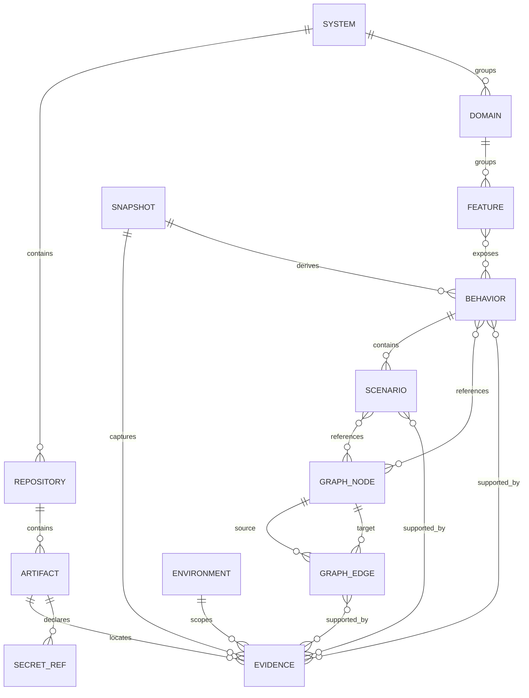
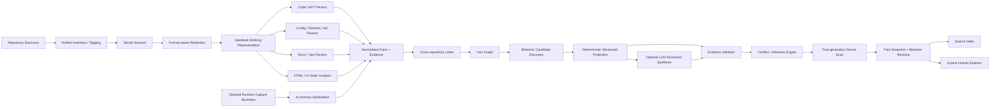
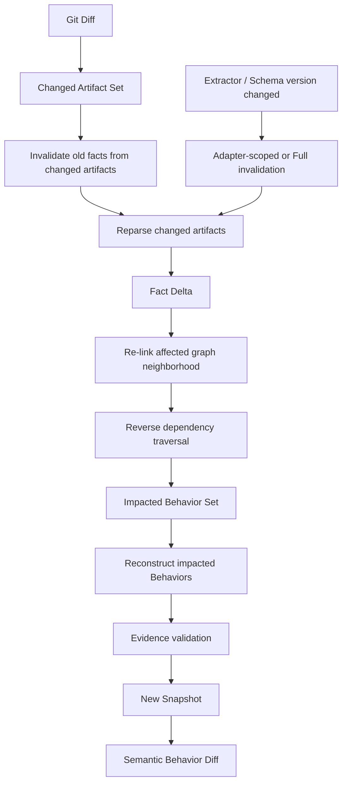
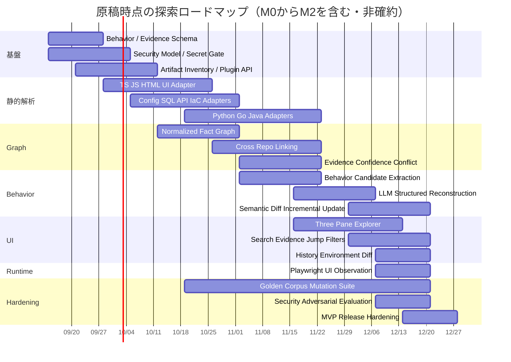

# Spec Reconstructor — 既存システム逆仕様化OSS 要件定義・調査報告書

> 改訂: 2026-09-09 / 要件レビュー v0.2。目的と非目的を維持し、観測範囲、データ契約、再現性、運用、受入条件を補強した。規範要件とrelease gateを採否の基準とし、技術候補・スコア係数・工数は設計上の仮説として扱う。本書のSchemaコードブロックは型を示す概念記法であり、実装時には機械検証可能なSchemaと適合fixtureへ落とし込む。

**OSS名:** Spec Reconstructor
**リポジトリ／パッケージ識別子:** `spec-reconstructor`

### 今回の再確認で補強した点

現行の中核方針は維持する。実装上の穴になっていたのは、静的抽出と実行観測の区別、claimとEvidenceの意味的対応、環境・時点・複数repoの版の固定、未解決link、非同期処理、秘匿化による情報欠落、失敗時の公開条件、およびMVPの範囲と測定方法である。各節の修正に加え、「解析・運用の追加必須契約」と「追加契約の受入対応表」に検証可能な条件を定義した。以降「本OSS」はSpec Reconstructorを指す。

原稿の内部検索引用は参照可能な一次資料リンクへ置き換えた。参照日は2026-09-09。既存OSSの数値は各プロジェクトの自己報告であり、本OSSでの独立再現やBehavior復元精度の証明を意味しない。ライセンス欄は調査上の識別情報であり、採用版・grammar・rules・再配布物の確認は依存物選定時に行う。

## エグゼクティブサマリー

### 結論

Spec Reconstructorの要件骨格は十分に成立している。実装上の中心思想は、**LLMにコードを読ませて仕様書を書かせることではなく、決定論的な解析器で既存システムから事実と関係を抽出し、そのEvidence付きFact Graphから人間向けBehavior Specificationを再構成すること**に置くべきである。

最終的なプロダクト定義は、次の一文に集約できる。

> **Spec Reconstructorは、複数リポジトリ・複数技術・複数運用資産から、現在存在しているシステムの構造と振る舞いを復元し、人間が「このシステムは何を持ち、何をすると、どの条件で、どこへ流れ、何が起きるのか」を把握できるBehavior中心の仕様へ変換するOSSである。**

これはUAT、QA、テスト生成、設計評価、要件生成を目的としない。対象システムが「正しいか」を判定するのではなく、**「実際にどうなっているか」を把握可能にする**ことだけを目的とする。

既存技術を見ると、基礎部品はかなり揃っている。JoernはAST・制御フロー・データフロー等をCode Property Graphへ統合する考え方を実用化しており、Tree-sitterは多数言語をインクリメンタルに構文解析できる。Kytheは生成コードを含むソース間の意味的リンクを扱い、Mooseはソフトウェア解析・メタモデル・可視化の先例になる。DoxygenやSourcetrailは「人間が既存コードを理解する」ための表示手法を示している。[Joern CPG](https://docs.joern.io/code-property-graph/)、[Tree-sitter](https://tree-sitter.github.io/tree-sitter/)、[Kythe Schema](https://kythe.io/docs/schema/)、[Moose](https://moosetechnology.org/)、[Doxygen](https://www.doxygen.nl/)、[Sourcetrail](https://github.com/CoatiSoftware/Sourcetrail)

特にEnolaの2026-09-04・extractor v264の公開benchmarkは本構想の参考になる。公開91 OSSリポジトリで448,086ファイルを解析し、8,194,786 Fact、26言語タグを報告し、91/91でcold/warm間の`facts.jsonl`と`snapshot_id`が一致したとしている。これはプロジェクトの自己報告であり、本レビューでは実行を再現していない。また同資料は`snapshot_id`の対象がFact streamで、receipt内の`file_hashes`の安定性までは示さないと明記する。本文中のEnolaの数値はこの測定条件を指し、本OSSのBehavior品質を保証する材料にはしない。[Enola benchmark](https://github.com/enola-labs/enola/blob/main/docs/BENCHMARKS.md)

一方、本調査範囲で確認した既存ツールには、以下を一体として提供するものは見当たらない。これは各ツールの公式な対象範囲を比較した上での本調査の推論である。[Joern CPG](https://docs.joern.io/code-property-graph/)、[Enola benchmark](https://github.com/enola-labs/enola/blob/main/docs/BENCHMARKS.md)、[Moose](https://moosetechnology.org/)、[Doxygen](https://www.doxygen.nl/)、[Sourcetrail](https://github.com/CoatiSoftware/Sourcetrail)、[Playwright Trace viewer](https://playwright.dev/docs/trace-viewer)

**差別化の核は「Behavior + Evidence」である。**

```text
Existing System
    │
    ├─ Code
    ├─ Config
    ├─ Schema / Migration
    ├─ Tests
    ├─ IaC
    ├─ CI/CD
    ├─ HTML / UI
    ├─ API definitions
    ├─ Docs
    ├─ Runbook
    ├─ Monitoring
    └─ PR / Issue / History
          │
          ▼
   Secret Sanitization
          │
          ▼
 Deterministic Extraction
          │
          ▼
 Evidence-backed Fact Graph
          │
          ▼
 Cross-repository Linking
          │
          ▼
 Behavior Reconstruction
          │
          ▼
 System → Domain → Feature
        → Behavior → Scenario
          │
          ▼
 Human-readable Explorer
```

特に重要な設計判断は以下である。

| 原則 | 要件 |
|---|---|
| Executable Reality First | 現在の挙動はコード、実効Config、Schema、IaC等を一次情報とする |
| Evidence First | 原子的な仕様記述は必ずEvidence、またはINFERRED/UNKNOWN表示を持つ |
| Conflict Preserving | 不整合をLLMに丸めさせず、そのまま人間へ表示する |
| LLM Is Not Authority | LLMは分類・グルーピング・文章化に使うが、Factを創造する権限を持たない |
| Secret Before LLM | 秘密値はLLMへ渡る前に不可逆に取り除く |
| Coverage Is Explicit | 「読めなかったもの」を無かったことにしない |
| Snapshot Based | 同一入力から同一Fact Graphを再現し、変更はsnapshot間差分として扱う |
| Human Comprehension First | グラフそのものではなくBehavior仕様を主UIとする |

この構成は、1995年のSoftware Reflexion Modelsが示した「高レベルモデルと実ソースの一致・不一致を明示する」という思想とも整合する。同研究は、高レベルの理解モデルがソースと乖離する問題に対し、一致箇所と不一致箇所を明示することで既存システム理解を支援した。本OSSではこの思想を、コード対設計だけでなく、コード・UI・Config・DB・Ops・Docsを横断するBehavior単位まで拡張する。[Software Reflexion Models (1995)](https://www.cs.ubc.ca/~murphy/papers/rm/fse95.html)、[Extending and Managing Software Reflexion Models](https://www.cs.ubc.ca/sites/default/files/tr/1997/TR-97-15_0.pdf)

**推奨MVPは「万能解析」を最初から目指さない。** 「定義した入力境界内のArtifactをinventoryする」「対応できるものは深く解析する」「対応できないものは状態と理由を示す」の三段構成にする。最初の公開版をM0とし、TypeScript/JavaScript、React、Expressによる一つの縦断経路と、後述の設定・契約形式の限定subsetを対象にする。Python、Go、Java等はM1以降の候補である。parserが存在することと、frameworkの意味やBehaviorを正しく復元できることは別の達成条件とする。[Joern CPG](https://docs.joern.io/code-property-graph/)、[Tree-sitter](https://tree-sitter.github.io/tree-sitter/)、[Enola benchmark](https://github.com/enola-labs/enola/blob/main/docs/BENCHMARKS.md)

## 類似OSSと研究動向

### 既存OSSの比較

本OSSを一つの既存製品のforkとして成立させるより、**Enola的Fact Graph、Joern的Program Graph、Kythe的provenance、Playwright的UI観測、Sourcetrail的探索UXを組み合わせ、Behavior層を独自に置く**方が設計として自然である。

| 候補 | License | 主な対象 | 強み | 弱み・本OSSとの差 | 関連度 |
|---|---|---|---|---|---|
| **Enola** | Apache-2.0 | multi-repo architecture intelligence / typed fact graph | 多言語Fact抽出、cross-repo解決、snapshot/diff、未解決linkのcoverage、再現性重視。本調査では最も近い。2026-09-04 benchmarkでは91 repo・約819万facts。[Enola benchmark](https://github.com/enola-labs/enola/blob/main/docs/BENCHMARKS.md) | 主眼はarchitecture/change intelligence。Behavior仕様、Evidence taxonomy、詳細なUI/Ops behavioral reconstructionは本OSSで追加が必要 | ★★★★★ |
| **Joern** | Apache-2.0 | 静的コード解析 / Code Property Graph | AST・control flow・data flow等を共通property graphへ統合し、複数言語に共通クエリを適用できる。[Joern CPG](https://docs.joern.io/code-property-graph/)、[Joern frontends](https://docs.joern.io/frontends/) | セキュリティ/プログラム解析中心。Docs/Ops/UI/人間向けBehaviorは対象外 | ★★★★☆ |
| **Tree-sitter** | MIT | 構文解析 | concrete syntax treeを高速・incrementalに更新でき、構文エラーを含むソースにも強い。多数言語grammarが存在。[Tree-sitter](https://tree-sitter.github.io/tree-sitter/) | 構文木まで。call resolution、framework semantics、Behavior groupingは別途必要 | ★★★★★ |
| **Kythe** | Apache-2.0 | semantic code indexing / cross-reference | language-agnosticなindexing ecosystem。生成コードと生成元を`generates`等で関連付けるモデルが参考になる。[Kythe Schema](https://kythe.io/docs/schema/) | build/extractor統合が重く、Behavior・Docs/Opsモデルではない | ★★★★☆ |
| **Moose** | MIT | software reverse engineering / analysis | import、parsing、modeling、measurement、querying、mining、interactive visualizationまで一体的に扱う。Famix系メタモデルも参考になる。[Moose](https://moosetechnology.org/) | Pharo/Smalltalk系エコシステム色が強く、現代Web全体のBehavior reconstructionにはそのまま適用しにくい | ★★★☆☆ |
| **Doxygen** | GPL-2.0 | source documentation generator | 未documented codeからもentityを抽出し、cross-reference、call graph、dependency graph等を生成できる。[Doxygen](https://www.doxygen.nl/)、[Doxygen manual](https://www.doxygen.nl/manual/starting.html) | class/function/API構造中心。実行上の分岐、外部副作用、OpsなどBehavior全体は表現しない | ★★☆☆☆ |
| **Sourcetrail** | GPL-3.0、archived | interactive source explorer | 「知らないコードベースの探索」に特化したUX、オフライン動作、グラフとコードジャンプが参考になる。[Sourcetrail](https://github.com/CoatiSoftware/Sourcetrail) | 2021年にarchive。C/C++/Java/Python中心。仕様再構成はしない | ★★★☆☆ |
| **Semgrep CE** | LGPL-2.1 engine | pattern-based static analysis | 30以上の言語、決定論的rule engine、JSON/SARIF出力。framework-specific pattern extractorとして利用価値がある。[Semgrep CE languages](https://docs.semgrep.dev/semgrep-ce-languages) | Behavior graphではない。ルールライセンスと製品機能の境界には注意が必要 | ★★★☆☆ |
| **Playwright** | Apache-2.0 | Web UI runtime observation | DOM/ARIA state、navigation、browser operation、network activity、traceを取得できる。UIの動的配線復元に強い。[Playwright ARIA snapshots](https://playwright.dev/docs/aria-snapshots)、[Playwright network](https://playwright.dev/docs/network)、[Playwright Trace viewer](https://playwright.dev/docs/trace-viewer) | 実行可能Web環境が必要。探索操作には副作用・Credential露出のリスクがあるためoptional adapter向け | ★★★★☆ |
| **Daikon** | unrestricted/permissive | dynamic invariant detection | 実行時に値を観測し、「観測された実行で成立した性質」を抽出する。program understanding用途も明示されている。[Daikon](https://plse.cs.washington.edu/daikon/) | 観測した経路しか証明できず、全システムの静的構造やUI/Opsを統合するものではない | ★★★☆☆ |

Enolaの最新benchmarkが示す設計上の重要なポイントは、**「解析成功数」だけでなく、何を見たか・何を読めなかったか・cross-repo linkの何件が解決できなかったかを測定対象にすること**である。同プロジェクトは入力をsnapshotとして扱い、同一入力に対するfactのbyte-level reproducibilityも検証している。本OSSも「解析器の賢さ」より先にこの再現性とcoverage accountingを採用すべきである。[Enola benchmark](https://github.com/enola-labs/enola/blob/main/docs/BENCHMARKS.md)

JoernのCode Property Graphも基礎設計として重要である。CPGはtyped node、labeled directed edge、key-value propertyから成るproperty graphであり、構文・制御フロー・データフローを単一表現に統合する。したがって本OSSではCPGをそのまま最終モデルにするのではなく、**CPG的な低層Fact Graphの上にUI、DB、Config、Queue、Infrastructure、Ops、Behaviorをoverlayとして追加する**のが自然である。[Joern CPG](https://docs.joern.io/code-property-graph/)

### 学術研究から採用すべき考え方

Software Reflexion Modelsは、既存システムの高レベル理解において「不一致はノイズではなく情報である」とみなす思想を提供する。元研究では、エンジニアが高レベルモデルとソースのmappingを定義し、一致・不一致を計算した。後続研究では設計と実装のdriftを除去するのではなく、理解の材料として利用する点が強調された。これは今回の`CONFLICT`を消さない方針と極めて相性が良い。[Software Reflexion Models (1995)](https://www.cs.ubc.ca/~murphy/papers/rm/fse95.html)、[Extending and Managing Software Reflexion Models](https://www.cs.ubc.ca/sites/default/files/tr/1997/TR-97-15_0.pdf)

GUI分野ではMemonらの「GUI Ripping」が、実行中GUIを自動巡回してwindow/widget/propertyを抽出し、GUI forestやevent-flow graphとして復元する方法を提示した。研究目的はテストだったが、**実行UIから画面要素と遷移可能性を復元する方法論そのもの**は今回の「HTMLだけでは見えない動的UI surface」を把握する上で有用である。UMDの研究ページでもWCRE 2003のGUI Ripping研究が確認できる。[GUI Ripping (2003)](https://www.cs.umd.edu/~atif/pubs/MemonWCRE2003-abstract.html)、[UMD GUI Ripping research](https://www.cs.umd.edu/node/14596)

Daikonの重要な教訓は、動的観測から得た情報を「一般的な真理」と混同しないことである。Daikon自身も、実行して値を観測し、**observed executionsにおいて真だったproperty**を報告するものとして説明している。したがって本OSSでPlaywright、trace、log、runtime instrumentationを導入しても、それは`RUNTIME_OBSERVED`かつenvironment/path scopedなEvidenceとして扱い、未観測経路まで一般化してはならない。[Daikon](https://plse.cs.washington.edu/daikon/)

総じて、学術・OSSの既存研究から得られる設計原則は次である。

```text
Syntax/Program Analysis
        +
Semantic Cross-reference
        +
Runtime Observation
        +
Artifact Provenance
        +
Explicit Drift / Conflict
        ↓
Behavior Reconstruction
        ↓
Human Comprehension
```

本OSSの新規性は低層解析アルゴリズムそのものより、**この情報を「人間が現在のBehaviorを理解する」という一つの目的に統合するProduct ModelとUI**にある。

## プロダクト要件とデータモデル

### 規範的なプロダクト要件

「何でも解析する」は、実装上「何でも完全に理解する」にはできない。そのため要件は、**指定された入力境界内のArtifactをinventory対象とし、各Artifactについて`PARSED / PARTIAL / UNSUPPORTED / IGNORED / ERROR`の状態と理由を必ず残す**と定義する。列挙できないディレクトリ・未取得repo等はDiscoveryGapとして記録し、完全なinventoryと表示しない。`PARSED`は宣言したadapter能力の範囲で抽出完了した状態であり、対象ファイルの振る舞いを完全に理解した意味ではない。

| ID | 要件 |
|---|---|
| CORE-HUMAN | 本システムの唯一の最終目的は、既存プロダクトの現在の構造・機能・振る舞いを人間が把握できる状態にすることである |
| SCOPE-ALL | monorepo・複数repoの双方に対応し、code、test、config、schema、DB migration、IaC、CI/CD、HTML/UI、API schema、docs、ops、monitoring等をinventoryする |
| SOURCE-FIRST | 指定版の実装・設定を一次資料とする。稼働中環境の現行Behaviorと表示するにはdeployment bindingと観測範囲が必要。test・schema・migrationの宣言を適用済みの事実と混同しない |
| CONFLICT-PRESERVE | Evidence間の矛盾を自動的に一つへ統合してはならない |
| COVERAGE-VISIBLE | 全artifactについて解析可否・coverage・error・unsupportedを明示する |
| SECRET-GATE | 秘密値はLLM、Fact Store、検索index、exportへ到達する前にredactする |
| UI-SURFACE | page、route、component、form、field、button、visibility、validation、API call、navigationを可能な限り復元する |
| DYNAMIC-INFER | DI、reflection、generated code、dynamic routing等の静的確定不能edgeは推論可能だがEvidenceとconfidenceを必須とする |
| SNAPSHOT | Sanitized Input Manifestと解析依存物の同一性に対してFact Snapshotを決定論的に再現する。LLMの文章再生成は別revisionで管理する |
| INCREMENTAL | git diffから影響GraphとBehaviorを求め、局所的な変更では対象Behaviorのみ再解析できること |
| TRACEABILITY | 原子的claimにFact/Evidenceへの対応と導出規則、または明示的`INFERRED`/`UNKNOWN`がある。Evidence IDの存在だけでは支持を認定しない |
| NO-AUTHORITY-LLM | LLM出力だけを根拠にFACT・STATIC_EXTRACTED・RUNTIME_OBSERVEDへ昇格してはならない |
| NO-AUTO-DESIGN | 要求、設計、実装改善案を自動決定する機能を本体責務に含めない |
| NO-AUTO-WRITE | 解析結果を理由に自動的にソースコードや設定を変更しない |

Evidence provenanceの概念は、W3C PROVがEntity・Activity・Agentおよび`wasDerivedFrom`等の関係を標準化している思想が参考になる。また外部ツール連携を考えるなら、static analysis結果の交換形式として標準化されているSARIFをEvidence export adapterの候補にできる。[W3C PROV-DM](https://www.w3.org/TR/prov-dm/)、[SARIF 2.1.0](https://docs.oasis-open.org/sarif/sarif/v2.1.0/os/sarif-v2.1.0-os.html)

### Behaviorの粒度

人間向けnavigationの基本階層は以下とする。これは表示上の投影であり、BehaviorやEvidenceの所有を木構造へ限定しない。DomainをまたぐBehaviorは一つのIDを複数Featureから参照でき、未分類は`Unclassified`に残す。共有処理を階層ごとに複製して独立したFactにしない。

```text
System
└── Domain
    └── Feature
        └── Behavior
            └── Scenario
                └── Evidence
```

`Behavior`は「ユーザーが押したボタン」に限定しない。

Behaviorの起点候補は、UI action、HTTP/gRPC/API request、CLI command、cron/job、queue/event、webhook、file watcher、startup event、internal scheduled taskなどである。

例えば、

```text
Feature: 注文
└── Behavior: 注文をキャンセルする
    ├── Scenario: 正常キャンセル
    ├── Scenario: 権限不足
    ├── Scenario: 既に発送済み
    ├── Scenario: 在庫戻し失敗
    └── Scenario: 外部決済refund timeout
```

のように分解する。

DomainやFeatureの名称は、コード上に明示されていない場合がある。その場合LLMによるgrouping/namingを許すが、**Domain名そのものを`INFERRED`として保持し、抽出したFactを書き換えない**ことが必要である。

### Behavior Schema

最も重要な構造上の要件は、**Behavior全体だけでなく、各field・各flow step・各branchにもEvidenceを付けること**である。

```yaml
Behavior:
  id: BehaviorId
  system_id: SystemId
  primary_feature_id: FeatureId | null
  feature_ids: [FeatureId]
  domain_ids: [DomainId]  # Feature所属からの表示projection

  title: Claim<string>
  summary: Claim<string>
  scope_ref: ScopeId

  trigger:
    - Claim<Trigger>

  actors:
    - Claim<Actor>

  preconditions:
    - Claim<Condition>

  inputs:
    - Claim<InputSpec>

  validation:
    - Claim<ValidationRule>

  authorization:
    - Claim<AuthorizationRule>

  main_flow:
    - FlowStep

  branches:
    - BranchSpec

  state_transitions:
    - Claim<StateTransition>

  outputs:
    - Claim<OutputSpec>

  side_effects:
    - Claim<SideEffect>

  external_calls:
    - Claim<ExternalCall>

  error_behavior:
    - Claim<ErrorBehavior>

  retry_timeout:
    - Claim<ResilienceRule>

  idempotency:
    - Claim<IdempotencyRule>

  concurrency:
    - Claim<ConcurrencyRule>

  persistence:
    - Claim<PersistenceOperation>

  observability:
    - Claim<ObservabilityRule>

  recovery:
    - Claim<RecoveryProcedure>

  environment_differences:
    - EnvironmentDiff

  scenario_ids:
    - ScenarioId

  flow_connection_refs:
    - FlowConnectionId

  evidence_refs:
    - EvidenceId

  completeness: COMPLETE | PARTIAL
  conflict_refs: [ConflictId]
  unknown_field_paths: [string]
  status: NORMAL | PARTIAL | CONFLICT | UNKNOWN  # 表示上の集約。上記の併存状態は保持

  confidence:
    score: float | null
    band: HIGH | MEDIUM | LOW | VERY_LOW | UNKNOWN
    basis: string

  snapshot_id: SnapshotId
```

共通`Claim<T>`は次のようにする。

```yaml
Claim:
  id: ClaimId
  value: T | null
  value_state: KNOWN | UNKNOWN | NOT_APPLICABLE | REDACTED
  assertion_level: SUPPORTED | INFERRED | UNASSESSED
  fact_refs: [FactId]

  evidence_refs:
    - EvidenceId

  evidence_type:
    - FACT | DOC | OPS | INFERRED

  observation_mode:
    STATIC_EXTRACTED | RUNTIME_OBSERVED | DECLARED | INFERRED

  scope_ref: ScopeId
  derivation_rule: RuleId | null
  premise_claim_refs: [ClaimId]
  validation: SUPPORTED | UNSUPPORTED | UNASSESSED
  reason_code: string | null
  conflict_refs: [ConflictId]

  confidence:
    score: float | null
    band: HIGH | MEDIUM | LOW | VERY_LOW | UNKNOWN

  status:
    NORMAL | PARTIAL | CONFLICT | UNKNOWN
```

`FlowStep`は文章ではなく構造として持つ。

```yaml
FlowStep:
  id: FlowStepId
  order: integer  # 表示順。実行順序や因果関係の証明には使わない

  kind:
    UI_ACTION |
    CALL |
    VALIDATE |
    AUTHORIZE |
    READ |
    WRITE |
    EMIT |
    CONSUME |
    WAIT |
    BRANCH |
    RETURN |
    ERROR |
    NAVIGATE

  subject_ref: GraphNodeId
  object_ref: GraphNodeId | null

  description: Claim<string>

  evidence_refs:
    - EvidenceId

  confidence: Confidence
```

こうしておけば、

```text
「注文作成」
```

という一枚の文章ではなく、

```text
Button
  ↓
React handler
  ↓
POST /orders
  ↓
Controller
  ↓
Auth guard
  ↓
Service
  ├─ DB INSERT
  ├─ Event emit
  └─ Queue enqueue
```

をEvidence付きのBehaviorへ投影できる。

### EvidenceとArtifact

Evidenceにはソース本文全体を複製する必要はない。最低限、出所を再現できるpointerを保持する。

```yaml
Evidence:
  id: EvidenceId

  repository_id: RepositoryId | null
  artifact_id: ArtifactId
  commit: string | null
  source_revision_ref: SourceRevisionId
  sanitized_content_id: string
  scope_ref: ScopeId

  path: string

  region:
    start_line: integer | null
    end_line: integer | null
    start_column: integer | null
    end_column: integer | null
    symbol: string | null
    coordinate_system: original_decoded_unicode_codepoint_1_based
    sanitized_region_ref: RegionMapId | null

  source_priority:
    PRIMARY | SECONDARY | INFERENCE

  evidence_type:
    FACT | DOC | OPS | INFERRED

  observation_mode:
    STATIC_EXTRACTED | RUNTIME_OBSERVED | DECLARED | INFERRED

  extractor:
    name: string
    version: string

  sanitized: true
  sanitizer_policy_version: string
  derivation_refs: [EvidenceId]

  sanitized_excerpt: string | null
```

Locationとartifact provenanceを第一級データとして扱う設計は、Kytheがsource anchorやgenerated-code mappingを位置情報として保持する考え方、W3C PROVのderivationモデルと整合する。[Kythe Schema](https://kythe.io/docs/schema/)、[W3C PROV-DM](https://www.w3.org/TR/prov-dm/)

Evidenceの参照先は指定revisionに固定する。非Git資産もArtifactとして登録し、`commit=null`と取り込み版のIDを持つ。sourceが取得不能・削除済みの場合は表示時に`SOURCE_UNAVAILABLE`を示し、最新branchの同じ行を代用しない。保存したsanitized excerptの有無と、元ソースへのアクセス可否は分ける。

### Graph Schema

GraphはBehavior生成の中間表現であり、**最終UIの中心ではない**。

主要Nodeは以下とする。

```text
System
Domain
Feature
Repository
Artifact
Symbol
Module
UIPage
UIComponent
UIElement
Endpoint
Command
Job
Event
Queue
DataEntity
DataStore
ConfigKey
FeatureFlag
AuthorizationRule
ExternalSystem
Environment
Behavior
Scenario
Evidence
Fact
Claim
Scope
Conflict
UnresolvedLink
SecretRef
```

主要Edgeは以下とする。

```text
CONTAINS
DECLARES
IMPORTS
CALLS
HANDLES
ROUTES_TO
NAVIGATES_TO
READS
WRITES
VALIDATES_WITH
AUTH_GUARDED_BY
EMITS
CONSUMES
SENDS_TO
CONFIGURED_BY
DEPLOYED_AS
GENERATED_FROM
OBSERVED_IN
EVIDENCED_BY
DERIVED_FROM
CONFLICTS_WITH
AFFECTS
```

JoernのCPGがtyped nodes、directed labeled edges、propertiesを使って異なるprogram representationを統合しているため、本OSSでもproperty graph的構造を採用する合理性は高い。生成コードについてはKytheのsource/generated mappingが直接参考になる。[Joern CPG](https://docs.joern.io/code-property-graph/)、[Kythe Schema](https://kythe.io/docs/schema/)

Edgeには必ず次のmetadataを持たせる。

```yaml
GraphEdge:
  id: EdgeId
  source: GraphNodeId
  target: GraphNodeId | null
  type: EdgeType

  link_status: RESOLVED | AMBIGUOUS | UNRESOLVED | OUT_OF_SCOPE
  target_candidates: [GraphNodeId]
  reason_code: string | null

  resolution:
    DETERMINISTIC | RUNTIME_OBSERVED | HEURISTIC | LLM_INFERRED

  evidence_refs:
    - EvidenceId

  confidence: Confidence

  scope_ref: ScopeId

  extractor:
    name: string
    version: string

  # first_seen/last_seenはsnapshot membershipから得る履歴projectionに置く
```

`LLM_INFERRED`のedgeはBehavior Revision側の推論overlayに保存し、決定論的なFact Snapshotへ混入させない。heuristicも確定edgeと区別して保持する。未解決先はnullable targetと候補集合で表し、架空の確定nodeを作らない。参照先の存在、source/targetの許可node型、多重edgeの一意性、scope整合性をschema/ruleで検証する。

ERの概念構造は以下になる。



GraphとBehaviorを分離する理由は、同一Fact Graphから異なる人間向けviewを生成できるからである。

```text
Fact Graph
   ├── Behavior View
   ├── UI Wiring View
   ├── Data View
   ├── API View
   ├── Environment View
   └── Change Impact View
```

これによって将来別用途が増えても、Behavior本体を破壊せずに済む。

### 補助Schemaと意味の不変条件

実装では以下も第一級データとする。空配列は「ないと確認した」のか「抽出できなかった」のかを単独では表さない。後者にはfield単位の`value_state`、reason、coverageを付ける。

```yaml
Scope:
  id: ScopeId
  source_revision_refs: [SourceRevisionId]
  environment: EnvironmentId | UNKNOWN
  deployment_ref: DeploymentId | null
  applicability: COMMON_PROVEN | CONDITIONAL | UNKNOWN
  actor_role: string | UNKNOWN
  tenant_cohort: string | UNKNOWN  # 個人・顧客の識別値は保存しない
  condition_refs: [ClaimId]
  observation_window: TimeRange | null
  execution_path_ref: string | null
  binding_evidence_refs: [EvidenceId]

Fact:
  id: FactId
  subject_ref: GraphNodeId
  predicate: PredicateId
  object: TypedValue | GraphNodeId
  scope_ref: ScopeId
  evidence_refs: [EvidenceId]
  derivation_rule: RuleId
  premise_fact_refs: [FactId]

BranchSpec:
  id: BranchId
  condition: Claim<Condition>
  from_step_id: FlowStepId
  successor_refs: [FlowConnectionId]
  completeness: COMPLETE | PARTIAL

FlowConnection:
  id: FlowConnectionId
  source_step_id: FlowStepId
  target_step_id: FlowStepId | null
  kind: NEXT | TRUE_BRANCH | FALSE_BRANCH | EXCEPTION | FORK | JOIN | LOOP | ASYNC_DELIVERY | COMPENSATION
  guard: Claim<Condition> | null
  relation: MUST_FOLLOW | MAY_FOLLOW | OBSERVED_FOLLOW | UNRESOLVED
  evidence_refs: [EvidenceId]
  scope_ref: ScopeId

Scenario:
  id: ScenarioId
  behavior_id: BehaviorId
  title: Claim<string>
  scope_ref: ScopeId
  entry_step_refs: [FlowStepId]
  condition_refs: [ClaimId]
  connection_refs: [FlowConnectionId]
  outcome_claim_refs: [ClaimId]
  feasibility: PROVEN | OBSERVED | UNKNOWN
  completeness: COMPLETE | PARTIAL
  termination: KNOWN | UNKNOWN | LONG_RUNNING

Conflict:
  id: ConflictId
  subject_ref: GraphNodeId
  predicate: PredicateId
  scope_ref: ScopeId
  competing_claim_refs: [ClaimId]
  comparison_rule: RuleId
  reason_code: string
  annotation_refs: [AnnotationId]
```

**MODEL-01:** 金額・サイズ・時間には単位と型を持たせ、`null`、未設定、空文字、0、falseを同一視しない。retryは「再試行回数」か「初回込みの試行回数」か、timeoutは接続・読み込み・全体のどれかを記録する。比較可能な型・単位・scopeへ正規化できないclaimは比較不能とする。

**PROOF-01:** `Fact`の支持Evidenceは1件以上、導出premiseは同一snapshotの参照可能なFactに限定する。Evidence→Fact→Claimの導出は循環を許さない。Graph自体の循環は許す。確定claimは値だけでなく、否定・数量・条件・実行主体・時間範囲も支持される必要がある。文章の見出し・要約・Search回答・exportも同じ検証を受ける。根拠のない「必ず」「すべて」「存在しない」を禁止する。

**FLOW-01:** `main_flow`の配列順は読者向けの順であり、実行順序は`FlowConnection`で表す。`MUST_FOLLOW`はguardが成立した到達済みsourceに対する制御関係を意味し、障害があっても処理完了するというliveness保証ではない。分岐、例外、並列実行、loop、早期return、取消、非同期境界を失わず、path数・深さ・計算量の上限で打ち切った領域を`PARTIAL`とする。Scenarioを全組合せの列挙と定義しない。

非同期処理では「emit呼出」「brokerによる受理」「consumer起動」「処理完了」を区別する。delivery保証、順序、重複、ack、dead-letter、再配送、idempotency key、transactionのcommit/rollback、outbox、補償、部分成功、cache整合性は、根拠があるものだけをclaimにする。SQL文の存在から永続化成功を、APIの2xx/202から後続処理完了を導かない。外部サービス内部が未取得ならExternalSystemで経路を止める。cronのtimezone、営業日条件、feature flagのactor/cohort条件もscopeへ保持する。

## 解析パイプラインとEvidence設計

### 全体パイプライン

解析順は**LLM-firstではなくParser-first**とする。



Tree-sitterはsource editに応じてsyntax treeを効率的に更新するincremental parserとして設計されているため、言語横断の第一段parserに適する。一方、Tree-sitterだけではsemantic resolutionが足りないため、framework adapter・compiler API・Joernのようなprogram-analysis frontendを併用する。[Tree-sitter](https://tree-sitter.github.io/tree-sitter/)、[Joern CPG](https://docs.joern.io/code-property-graph/)

### Artifact分類

全ファイルを最初に以下へ分類する。

| Tag | 例 |
|---|---|
| CODE | `.ts`, `.go`, `.py`, `.java`, `.cpp` |
| UI | HTML, JSX/TSX, Vue/Svelte templates, CSS |
| TEST | unit/integration/E2E |
| CONFIG | JSON/YAML/TOML/env schema |
| SCHEMA | SQL/schema/migration |
| INFRA | Terraform/HCL, Docker, Kubernetes |
| CI_CD | GitHub Actions等 |
| API_SPEC | OpenAPI, GraphQL, Proto |
| DOC | Markdown, AsciiDoc |
| OPS | runbook、operational procedure |
| MONITORING | alert、dashboard definition、metrics config |
| GENERATED | generated source |
| BINARY | binary artifact |
| UNKNOWN | 未分類 |

「任意のプロダクト」を対象にする以上、unsupported artifactが生じること自体を失敗とはしない。**黙って落とすことを失敗とする。**

例えば、

```text
Artifacts: 12,842

PARSED       11,972
PARTIAL         391
UNSUPPORTED     284
IGNORED         173
ERROR            22
```

を常に表示できるようにする。この方向性はEnolaがparsed/seen数やcross-repo missesを明示的にbenchmarkしている思想と一致する。[Enola benchmark](https://github.com/enola-labs/enola/blob/main/docs/BENCHMARKS.md)

### 初期対応言語・framework

製品仕様として対応言語を固定する必要はない。parser/plugin interfaceを第一級仕様とし、その上でMVPだけ以下を推奨する。

| Tier | 対応候補 | 理由 |
|---|---|---|
| Inventory対象 | Git、HTML、Markdown、JSON、YAML、TOML、XML、SQL、Shell、Dockerfile等 | 列挙・分類と意味解析の対応範囲を区別する |
| M0 Code | TypeScript / JavaScript | 後述のReact/Express subsetを受入対象にする |
| M1候補 Code | Python | Web/API/automation系へ段階追加 |
| M1候補 Code | Go | API・service・infra tool群へ段階追加 |
| M1候補 Code | Java | Spring等の大規模Backendへ段階追加 |
| 契約候補 | OpenAPI / GraphQL / Protocol Buffers | M0はOpenAPI subset、残りはM1以降 |
| Infra候補 | Terraform/HCL、Kubernetes manifests | M0はHCLの静的宣言subset。適用済みかは別Evidence |
| Tier-2 | C/C++、C#/.NET、Rust、Kotlin、Ruby、PHP、Swift、Dart等 | pluginとして段階投入 |

Tree-sitterは多数言語のparsing infrastructureを提供し、JoernもC/C++、Java、JavaScript、Python、Kotlin等をCPGへ変換する。Enolaの2026年benchmarkもC/C++、C#、Dart、Go、HCL、Java、Kotlin、Python、Rust、SQL、Swift、TypeScript、OpenAPI、gRPC等を含む26タグを扱っているため、多言語正規化自体を根本的リスクとみなす必要はない。ただし**各frameworkのsemantic adapter品質**が実際のボトルネックになる。[Joern frontends](https://docs.joern.io/frontends/)、[Enola benchmark](https://github.com/enola-labs/enola/blob/main/docs/BENCHMARKS.md)、[Tree-sitter](https://tree-sitter.github.io/tree-sitter/)

### HTML/UI Surface解析

静的UI adapterは少なくとも次を抽出する。

```text
Page
├── Route
├── Component
├── Form
│   ├── Field
│   ├── Validation
│   └── Submit handler
├── Button
├── Link
├── Visible state
├── Hidden/conditional state
├── Authorization guard
├── API call
└── Navigation
```

具体的には、

```html
<form action="/api/orders" method="post">
  <input type="number" name="quantity" min="1" max="20" step="1" required>
  <button type="submit">注文する</button>
</form>
```

から、

```text
UIPage
  └─ contains → Form
       ├─ input → quantity
       ├─ validates → required
       ├─ validates → 1 <= quantity <= 20
       └─ submits → POST /api/orders
```

を生成する。

この例はブラウザ側の数値入力制約であり、サーバ側の検証があることは別Evidenceが必要である。`type`省略時はtext扱いなので、`min/max`の存在だけから数値範囲をFact化しない。`novalidate`、`formnovalidate`、JavaScriptによる送信経路も区別する。[HTML Standard: input](https://html.spec.whatwg.org/multipage/input.html)

React等ではDOMだけでなくJSX conditional rendering、router definitions、event handler、fetch/Axios等のcall siteを結び、

```text
<Button onClick={handleCancel}>
        │
        ▼
handleCancel()
        │
        ▼
api.post("/orders/" + id + "/cancel")
        │
        ▼
POST /orders/:id/cancel
```

を構築する。

静的解析だけでは認証後の表示、runtime-generated component、remote config、client-side routing等を取り切れないため、optional dynamic adapterとしてPlaywrightを採用する価値が高い。PlaywrightはARIA snapshotでrole、attribute、accessible name等を構造化して取得でき、traceではDOM snapshotやnetwork activityを記録できる。[Playwright ARIA snapshots](https://playwright.dev/docs/aria-snapshots)、[Playwright network](https://playwright.dev/docs/network)、[Playwright Trace viewer](https://playwright.dev/docs/trace-viewer)

ただしruntime UIから得た情報には必ず、

```yaml
observation_mode: RUNTIME_OBSERVED
environment: staging
visited_state: authenticated-user
```

のようなscopeを付ける。未訪問stateを「存在しない」と判定しない。この原則は、Daikonが動的解析結果を「observed executionsで成立した性質」と明確に限定していることとも整合する。[Daikon](https://plse.cs.washington.edu/daikon/)

### LLMを使ってよい場所

LLMは三箇所に限定するのが安全である。

**Behavior reconstruction**では、Fact Graphのsubgraphを入力し、

```text
Trigger
Actor
Preconditions
Main Flow
Branches
...
```

へ整理する。

**Domain / Feature grouping**では、package構造やroute、entity、docs等から人間向け分類名を生成する。ただし明示的domain metadataが存在しない場合は`INFERRED`。

**Behavior Query**では、

> 「注文キャンセル後に在庫はどこで戻される？」

をstructured graph queryへ変換する。

逆に、以下にはLLMを使わない。

```text
Raw source parsing
Secret removalの唯一の防御
Source authorityの決定
FACT認定
Git diff計算
Evidence location生成
Snapshot ID生成
Arbitrary code execution
```

LLM出力はJSON Schema等で拘束し、

```json
{
  "claim": "在庫が1件戻される",
  "evidenceRefs": ["ev_107", "ev_108"]
}
```

のように**claimとEvidenceを同時出力させる**。ただし存在するEvidenceRefを出すだけでは不十分である。確定表示は、構造化Factのsubject・predicate・value・scopeと一致するclaim、またはversion付き決定論的導出規則で検証できるclaimに限定する。例えば「在庫カウンタを更新する」Evidenceから「在庫が1件戻る」とは認定できず、増減値と条件の根拠も必要になる。自由文の意味を検証できない場合は`INFERRED`または`UNASSESSED`として表示し、根拠不一致は再分類または棄却する。LLMによる自己採点・別LLMによる同意だけでは昇格しない。

さらに安定性のため、

```text
sanitized evidence bundle hash
+ model identifier
+ prompt version
+ schema version
+ retrieval / synthesis / validator versions
+ scope + locale + generation parameters
```

をcache keyとし、検証済み出力を再利用する。cache消去後のLLM再生成がbyte一致することは保証しない。LLMを使わずFactから構造化Behaviorと定型文を出す経路をM0で必須とし、LLM停止・予算超過でもEvidence Explorerを利用できるようにする。Factの再現性と文章の再利用は、後述のSnapshot契約で分離する。

### Evidence Taxonomy

Evidenceの種別、把握方法、claimの状態は独立に持たせる。`FACT`は根拠に忠実に抽出した内容を示し、稼働中環境の実測や無条件な真理を意味しない。

**「どんな根拠か」軸**

| Type | 意味 | 例 | 現行仕様への扱い |
|---|---|---|---|
| `FACT` | 指定sourceから直接抽出した構造・値、または範囲を限定した実測 | validator、route、DB constraint、effective config | 把握方法とscopeの範囲で利用 |
| `DOC` | 文書・PR・Issue等の説明 | README、design doc、PR rationale | 補足・背景 |
| `OPS` | 人間向け運用情報 | runbook、manual recovery instruction | 運用Behaviorの補足 |
| `INFERRED` | heuristic/LLMによる推論 | DIの候補binding | 推論表示必須 |

`CONFLICT`と`UNKNOWN`はEvidenceの種別には入れず、claim/Behaviorの状態として保持する。矛盾と部分欠落は同時に存在できる。`NOT_APPLICABLE`は対象外と確認できたfield、`REDACTED`は秘匿化のため不明なfieldとし、未解析の`UNKNOWN`や空配列と区別する。

実行可能なmonitor rule、deployment config、IaCは「運用領域」でも`OPS`ではなく`FACT`でよい。`OPS`は主にrunbook等の**宣言的な人間向け運用資料**を指す。

**「どのように分かったか」軸**

| Mode | 意味 |
|---|---|
| `STATIC_EXTRACTED` | 指定revisionの実装・設定を静的に読み取った。実行・到達・適用済みは未証明 |
| `RUNTIME_OBSERVED` | 記録された実行・環境・時刻・actor・経路の範囲で直接観測した |
| `DECLARED` | test、schema contract、document等が「そうあるべき」と宣言している |
| `INFERRED` | relationまたは意味を解析器/LLMが推論した |

例えば、

```text
validator.ts:
MAX_WEIGHT = 25
```

なら、

```text
FACT + STATIC_EXTRACTED
```

である。

```text
expect(overweight(26)).toFail()
```

なら、

```text
FACT + DECLARED
```

とする。

```text
README:
最大30kg
```

なら、

```text
DOC + DECLARED
```

である。

### Code-first Authority

Source優先順位は次とする。優先順位は同じsubject・predicate・適用条件を比較するときの表示規則であり、Evidenceの種別やscopeを上書きしない。

```text
P1: Implementation / Effective Evidence
    code
    effective config
    schema
    migration
    IaC
    authorization policy
    routes
    feature flags
    tests
    runtime observation

P2: Secondary Context
    README
    design docs
    runbook
    PR
    issue
    Git history

P3: Inference
    deterministic heuristic
    LLM inference
```

ただしP1内でも**「より実効的で具体的なもの」**を優先する。test、migration、OpenAPI、IaCに宣言があるだけで本番適用済みとは判定しない。testはassertionの存在、migrationは変更命令の存在をそれぞれ証明する。mock下のtest実行もそのtest環境に限定する。稼働中の環境を表示する場合はdeployされた版・設定のbindingを要求し、未確認なら「指定ソース版の仕様」と表示する。

例えば、

```text
source default:
TIMEOUT = 30

production:
TIMEOUT=120
```

でproduction bindingまで証明できたなら、

```text
Common/default: 30 sec
Production:     120 sec
```

と表示する。

これは矛盾ではなくenvironment differenceである。

一方、

| Evidence | 表示 |
|---|---|
| code = 25 / README = 30 | Current = 25。`CONFLICT`表示、README 30も残す |
| implementation = 25 / test expects 30 | Current = 25。Primary同士の不一致として強い`CONFLICT` |
| Service A code = 25 / Service B code = 30、同一env/path | 同じsubject・predicate・単位・条件を指すと証明できた場合のみ`CONFLICT`。異なる段階の制約なら併記し、関係が未解決なら比較不能とする |
| production env = 30 / default code = 25 | environment differenceとして分離 |
| code = 25 / LLM = 30 | 25。推論をcurrentへ採用しない |
| Evidenceなし | `UNKNOWN` |

Software Reflexion Modelsが一致と不一致の両方を理解材料として示したように、**Conflict BadgeはConfidenceが高くても消してはならない**。[Software Reflexion Models (1995)](https://www.cs.ubc.ca/~murphy/papers/rm/fse95.html)、[Extending and Managing Software Reflexion Models](https://www.cs.ubc.ca/sites/default/files/tr/1997/TR-97-15_0.pdf)

### Confidence算定

LLM自身に「自信度を0〜1で出して」と頼む方式は採用しない。Confidenceは**Evidence構造から機械的に計算するEvidence Support Score**とする。

これは確率ではなく、

> 「このclaimを現在の挙動として表示するのに、どれほど直接的・高品質・環境一致したEvidenceが存在するか」

の指標と定義する。

各Evidence `e`について、

\[
p_e = B_e \times A_e \times D_e \times Q_e \times M_e
\]

とする。

推奨初期値は以下。

| Factor | 値の例 |
|---|---:|
| direct implementation / effective config | Base `0.98` |
| direct runtime observation | `0.95` |
| test assertion | `0.90` |
| executable monitoring / CI rule | `0.90` |
| runbook | `0.70` |
| README / design document | `0.65` |
| PR / Issue | `0.60` |
| LLM inference | `0.50` |

Authority multiplier `A`：

```text
P1 = 1.00
P2 = 0.65
P3 = 0.40
```

Directness `D`：

```text
direct extraction         1.00
deterministic cross-link  0.95
heuristic link            0.75
multi-hop inference       0.60
```

Extractor quality `Q`はversion・能力別golden datasetの測定値を用いる。未評価adapterは`Q=null`、scoreも`null`、bandは`UNKNOWN`とし、仮の数値で評価済みに見せない。測定したprecisionはこのsupport scoreへ使う係数であり、個別claimが真である確率ではない。

Environment match `M`：

```text
exact compatible scope       1.00
proven common scope          0.90
scope unknown / incompatible support対象から除外
```

同じartifactや同じ生成元から同じ事実を抽出してconfidenceを不当に上げないため、`derivation_refs`をたどったEvidence Family単位で最大値だけを採用する。コピーされたdocs、同一trace由来のログ、同一生成元のschemaとgenerated codeも独立根拠と数えない。独立性を判断できない場合は同一家族として扱う。

supportを、

\[
S = 1 - \prod_i (1-p_i)
\]

とする。

contradictory Evidenceについて、

\[
K = 1 - \prod_j (1-p_j)
\]

を求める。

以下の集約式は、同一scopeの同一命題を支持する代替根拠にのみ適用する。連続する因果経路のように全premiseが必要なclaimは、必須premise/edgeの最小scoreを上限とし、未解決edgeがあれば確定した経路にはしない。testや文書だけで実装・本番挙動を支持しない。重みの足し合わせからsource authorityや観測範囲を変更することも禁止する。

最終scoreは、

\[
C = S(1-rK)
\]

とする。

`r`はcontradiction authorityに依存させる。

```text
Primary vs Primary     r = 0.80
Secondary vs Primary   r = 0.25
Inference vs Primary   r = 0.10
```

つまりREADMEがコードと違うだけでコード事実のconfidenceを壊滅させないが、**比較可能なPrimary Source同士が食い違った場合は大きく下げる**。矛盾の種類が混在するときは対象claimに対する最大の`r`を使い、算定policy versionと各factorを保存する。Conflictの有無はscoreと独立して表示する。

bandはMVPでは、

```text
HIGH       >= 0.90
MEDIUM     >= 0.75
LOW        >= 0.50
VERY_LOW   <  0.50
UNKNOWN    有効な支持Evidenceなし、または係数未評価
```

を初期値とし、後述のgolden corpusでcalibrationする。

さらに、

> **Inferenceだけで成立するclaimは0.79を上限とする**

というhard capを設ける。

これによりLLMがどれほどもっともらしく説明しても`HIGH`にはならない。

### Incremental Update

差分更新は単純な「changed fileだけ再parse」では不十分である。route root、dependency injection config、path alias、schema等を変えると、変更されていない大量ファイルのlink結果が変わるからである。

更新処理は以下とする。



削除・rename・repoの追加/除外・入力の未取得化も変更として扱う。追跡対象はgit diffだけではなく、外部資産、実効設定、lockfile、manual overlay、秘匿化policy、linker、LLM/生成policyの版を含む。影響を安全に局所化できない場合は広いscopeまたはfull rebuildへ戻す。解析失敗によって消えたFactをBehaviorの削除と表示しない。

各adapterには、

```text
FILE
MODULE
REPOSITORY
CLUSTER
GLOBAL
```

の`invalidation_scope`を宣言させる。

例えば、

```text
関数本体変更       → FILE/MODULE
tsconfig path alias → REPOSITORY
root route mount    → REPOSITORY/CLUSTER
cluster mapping     → CLUSTER
Graph schema変更    → GLOBAL
```

とする。

Enolaがsnapshotを「比較可能なvalue」として扱い、cold/warmのcache状態が結果に影響しないことを検証している点は、ここで非常に良い参照になる。[Enola benchmark](https://github.com/enola-labs/enola/blob/main/docs/BENCHMARKS.md)

## 解析・運用の追加必須契約

### 入力の固定とinventory境界

**INPUT-01 / M0:** 解析開始時にInput Manifestを固定する。system ID、安定したrepository ID、対象root、commitまたはworking-tree版、submodule、include/exclude、依存物lockfile、外部資産の取り込み版、入力の取得可否、sanitize policy、解析設定を記録する。複数repoのcommit集合を一つの入力とし、同時刻・同一deploymentで動いていたとは推定しない。

M0の既定入力はローカルに用意済みのGit repoまたはdirectoryとする。remote clone/fetch、依存install、build、migration、テスト実行、Terraform plan/apply、設定コードのimportは自動実行しない。working-treeモードはtracked/untrackedの採否を明示し、読み取り中に変更された入力を再取得または`INPUT_CHANGED`として止める。branch名だけを版として保存しない。

submodule、LFS pointer、symlink/junction、循環link、root外参照、vendor/generated、隠しファイル、binary、archive、巨大ファイル、読み取り権限不足を処理表で定義する。既定ではroot外へ辿らずarchiveを展開しない。excluded directoryの全子孫を列挙していない場合は、除外rootとpolicyを記録し、未知の件数を0件にしない。encoding、改行、大小文字、Unicode表記の違いによるpath衝突は検出する。元pathの識別を壊す一律の小文字化・Unicode正規化は禁止する。

### cross-repo linkingと環境解決

**LINK-01 / M0:** Endpointの同一性はHTTP methodとpathだけで決めない。service identity、base URL、gateway/reverse-proxy rewrite、route mount、API version、環境bindingを検証する。gRPCはpackage/service/method、eventはbroker/namespace/topic/schema version、DBはinstance/schema/tableも含める。動的文字列・DI・reflection・overloadの候補が複数ある場合は候補集合と理由を残し、一意に確定しない。

呼出候補を列挙した時点で分母へ登録し、成功したlinkだけを保存しない。`RESOLVED / AMBIGUOUS / UNRESOLVED / OUT_OF_SCOPE`と未対応・未取得の理由を保持する。組み合わせ候補や名称の類似は`HEURISTIC`であり、証明済み経路に混ぜない。human bindingは出所を記録した補助宣言として扱う。

**ENV-01 / M0:** configの上書き順はframework/実行方式ごとのversion付きruleで解決する。default、file、環境変数、CLI、secret reference、remote config、feature flagのlayerを記録する。repo内の`production.yaml`という名前だけでは本番適用の証拠にならない。bindingが得られない値は宣言値として表示する。runtime evidenceも時刻・deployment・actor・経路の範囲に限定し、古い観測を現在へ自動延長しない。

単なる環境差・版差・条件差はConflictではない。同じscopeが重なる同一命題に非互換な値がある場合にConflictを作る。重なり自体が不明な場合は比較不能として候補を併記する。M1のenvironment matrix UIが未実装でも、M0でscopeを保存し、混在防止とscope表示を必須とする。

### ID、snapshot、差分の互換性

**SNAP-01 / M0:** Fact Snapshot、Behavior Revision、実行記録を分ける。

| 単位 | 固定する内容 | 再現性・変更時の扱い |
|---|---|---|
| Sanitized Input Manifest | 各資産の秘匿化後content ID、scope、namespace、解析に必要な設定・依存物の版 | 同一入力判定の正本。secret値やそのhashを含めない |
| Fact Snapshot | manifest ID、確定Fact/Graph、Evidence、coverage、比較に必要なpolicy versions | 同一manifestとtoolchainでcold/warm・process・列挙順を変えてbyte一致 |
| Behavior Revision | fact snapshot ID、構造化claim、導出/生成/validator版、採用出力 | 決定論的投影は再現。LLM再生成は新revision。既存revisionのexport/replayは同一 |
| Run Receipt | 実行時刻、所要時間、host、retry、診断、cache利用、token量 | 監査用。Factのcontent hashから除外 |

再現性gateは入力が固定され必要な処理が完了したrun同士に適用する。時間切れ・OOM・入力変更等で範囲が欠けたrunは`PARTIAL/FAILED`として区別し、同じmanifestの完全なFact Snapshotを上書きしない。runtime記録を入力とする場合は記録自体の版を固定し、新しい実行観測は新しい入力とする。LLM由来の推論はFact Snapshotのhash対象外である。

同一対象をsnapshot間で照合する`identity_key`と、その版の内容を固定する`record_id`を分ける。前者はkind・repository namespace・symbol/署名等の安定anchor・predicate・論理的な適用条件から作り、後者には値・Evidence版・scopeも含める。entity/Behaviorの識別にLLMが付けた名称、連番、絶対checkout path、走査順を使わない。rename、移動、split/merge時に同一性を証明できる場合はalias/lineageを残し、曖昧なら新IDと候補を示す。判定ruleの版も保存する。

canonical serializationはキー順、setのsort、UTF-8、数値・単位、改行、null、重複排除を規定する。JSONのcanonicalizationにはRFC 8785等を参考にするが、Factの意味的正規化は別ruleで定義する。丸めや負の0で元言語の意味が失われる値は型付き文字列表現等で区別する。[RFC 8785](https://www.rfc-editor.org/rfc/rfc8785.html)

SecretRefは安定したproject namespaceとlocationから生成し、実行ごとにsaltを再生成しない。namespaceもmanifestの入力とする。秘密値だけが変わった場合、秘匿化後の仕様が同一なら同一Fact内容でよい。秘密値変更の検出・追跡はこのOSSの保証外とする。原文全体のhashを介して秘密値の検証oracleを新設しない。

`snapshot_id`や`first_seen/last_seen`を自身のcontent hashの入力へ含める循環定義は禁止する。snapshot間の履歴は外側のmembership/receiptから計算する。schema versionは保存・API・exportに必須とし、未対応majorは明示的に拒否する。migrationは新snapshotへの変換とし旧版を暗黙上書きしない。比較器が扱えない版差は`NOT_COMPARABLE`と表示する。解析器変更による差分、source変更、coverage低下、生成文だけの変更を分離する。

### adapterの能力と実行境界

**ADAPTER-01 / M0:** plugin contractにはAPI/schema version、対応言語・framework・dialectと版範囲、抽出predicate、精度評価状況、入力制限、invalidation scope、resource上限、必要権限を持たせる。「parseできた」「意味的に解決できた」「Behaviorへ投影できた」を別capabilityとして公開する。

pluginへの入力はsanitized representationに限定する。raw sourceを扱う信頼済みingest/sanitizerと、parser/LLMの権限境界を分離する。shell、network、任意path読み取り・書き込みをpluginへ既定で与えず、宣言された出力だけを検証して取り込む。sandboxを提供できないhostでは隔離を要求するpluginを起動しない。既定のbuilt-in adapterにもCPU/memory/time/file-size上限を設ける。parser panic、複雑な入力、timeoutは該当artifactの診断へ変換する。

### 実行状態、途中失敗、保存

**RUN-01 / M0:** CLIまたはAPIは`scan / status / cancel / inspect / export`に相当する操作と、機械可読の状態を持つ。`QUEUED → RUNNING → COMPLETE | PARTIAL | FAILED | CANCELLED`を区別し、何段階まで完了したか、reason code、artifact別診断、実行policyを記録する。

部分解析は`PARTIAL`の明示付きで利用できるが、機密境界の検証失敗、入力の不整合、参照整合性違反は公開を止める。coverage gateに未達の結果をcompleteとして扱わない。CLIの規範的終了コードは`0=complete`、`2=partial`、`1=failed`、`130=cancelled`とし、詳細理由はstructured reportで返す。Conflictの存在だけでは解析失敗にしない。

新snapshotはstaging領域で検証後にatomicに公開し、失敗時は直前の有効snapshotを維持する。sourceが同一のrunを複数開始した場合のlock/競合制御を定義し、検索indexもsnapshot単位で切り替える。中断から再開する場合はmanifest・版・policyが一致する検証済みcheckpointのみ再利用する。disk不足、process終了、破損cache、network/provider障害の際にも部分書き込みを公開しない。

### LLMとデータ持ち出し

**LLM-01 / M0:** LLMとembeddingはoptionalとする。ネットワークを切断した状態でinventory、Fact抽出、決定論的Behavior投影、exact/structured search、Evidence参照、exportが完了することを必須とする。外部LLM/embedding provider、telemetry、crash upload、update checkは既定OFF。cloud providerを有効にする設定には送信先・送信対象・保持方針の確認結果を含め、sanitizedでも内部構造や個人情報が残り得ることを利用者が把握できるようにする。

生成の上限はrun単位のtoken量・金額・時間・retry回数とし、超過時には停止して決定論的結果を残す。model revision、prompt/schema版、入力bundle、chunk/truncation、未使用Evidence、usageを記録する。context切り詰めで落とした情報を「存在しない」と要約しない。QueryのLLM変換先はread-onlyの許可済みquery schemaとし、取得件数・経路深さを制限する。

### export、Explorer、共同閲覧

**OUTPUT-01 / M0:** JSON/JSONLによる機械可読snapshot exportと、根拠リンク付きMarkdownまたは静的HTMLによる人間向けexportを必須とする。exportにschema/version、snapshot/revision、scope、coverage、Conflict、Unknown、redaction状態を含める。snippetの含有を選択でき、sourceがない場所でも少なくとも根拠の識別と欠落表示が成立する。内部pathや組織名等のmetadataもexport policyで除去可能にする。外部送付自体は行わない。

source、Markdown、HTML、SVG、URL、LLM生成物は表示前にsanitize/escapeし、任意script・remote image・埋め込みを実行しない。Evidence jumpは対象root・repo・revisionのallowlist内のみ解決し、URL中のcredentialsや危険なschemeを拒否する。既定サーバはloopback・単一利用者とし、session tokenとOrigin検証等で他ページからのアクセスを防ぐ。

共有サーバ/複数利用者モードはM0対象外。有効化する版では認証、project単位の認可、検索・RAG・exportに及ぶ同じアクセス境界、監査を必須とする。認可未実装の状態でLAN/publicへ公開しない。importはM1以降とし、導入時には版・整合性・サイズ・展開path・外部URLの検証を要求する。

### 人間による補正とデータの削除

**REVIEW-01 / M1:** naming/grouping、補助binding、注記、Conflictの解釈はversion付きoverlayで保存し、抽出Factを変更しない。人間の判断にも作者、理由、根拠、scopeを持たせるが、本文の同意だけで実測FACTへ昇格しない。元Evidenceや対象版が変われば`STALE`を示し、別版へ黙って適用しない。M0では注記編集を提供せず、この分離を将来の保存互換条件とする。

**RETENTION-01 / M0:** local store/cache/index/exportは機密資産としてOSの利用者境界で保護する。保存先と容量、retention上限を明示し、snapshot単位で削除できるようにする。削除要求は管理下のBehavior、Evidence excerpt、検索index、embedding、LLM cache、一時ファイル、派生exportにも伝播させる。参照中snapshotから必要なEvidenceを無告知に消さず、削除状態を表示する。immutableは内容の暗黙書換禁止を意味し、削除禁止ではない。外部にコピー済みのexportや外部providerの保持物は削除保証の範囲外として一覧に示す。

### 非機能要件と測定条件

**NFR-01 / M0:** 以下はこのレビューで置いた暫定受入目標であり、性能実績ではない。M0実装初期に固定corpusと実機計測で可否を判断し、変更する場合は理由と版を残す。目標未達のまま「対応済み」と宣言しない。

| 項目 | 測定条件と初期目標 |
|---|---|
| 配布・host | Linux x86_64を基準runtimeとし、WindowsはWSL2経由をM0経路とする。macOS/native Windowsは検証前に対応済みと表示しない。fresh installからsample scan/exportまで文書化する |
| full scan | 8 CPU / 16 GiB RAM / local SSD、M0対応subsetの固定5 repo・計1万text artifact・100万LOCで、LLMを除く全静的pipelineをcold 3回計測。各回10分以内、peak RSS 8 GiB以内 |
| Explorer | 固定snapshotの10万Fact・1千Behavior、warm状態の固定100操作で、exact/structured search p95 ≤ 1秒、Behavior/Evidence表示 p95 ≤ 2秒。graphは上限付きで展開 |
| 停止・資源制御 | cancelから10秒以内に新規処理を止め、worker終了とstaging整理の結果を表示。処理時間、bytes、fact数、cache容量の上限を設定できる |
| 日本語・アクセシビリティ | 日本語・英語の名称と検索に対応。keyboardだけで3ペイン・Evidenceへ移動でき、focus可視、色以外の状態表示、200%拡大時のreflow、motion reductionを確認する |
| 可観測性 | stage別時間、artifact状態、未解決数、cache命中、token/cost、error codeを取得でき、秘密値や原文本文を診断に出さない |

アクセシビリティはWCAG 2.2を設計・確認の参照とする。上記の限定チェックだけでWCAG全体への適合を主張しない。[WCAG 2.2](https://www.w3.org/TR/WCAG22/)

## UI/UX仕様

### UIの設計目的

成果物の中心はGraphではない。

ユーザーが知りたいのは、

> 「この処理はどう動く？」

であって、

> 「このgraphには2万個nodeがあります」

ではない。

したがって主画面は3ペインとする。

```text
┌────────────────────┬────────────────────────────────────┬────────────────────────┐
│ System Navigation  │ Behavior Specification             │ Evidence               │
│                    │                                    │                        │
│ Search             │ 注文キャンセル                     │ FACT / STATIC_EXTRACTED│
│                    │                                    │                        │
│ System             │ Summary                            │ order_service.ts       │
│ ├─ Order           │ Trigger                            │ L182-L224               │
│ │  ├─ Create       │ Actor                              │                        │
│ │  ├─ Cancel ◀     │ Preconditions                      │ [Open source]          │
│ │  └─ Refund       │ Inputs                             │                        │
│ ├─ Inventory       │ Authorization                      │ Related evidence       │
│ └─ Payment         │ Main Flow                          │ test/...               │
│                    │ Branches                           │ docs/...               │
│ Filters            │ State transitions                 │                        │
│ ☑ Conflict         │ Side effects                      │ Confidence             │
│ ☑ Unknown          │ Retry / Timeout                   │ 0.96 HIGH              │
│ env: production    │ Observability                      │                        │
│                    │ Recovery                           │ Conflict               │
│ History            │ Environment differences           │ README says ...        │
└────────────────────┴────────────────────────────────────┴────────────────────────┘
```

中央は**静的で読むことに集中できる仕様書**とする。

アニメーションは背景、Graph、selection transition等に限定する。本文の文字、Evidence、diff内容を常時動かさない。

### Behavior Detail View

Behavior表示順は、人間が「何が起きるか」を追う認知順に合わせる。

```text
概要
  ├ Trigger
  ├ Actor
  └ Preconditions

入力とGuard
  ├ Inputs
  ├ Validation
  └ Authorization

処理
  ├ Main Flow
  ├ Branches
  └ State Transitions

結果
  ├ Outputs
  ├ Side Effects
  ├ Persistence
  └ External Calls

実行特性
  ├ Retry / Timeout
  ├ Idempotency
  └ Concurrency

運用
  ├ Observability
  └ Recovery

差分
  └ Environment Differences

根拠
  ├ Evidence
  ├ Conflict
  └ Unknown
```

Behaviorの冒頭では少なくとも、

```text
Specification basis: Source revision / deployment binding status
Confidence: HIGH 0.94
Evidence: 17
Conflicts: 1
Unknowns: 2
Environment: production
Snapshot: abc123
```

を表示する。

### Evidence Panel

Evidenceクリック時は、

```text
order_service.ts
commit: a7c9...
lines: 183–196

Source class:
PRIMARY

Evidence:
FACT / STATIC_EXTRACTED

Extractor:
typescript-service-adapter@0.4.1

Environment:
common

Sanitized:
yes
```

と表示し、その下に秘密値を除去済みの最小snippetを置く。

```ts
if (order.status === "shipped") {
  throw new OrderCannotBeCancelledError();
}
```

さらに、

```text
Behavior
→ FlowStep 4
→ Service.cancel()
→ order.status guard
→ order_service.ts:183
```

という証拠経路を表示すると、人間が「AIが言っている」ではなく「なぜこの記述になったか」を確認しやすい。

### Search

検索は三層にする。

**Exact/Search**：

```text
cancelOrder
POST /orders/:id/cancel
orders.status
```

**Structured Search**：

```text
type:CONFLICT
env:production
repo:payment-service
actor:admin
evidence:INFERRED
unknown:true
```

**Behavior Query**：

```text
注文をキャンセルしたら在庫はどこで戻る？
```

この質問はLLMが直接回答を創作せず、

```text
question
  ↓
entity/intent extraction
  ↓
Behavior / Fact Graph retrieval
  ↓
evidence bundle
  ↓
answer generation
```

とする。

回答例：

```text
注文キャンセル後、InventoryService.restore() が呼ばれ、
inventory_items.reserved_count が更新されます。

ただし payment refund が失敗した場合にも在庫戻しが実行されるかは
静的解析のみでは確定できません。

[FACT] OrderService.cancel → InventoryService.restore
[FACT] InventoryService.restore → inventory_items UPDATE
[UNKNOWN] refund failure branch
```

この「答えられない箇所をそのままUNKNOWNにする」ことが主要UX要件である。

### Semantic Diff

diffは生成文章のword diffを主にしない。

```diff
Behavior: Cancel Order

Validation
- cancellable status: pending, paid
+ cancellable status: pending, paid, preparing

Retry
- Payment refund: 3 attempts
+ Payment refund: 5 attempts

Side Effects
+ Event: OrderCancellationRequested

Environment
+ production timeout: 15s
```

のように**Behavior Schemaのfield差分**を表示する。

その変更の右側に、

```text
Changed evidence:
refund_client.ts:81
production.yaml:44
```

を置く。

これによってLLMの言い回しが変わっただけのdiffを抑制できる。

### Environment Diff

環境差は別tableとする。

| Property | Common | Dev | Staging | Production |
|---|---|---|---|---|
| Retry | 3 | 3 | 3 | 5 |
| Timeout | 30s | 5s | 10s | 30s |
| feature `refund_v2` | — | on | on | off |
| Endpoint | `/refund` | local | staging API | production API |

Environmentが不明なFactを勝手にproductionへ帰属させない。選択中scope、観測時刻、deployment bindingの有無を常に表示する。比較元が未取得なら空欄ではなくUNKNOWNとし、異なる版の値を単純な環境差として比較しない。

### Graph表示

Graphはsecondary viewとする。

Behaviorを開いた状態で、

```text
UI Button
   ↓
Frontend handler
   ↓
POST /orders/:id/cancel
   ↓
Controller
   ↓
Policy
   ↓
Service
   ├── DB
   ├── Inventory API
   └── Payment API
```

だけをcontextual graphとして出し、巨大な全システムgraphを最初から見せない。

React Flowはnode-based UIを構築するオープンソースのReact componentとして提供され、pan/zoom等のinteractive graph用途に向くため、本用途のGraph部にはThree.jsより適切である。[React Flow](https://reactflow.dev/)

以下はUI実装の候補であり、要件そのものではない。offline動作、配布容易性、認可境界、NFR-01を満たすかで選定する。

```text
Next.js
React
Tailwind CSS
React Flow
React Three Fiber: optional
```

とする。Next.jsはReactベースでroutingやclient/server renderingを提供し、Tailwindはutility classでUIを構築できるため、explorer系アプリの実装速度を上げやすい。[Next.js documentation](https://nextjs.org/docs)、[Tailwind utility classes](https://tailwindcss.com/docs/styling-with-utility-classes)

React Three Fiberは**装飾のみ**とする。

```text
許可:
- 背景の粒子
- graph background
- loading visualization
- node focus transition

禁止:
- Behavior本文が常に動く
- Evidenceがfloatingする
- 読んでいるlineが移動する
- animationしないと情報が分からない
```

今回のプロダクトでは「おしゃれさ」より、**「どこを見れば事実と推論を区別できるか」がUI品質を決める**。

MVPのDOM構造はこれくらい単純でよい。

```html
<div class="grid h-screen grid-cols-[280px_minmax(0,1fr)_420px]">
  <aside aria-label="System navigation">
    <!-- System → Domain → Feature → Behavior -->
  </aside>

  <main class="overflow-y-auto">
    <article data-behavior-id="order.cancel">
      <!-- Static behavioral specification -->
    </article>
  </main>

  <aside aria-label="Evidence">
    <!-- Evidence / confidence / conflict -->
  </aside>
</div>
```

Tailwindはmarkup内でsingle-purpose utilityを組み合わせる設計を公式に採っており、このような固定explorer layoutを比較的直接的に表現できる。[Tailwind utility classes](https://tailwindcss.com/docs/styling-with-utility-classes)

## セキュリティとプライバシー

### Security Goal

今回の目的は「解析結果が漏洩しても無害にする」ことではない。システム構造そのものが機密情報になり得るため、それは不可能である。

目的は明確に、

> **収集時の機密境界でCredentialを除去し、解析DB・Fact Graph・Behavior仕様・LLM cache・exportへ秘密値を保存・送信しないことを設計上の不変条件とする。検出能力は対応形式と評価corpusを明示して測定する。**

任意に難読化された未知の秘密値まで完全に検出できるとは保証しない。0件leakageという受入値は指定fixtureと境界検査の結果であり、あらゆる実データでの絶対保証ではない。構造情報、内部URL、個人情報、業務データも機密になり得るため、secret検出だけで匿名化済み・公開可能とは判定しない。

とする。

OWASPのSecrets Management guidanceも、秘密情報についてblast radiusを小さくし、secret extractionを監視し、不要に広い共有Credentialを避けることを推奨している。[OWASP Secrets Management](https://cheatsheetseries.owasp.org/cheatsheets/Secrets_Management_Cheat_Sheet.html)

### Threat Model

| Threat | 例 | 必須Control |
|---|---|---|
| Raw source secret | API key、password、private key | LLM前redaction |
| Git history secret | 過去commitに削除済みkey | historyもredaction後のみ解析 |
| UI runtime secret | Authorization header、cookie、hidden field | network/DOM sanitizer |
| Prompt/cache leak | LLM prompt cacheにkey | sanitized representationのみcache |
| Output echo | LLMがsecret様文字列を生成 | post-generation scanner |
| Prompt Injection | READMEに「前の命令を無視して…」 | sourceをuntrusted dataとして扱う |
| Malicious build script | `npm install`等で任意code実行 | defaultではproject codeを実行しない |
| Runtime crawler side effect | 削除/支払いボタンを押す | dynamic explorationはexplicit opt-in |
| Graph leakage | internal endpoint/secret nameが露出 | derived DBをsensitive asset扱い |
| Plugin compromise | parser adapterが外部通信 | sandbox/egress control |

LLMに外部文書やWeb/ファイルを読み込ませる場合、OWASPはindirect prompt injectionを主要リスクとして挙げている。したがってREADME、コメント、HTML、Issueの文章は**命令ではなく解析対象data**として扱い、LLMにshell/network/write権限を与えない。[OWASP Prompt Injection Prevention](https://cheatsheetseries.owasp.org/cheatsheets/LLM_Prompt_Injection_Prevention_Cheat_Sheet.html)

### Secret Sanitization

処理順を以下から変更してはならない。

```text
RAW SOURCE
    ↓
Secret Detection
    ↓
Secret Classification
    ↓
Format-preserving Redaction
    ↓
SANITIZED SOURCE
    ↓
Parser / LLM / Graph
```

つまり、

```text
LLM
↓
「秘密らしいので後で消す」
```

は禁止である。

検出対象は最低限、

```text
API keys
Passwords
Access tokens
Refresh tokens
Private keys
Secret keys
Connection credentials
Authorization headers
Cookies / session tokens
Signed URLs / credentials
Cloud credentials
Database connection strings
```

とする。

Gitleaksはpassword、API key、token等をGit repository、file、stdinから検出するOSSであるため、一つのdetector候補になる。ただし同プロジェクトは現在「feature completeで今後はsecurity patches中心」と明記しているため、detector interfaceは抽象化し、Gitleaks固定依存にはしない方がよい。[Gitleaks README](https://github.com/gitleaks/gitleaks)

推奨方式は複数層である。

```text
Detector A: Known token formats
Detector B: Config-key semantics
Detector C: Entropy / heuristic
Detector D: PEM/private-key structure
Detector E: Framework-aware credentials
```

redactionは、

```text
PAYMENT_API_KEY="sk-actual-secret..."
```

を、

```text
PAYMENT_API_KEY="__SECRET_REF_sec_0193__"
```

へ変換する。

Graphには、

```yaml
SecretRef:
  id: sec_0193
  name: PAYMENT_API_KEY
  kind: API_KEY

  defined_at:
    artifact: deployment.yaml
    line: 42

  consumers:
    - payment-service
    - refund-worker

  environments:
    - production
```

まで保存できる。

**保存してはいけないもの：**

```yaml
value: prohibited
raw_hash_of_value: prohibited
encrypted_value: prohibited
llm_embedding_of_value: prohibited
```

特にraw secretのhashをIDとして利用しない。低entropy passwordではdictionary attackの補助情報になり得るため、SecretRef IDは**location + 固定したproject namespaceから作り、secret value由来にしない**。原文全体のcontent hashもexport/cache IDに新設せず、秘匿化後の内容を用いる。

**SANITIZE-01 / M0:** raw bytesを扱えるのは信頼済みingest/sanitizer境界だけとする。検出器のstdout/stderr、error stack、crash dump、一時ファイル、telemetry、cacheにもraw secretを出さない。format-aware処理に必要な最小限のlexerはこの境界内で動かし、一般adapterにraw原文を渡さない。scanner失敗・未処理の入力形式・秘匿化後の構文破損では、その資産の内容を下流へ出さず状態と理由を残す。

redactionは複数行値、escape、補間、URL userinfo、query、connection stringの一部credentialにも対応する。置換spanと元の位置の対応表を保持し、byte offsetと文字位置を混同しない。文字列の長さ・型・改行の変化でASTやEvidenceの位置が変わった場合は補正またはPARTIALとし、元の数値をsynthetic placeholderとして評価しない。redacted値に依存する比較・route・条件は`REDACTED`として意味の確定を止める。secret値を復元する対応表は保存しない。

検出の例外指定はrule・scope・理由・有効期限を持つpolicyとして管理し、全体scannerを無効化する指定は許さない。false positiveで業務定数まで消える割合と、それによるBehavior欠落も測定する。個人名、メール、顧客識別子、実データ、source path等は別のdata minimization policyで扱い、runtime本文の取得は必要項目のallowlist方式を既定とする。

### 保存ルール

| 対象 | 保存 |
|---|---|
| Secret名 | 可 |
| Secret種類 | 可 |
| 定義location | 可 |
| consumer | 可 |
| environment | 可 |
| secret literal | **不可** |
| secretのhash | **不可** |
| secretを含むraw snippet | **不可** |
| secretを含むLLM prompt | **不可** |
| secretを含むembedding | **不可** |
| sanitized excerpt | 可 |
| detector rule ID | 可 |

秘密情報がlogへ流れないようにする思想はOWASP Secrets Management guidanceとも一致する。[OWASP Secrets Management](https://cheatsheetseries.owasp.org/cheatsheets/Secrets_Management_Cheat_Sheet.html)

### UI runtimeの追加対策

Playwrightのtraceはbrowser operation、DOM snapshot、network activityを保持できるため、理解には非常に強力な反面、Credentialを取得しやすい場所でもある。[Playwright Trace viewer](https://playwright.dev/docs/trace-viewer)

そのため以下をredaction対象とする。

```text
Authorization
Proxy-Authorization
Cookie
Set-Cookie
query parameters
request/response bodies
localStorage
sessionStorage
hidden input
form values
DOM text matching secret rules
```

Screenshot、video、未加工trace/HAR、browser profile、storage stateの**永続保存はデフォルトOFF**とする。画面上にtokenや個人情報が表示される可能性があり、pixel dataは通常のtext sanitizerでは確実に消せない。raw traceを保存してからredactする実装は採用しない。runtime adapterはcapture境界で情報を選別・秘匿化し、保存前の処理を保証できないcapture機能は有効化しない。

dynamic analysis自体も、

```text
OFF by default
```

にする。

有効化する場合は、

```text
isolated container
read-only source mount
no production credentials
restricted filesystem
egress deny-by-default
explicit environment
```

を必須とする。**RUNTIME-01 / M2:** 対象host・環境・actor・許可操作・時間/遷移回数の上限・停止条件を明示した観測設定を要求する。許可hostの確認はredirect先や関連APIにも適用する。専用の非本番環境と低権限credentialを用い、削除・送金・通知・外部サービス変更等の操作は既定で許可しない。HTTP methodやボタン名だけを副作用判定に使わず、許可した操作と通信境界の両方で制約する。既定では与えられた観測経路だけを実行し、未訪問stateはUNKNOWNのまま残す。

Playwright自体はnetwork activityやDOM/ARIA stateを豊富に取得できるため、ここは「解析能力不足」ではなく「どこまで実行するか」のsecurity boundaryである。[Playwright network](https://playwright.dev/docs/network)、[Playwright Trace viewer](https://playwright.dev/docs/trace-viewer)

### 二重Secret Gate

生成後、保存・検索index・embedding・UI・exportの各境界でもscannerと出力policyを適用する。detector/policyの更新時は過去cacheを無条件に再利用せず、再検査して不適合な成果物を非公開化する。

```text
Sanitized Input
   ↓
LLM
   ↓
Generated Behavior
   ↓
Secret Scanner 2
   ↓
PASS → storage/UI/export
FAIL / SCANNER_ERROR → block + sanitized security event
```

つまり安全条件は、

> **秘密を見つけたら隠す**

ではなく、

> **秘密らしい値が最終境界を越えたら処理をfail closedする**

とする。

### PR・Issue・Git History

初回Discovery時のみ、PR/Issue/Git historyを設計意図理解の補助資料として取得できる。

ただし、

```text
PR/Issue/History
     ↓
Secret Sanitizer
     ↓
Secondary Evidence Store
```

の順序は他sourceと同じ。

PRの説明から、

```text
「なぜretryを3→5へ増やしたか」
```

を取得するのは有益だが、

```text
Current retry count = 5
```

という現行仕様をPR単独から確定しない。

通常のincremental updateではPR/Issue/historyを毎回更新しなくてよく、**明示的context refresh時のみ再取得**とする。一方、repository内README/runbook/docsは通常のartifactとしてdiff対象にする。

## 受入基準とロードマップ

### Quality Gateの考え方

ここでのAcceptance Criteriaは対象プロダクトに対するUATではない。

評価対象は唯一、

> **「この解析OSSが、対象システムをどれだけ忠実・追跡可能・安定的に人間へ提示できるか」**

である。

したがって、

```text
対象製品の仕様が良いか？       → 評価しない
対象製品にbugがあるか？        → 評価しない
要求を満たしているか？         → 評価しない

解析したFactが正しいか？       → 評価する
Behaviorの因果関係が正しいか？ → 評価する
根拠へ戻れるか？               → 評価する
不明点が不明と表示されるか？   → 評価する
Secretが漏れないか？           → 評価する
```

となる。

### Parser・Behavior Extraction受入基準

以下は「達成可能性が証明済みの業界標準値」ではなく、**本OSSのrelease gateとして設定する初期目標値**である。M0は後述のM0 capabilityに適用し、M1/M2の機能固有gateはその機能を公開する版で必須とする。未実装機能をM0の合格項目へ数えず、逆に入力会計・scope分離・機密境界はM0から省略しない。閾値を変更する場合はcorpus・理由・変更版を記録し、評価後に合格させるためだけの引下げをしない。

| Metric | 定義 | MVP Release Gate | 評価方法 |
|---|---|---:|---|
| **Traceability** | 原子的claimに検証済みの支持経路、または明示的INFERRED/UNKNOWN等の状態がある割合 | **100%** | schema + derivation validator |
| **Unsupported FACT hallucination** | 根拠なしの確定claim、または根拠が意味を支持しないclaim（H1/H2） | **0件** | golden comparison + mismatch fixtures |
| **Artifact accounting** | 列挙したartifactの状態と、列挙不能な境界のDiscoveryGapが記録される割合 | **100%** | 独立した期待inventoryとの比較 |
| **Parser precision** | 抽出node/edgeの正解率 | **≥98%** 公開capability別 | hand-labeled fixtures |
| **Parser recall** | 対応capability内に存在するnode/edgeの抽出率 | **≥95%** 公開capability別 | hand-labeled fixtures |
| **Behavior field precision** | 生成Behavior fieldが正しい割合 | **≥95%** | human-gold spec |
| **Behavior field recall** | 必要fieldを回収できた割合 | **≥90%** | human-gold spec |
| **Critical wiring precision** | UI→API→handler→data/event relation | **≥97%** | controlled full-stack fixtures |
| **Critical wiring recall** | 同relationの回収率 | **≥93%** | controlled full-stack fixtures |
| **Conflict precision** | 正しくCONFLICTと判定 | **≥95%** | seeded contradictions |
| **Conflict recall** | 存在するCONFLICTを検出 | **≥95%** | seeded contradictions |
| **Auto-resolution of conflict** | conflictを黙って統合 | **0件** | mutation suite |
| **Secret literal leakage** | planted secretがLLM/store/UI/exportへ到達 | **0件** | canary secret corpus |
| **Supported secret fixture recall** | 対応対象fixture secret検出 | **100%** | deterministic fixtures |
| **Mixed secret corpus recall** | 多様なsecret検出 | **≥99%目標** | adversarial corpus |
| **Deterministic Fact Graph** | 同Sanitized Input Manifest/toolchainで同一Fact Snapshot | **100%** | cacheなし・あり、別process、異なる列挙順 |
| **Stable Behavior IDs** | 入力不変でIDが変化しない | **100%** | snapshot regression |
| **Incremental equivalence（M1）** | incremental結果とfull rebuildの構造化意味差分 | **0件** golden suite | deletion/rename/policy変更も比較 |
| **Impacted Behavior recall（M1）** | 実際に影響されたBehaviorをinvalidate | **100%** fixture set | mutation testing |
| **Environment separation** | env overrideを誤ってcommonへ統合 | **0件** fixtures | environment matrix tests |

Enolaの公開benchmarkはFactのcold/warm再現性を報告しているが、本OSSの精度やLLM生成文の再現性を証明するものではない。Factの決定論性、構造化Behaviorの支持、LLM revisionのreplayを別々に検証する。[Enola benchmark](https://github.com/enola-labs/enola/blob/main/docs/BENCHMARKS.md)

### Hallucinationの定義

曖昧に「hallucination rate」を測ると評価不能になるため、以下に分ける。

```text
H1: Unsupported FACT
    Evidenceが存在しないのにFACTとして表示
    → 許容 0

H2: Evidence mismatch
    Evidenceはあるがclaimを支持していない
    → 既知fixtureで許容0。release blocker

H3: Invalid relation
    実際には繋がっていないedgeを確定表示
    → parser/behavior precisionへ計上

H4: Over-generalized observation
    stagingで観測したBehaviorをglobalとして表示
    → environment correctnessへ計上

H5: Unmarked inference
    推論なのにINFERRED表示がない
    → 許容 0
```

重要なのは、

```text
正解できない
```

ことを失敗にしすぎないことである。

```text
UNKNOWN
```

と正しく表示できるなら、それは**成功**である。

失敗は、

```text
知らないのに知っているように表示した
```

場合である。

### Coverage

Coverageは一つの数字にしない。

```text
Artifact Coverage
Parser Coverage
Symbol Coverage
Cross-repo Link Coverage
UI Surface Coverage
Behavior Field Coverage
Evidence Coverage
Environment Coverage
```

に分ける。

例えば、

```text
Artifact accounting:    12,842 / 12,842（列挙済み）
Discovery gaps:          1 directory（内部件数不明）
Parsed artifacts:        11,972 / 12,842
Cross-repo resolved:     81 / 100（抽出された呼出候補）
Behavior traceability:   250 / 250（うちUNKNOWN 30）
UI visited states:       37 / 100（事前定義した観測計画）
UI全体のstate coverage:  UNKNOWN
```

と出す。

この設計により、「95%解析済み」という誤解を招くaggregate scoreを避けられる。Enolaもbenchmarkでfiles seen/parsedやcross-repo resolutionを個別に扱っているため、この方式には良い先行例がある。[Enola benchmark](https://github.com/enola-labs/enola/blob/main/docs/BENCHMARKS.md)

**EVAL-01:** 各metricに分子・分母・除外理由・対象版・capability・scopeを付ける。分母0は`N/A`、分母不明は`UNKNOWN`であり100%にしない。Cross-repo resolution rateは列挙できた候補内の率であって、実世界の全linkに対するrecallではない。runtimeの全state空間が未定義なら総coverage率を出さない。`PARSED`率をBehavior理解率に置き換えない。

Traceability 100%はUNKNOWNで埋めても達成できるため、支持されたfield、推論、UNKNOWN、NOT_APPLICABLE、REDACTEDの件数を分ける。公開capabilityのgoldで解答可能なfieldをUNKNOWNにした場合はrecall上の欠落に数え、未対応領域の正しいabstentionと区別する。secretのfalse positive率と検出recallも別に表示する。

### Evaluation Dataset

Evalは四種類必要である。

**Synthetic fixtures**では各parser/framework featureを一つずつ制御する。

```text
DI
reflection
route nesting
middleware
auth guards
feature flags
async queue
retry
timeout
transaction
idempotency
generated code
environment override
conditional UI
dynamic route
```

**Full-stack controlled repos**では、

```text
React
  ↓
REST
  ↓
Backend
  ↓
DB
  ↓
Queue
  ↓
Worker
```

を自前で作り、Ground Truthを100%把握した状態でend-to-end extractionを測る。

**Public OSS corpus**では実世界の複雑さを測る。Enolaのように公開OSS corpusを固定し、tool versionごとにbenchmarkを回す方式が有効である。[Enola benchmark](https://github.com/enola-labs/enola/blob/main/docs/BENCHMARKS.md)

**Mutation suite**では既存fixtureへ機械的に、

```text
retry 3 → 5
permission added
endpoint path changed
DB field removed
new event emitted
README intentionally stale
secret injected
environment override added
```

を加え、

```text
diff detection
impact analysis
conflict detection
secret protection
incremental/full equivalence
```

を評価する。

Behavior correctnessについては、代表repoごとに人間が10〜20程度のBehaviorを手でgold specification化し、field-level comparisonを行う。M0の公開gateは少なくとも5つの独立したproject系統、計50 Behaviorを含め、対応capabilityごとに200以上のgold node/edge項目を用意する。希少な分岐は個別fixtureを全件確認する。母数不足は`INSUFFICIENT_SAMPLE`として公開対応を保留する。

corpusはcommit・license・schema/adapter版・設定を固定し、開発用とheld-out評価用をproject系統ごとに分ける。goldには原文位置、scope、expected value、unknownの理由を含め、Behavior/Conflictのgoldは2名による独立確認と不一致の調停を行う。micro平均だけでなくcapability別・project別の値、件数、推定の不確かさを報告する。

追加fixtureには、同名別service、route rewrite、未取得repo、権限不足、symlink循環、文字コード差、multiline redaction、生成元重複、誤った実在Evidence ID、actor/tenant条件違い、古いdeployment、非同期部分成功、解析中のsource変更、cancel、disk不足、cache破損、LLM停止、すべてUNKNOWNの出力を含める。公開OSSは実運用での到達性や正解全体が分からないため、規模測定の結果を完全なgold精度として扱わない。

人間が理解できるという目的も確認する。初見の読者5名以上に固定snapshotからtrigger、guard、副作用、失敗経路、Unknown、根拠位置を答えてもらい、回答・Evidence到達時間・誤認を記録する。M0の初期目標は問題正答率80%以上、観測されていない本番挙動やUnknownを確定事項と取り違える重大誤認0件とする。これは対象製品のUATではなくExplorerの理解支援の評価である。

### 追加契約の受入対応表

| 要件 | 段階 | 必須確認 |
|---|---|---|
| INPUT-01 | M0 | 未取得/読取不能/root外/入力変更を黙って省略せず、固定manifestを再利用できる |
| MODEL-01 | M0 | null/0/false/未設定、単位、retryの定義が異なるfixtureを誤統合しない |
| PROOF-01 | M0 | 存在するが無関係なEvidence ID、量・否定・条件のすり替わりを確定表示しない |
| FLOW-01 | M0 | branch・exception・async受理と完了・transaction rollbackを区別し、未対応部分を表示する |
| LINK-01 | M0 | 同名route/別service、rewrite、曖昧候補、未取得targetを誤って一意解決しない |
| ENV-01 | M0 | file名だけのproduction判定、版差、actor差、過去観測の一般化が0件 |
| SNAP-01 | M0 / M1差分 | cold/warm同一性、ID安定、schema不互換拒否。M1ではfullとincrementalも一致 |
| ADAPTER-01 | M0 | 能力外の構文・timeout・隔離不能を明示し、adapterが許可外IOをできない |
| RUN-01 | M0 | cancel/crash/disk不足/並行scanで不完全snapshotを公開せず、直前の有効版を維持 |
| LLM-01 | M0 | network/providerなしで解析・表示・exportが成立。予算/文脈上限でもFactと欠落を保持 |
| OUTPUT-01 | M0 | exportの参照・scope・状態を保持し、script/危険URL/認可外pathを表示時に実行・取得しない |
| REVIEW-01 | M1 | 注記がFactを上書きせず、source変更後はSTALEになる |
| RETENTION-01 | M0 | 管理下のindex/cache/派生物へ削除が伝播し、外部保持の限界を示す |
| NFR-01 | M0 | 固定環境で時間・メモリ・停止・表示性能、日本語/keyboard/拡大表示を記録 |
| SANITIZE-01 | M0 | 全永続/送信境界のcanary漏出0、失敗時遮断、位置mappingとredacted依存のUnknownを確認 |
| RUNTIME-01 | M2 | opt-in範囲・通信・副作用・保存制限・停止上限を観測fixtureで確認 |
| EVAL-01 | M0 | 分母0/不明、未対応、UNKNOWNの大量出力で精度・coverageが水増しされない |
| MVP-01 | 各段階 | 対応能力の版・subset・評価結果を公開し、未達能力は対応済みにしない |

### MVP優先順位

**MVP-01:** 最初の公開版M0はP0、早期拡張M1はP1、optional拡張M2はP2とする。M0で全候補言語・frameworkを実装する必要はない。公開する能力には対応範囲とgate通過が必要であり、optional機能を有効にした場合も共通の安全・根拠要件を省略できない。

| Priority | 内容 | MVP判断 |
|---|---|---|
| P0 | multi-repo discovery / artifact inventory | 必須 |
| P0 | secret-pre-LLM gate | 必須 |
| P0 | normalized Fact + Evidence model | 必須 |
| P0 | TypeScript/JavaScript + HTML/UI static | 必須 |
| P0 | JSON/YAML/SQL/OpenAPI/Terraformの下記subset | 必須 |
| P0 | cross-repo endpoint linking | 必須 |
| P0 | Behavior Schema生成 | 必須 |
| P0 | FACT/DOC/OPS/INFERREDと独立したConflict/Unknown状態 | 必須 |
| P0 | STATIC_EXTRACTED/RUNTIME_OBSERVED/DECLARED/INFERREDのSchema | 必須。runtime採取自体はM2 |
| P0 | 3-pane UI + Evidence jump | 必須 |
| P0 | full snapshot | 必須 |
| P0 | offline投影・exact/structured search・export・scope分離 | 必須 |
| P0 | LLM provider adapter | 利用は任意。使う場合はPROOF-01/LLM-01を必須適用 |
| P1 | Python / Go / Java adapters | 早期追加 |
| P1 | incremental git diff | 早期追加 |
| P1 | semantic Behavior diff | 早期追加 |
| P1 | natural-language Behavior Query | 早期追加 |
| P1 | environment matrixの比較UI | 早期追加。scopeの保存・分離はP0 |
| P1 | PR/Issue/history initial context | 追加 |
| P1 | GraphQL/Proto・追加framework・import・human overlay | capability単位で追加 |
| P2 | Playwright runtime UI adapter | optional |
| P2 | dynamic trace/log adapters | optional |
| P2 | C/C++/C#/Rust/Kotlin等 | plugin expansion |
| P2 | decorative R3F background | 最後 |

M0の受入対象subsetを次のように固定する。版は初期選定値であり、最新対応を意味しない。実装開始時にpatch版とfixture commitまでmanifestへ固定する。

| M0 capability | 確定表示を要求する範囲 | それ以外の扱い |
|---|---|---|
| [TypeScript 5.9](https://www.typescriptlang.org/docs/handbook/release-notes/typescript-5-9.html) / JavaScript ES2022 | import/export、直接call、literal/定数、guard、return/throw、明示的なSQL/event call | 実行時eval、reflection、解決不能DIはPARTIAL/候補 |
| [React 19](https://react.dev/blog/2024/12/05/react-19) / [Express 5](https://expressjs.com/en/guide/migrating-5/) | 直接onClick/onSubmit、条件表示、fetch呼出、literal routeとmount、middleware/handlerの順 | 複雑なrouter生成、metaprogramming、他frameworkは能力を限定表示 |
| JSON / YAML 1.2 | literal値、key参照、明示されたenvironment binding | custom tag、外部include、実行による生成は未対応として記録 |
| [PostgreSQL 17のSQL](https://www.postgresql.org/docs/17/sql-commands.html) | 明示的DDL/constraintとliteral SELECT/INSERT/UPDATE/DELETE | dialect差、動的SQL、ORM暗黙処理は確定せず、migration適用済みを推定しない |
| [OpenAPI 3.1](https://spec.openapis.org/oas/v3.1.0.html) | path/method/schema、ローカルに固定された参照 | network参照、server binding不明は未解決 |
| Terraform HCL2 | resource/data宣言、literal属性、静的reference | provider実行・state取得・applyなし。実際の稼働配線と断定しない |
| HTML / Markdown / Git | UIの静的属性、docsの宣言、revision/位置、artifact分類 | 動的UIは未観測、docsは現行実装の代用にしない |

ここで重要なのは、**Playwrightや派手なGraph animationよりEvidence jumpを先に作ること**である。

MVPが成立したと判断できる最小vertical sliceは、

```text
Frontend button
    ↓
API call
    ↓
Backend route
    ↓
Service branch
    ↓
DB mutation
    ↓
Event emission
```

を複数repoから見つけ、

```text
Behavior: Cancel Order
```

という一枚の人間向け仕様へまとめ、その各lineから元ソースへ戻れる状態である。

これができれば、このプロダクトの核は成立している。

### 開発ロードマップ

以下は原稿時点の探索的な工数図であり、確定スケジュールでもM0のrelease約束でもない。複数作業が並行するため、一人開発の実作業日程としては使わない。M0のschema・fixture・縦断経路・gateを先に成立させ、Python/Go/Java、incremental、runtimeはM1/M2へ分離して再見積りする。goldの独立確認・UX評価の協力者も必要となる。



Evalを最後にまとめて作るのではなく、parser開発開始とほぼ同時にfixtureを作るべきである。そうしないと「LLMがなんとなく良い仕様を書いた」で開発が進み、後から抽出精度を測れなくなる。

### 実装着手・公開前に確定する事項

要件上の不変条件と、まだ実装で選ぶものを分ける。以下は未決定の設計事項であり、決定時にADRと適合fixtureを残す。未定事項があることを理由に根拠検証やscope分離を後回しにしない。

| 項目 | 決定時点 | 必要な記録 |
|---|---|---|
| 機械検証用Schemaとrule registry | parser実装前 | 本書の型、null/状態、参照、source優先順位、導出規則を形式化したversion付きSchemaとvalid/invalid fixture |
| Graph保存方式・検索index・canonicalization | Fact Store実装前 | SNAP-01/RUN-01の整合性、再現性、性能を満たす比較結果。特定DBの採用は未確定 |
| parser/compiler/grammarと対応patch版 | capability実装前 | 読み取りのみで抽出する方法、権限境界、gold corpus、依存物の固定版 |
| 本体OSS licenseと配布物 | 公開前 | 本体、grammar、rules、UI部品、モデル、fixtureごとのlicense/NOTICE・再配布条件を確認した依存物台帳。比較表の略記だけで判断しない |
| benchmark規模・閾値・協力者 | M0 release計画時 | NFR-01/EVAL-01の実測結果、評価者、変更理由、未対応capability。工数図を達成証拠に使わない |
| cloud provider / shared deployment | 有効化前 | 送信/保持/認可の境界、設定既定値、運用責任者。M0ではどちらも必須にしない |

公開物にはversion固定した依存物一覧、導入・更新・backup/restore・削除手順、対応OS/capability表、既知の制約、脆弱性報告窓口と修正版の配布方針を含める。upgradeで既存snapshotを失わないことはRUN-01/SNAP-01の公開確認に含める。

### 最終要件ベースライン

以上を統合すると、このOSSの要求・要件ベースラインは次になる。

```text
PURPOSE

既存システムの現在の構造・機能・振る舞いを
人間が把握するために復元する。
評価・改善・要件生成はしない。


SOURCE MODEL

Primary
  Implementation / Effective Evidence（版・scope限定）
  ├ Code
  ├ Config
  ├ Schema / Migration
  ├ IaC
  ├ Tests（assertionの宣言とtest実行を区別）
  ├ CI/CD
  └ Runtime Observation

Secondary
  ├ Docs
  ├ README
  ├ Runbook
  ├ PR
  ├ Issue
  └ Git History

Inference
  ├ Static heuristic
  └ LLM


PIPELINE

Manifestで定義した入力境界とDiscoveryGap
    ↓
Inventory
    ↓
Secret Sanitization
    ↓
Deterministic Parsing
    ↓
Facts + Evidence
    ↓
Cross-Repo Graph
    ↓
Deterministic Behavior Projection + Optional LLM
    ↓
Evidence Validation
    ↓
Conflict / Unknown
    ↓
Fact Snapshot + Behavior Revision + Run Receipt
    ↓
Human Explorer


OUTPUT

System
└ Domain
  └ Feature
    └ Behavior
      ├ Trigger
      ├ Actor
      ├ Preconditions
      ├ Inputs
      ├ Validation
      ├ Authorization
      ├ Main Flow
      ├ Branches
      ├ State Transitions
      ├ Outputs
      ├ Side Effects
      ├ External Calls
      ├ Error Behavior
      ├ Retry / Timeout
      ├ Idempotency
      ├ Concurrency
      ├ Persistence
      ├ Observability
      ├ Recovery
      ├ Environment Differences
      └ Scenario
          └ Evidence


TRUST MODEL

FACT
DOC
OPS
INFERRED

×

STATIC_EXTRACTED
RUNTIME_OBSERVED
DECLARED
INFERRED

×

Scope / Conflict / Unknown / Redacted / Completeness

×

Confidence


UX

Navigation
│
├──────── Behavior Specification ─────── Evidence
│
Search / Query
Filters
History
Semantic Diff
Environment Diff
Conflict
Unknown


SECURITY

Secret Value
    ↓
Never enters LLM
Never stored
Never indexed
Never embedded
Never exported

Secret Metadata
    ↓
Name
Type
Location
Consumer
Environment
のみ保持


UPDATE

Initial:
Full Discovery

Subsequent（M1）:
Manifest / Git / Config / Adapter / Policy Delta
  ↓
Fact Delta
  ↓
Graph Impact
  ↓
Impacted Behaviors
  ↓
Selective Reconstruction
  ↓
Semantic Diff


SUCCESS CONDITION

「このシステム、結局どう動いてるの？」

に対して、

人間がBehaviorを読み、
必要ならEvidenceまで降り、
確定している部分・矛盾している部分・
分からない部分を区別しながら理解できること。
```

技術的には、Tree-sitter/Joern/Kythe型の解析基盤、Enola型のdeterministic multi-repo Fact Graph、Playwright型のUI runtime observationという既存の強い部品・先行例が既に存在する。[Joern CPG](https://docs.joern.io/code-property-graph/)、[Tree-sitter](https://tree-sitter.github.io/tree-sitter/)、[Kythe Schema](https://kythe.io/docs/schema/)、[Enola benchmark](https://github.com/enola-labs/enola/blob/main/docs/BENCHMARKS.md)、[Playwright Trace viewer](https://playwright.dev/docs/trace-viewer)

したがってこのOSSで最も難しく、かつ最も価値が出る部分は「さらに新しいparserを書くこと」そのものではない。**異種Evidenceから一つのBehaviorを正しく束ねること、分からないものをUNKNOWNのまま保つこと、Conflictを人間に分かりやすく見せること、そして巨大なSystem Graphを人間が読める仕様へ圧縮すること**である。

設計判断としては、最初に固定すべき順序も明確である。

```text
Behavior Schema
      ↓
Evidence Schema
      ↓
Fact / Graph Schema
      ↓
Golden Evaluation Corpus
      ↓
Parser / Linker
      ↓
Behavior Reconstruction
      ↓
3-pane UI
      ↓
Incremental Update
      ↓
Dynamic Observation
```

この順序なら、利用可能なLLM compute/token budgetを、**決定論的に集めたEvidence bundleを人間向けに整理するために使える**。DGXや特定GPU、cloud LLMを必須環境にせず、LLMなしでも中核機能が成立することを先に確認する。

最終的なプロダクトカテゴリとしては、単なる「AI documentation generator」より、**Evidence-backed System Comprehension / Reverse Behavioral Specification Engine**と定義するのが最も要件に忠実である。
