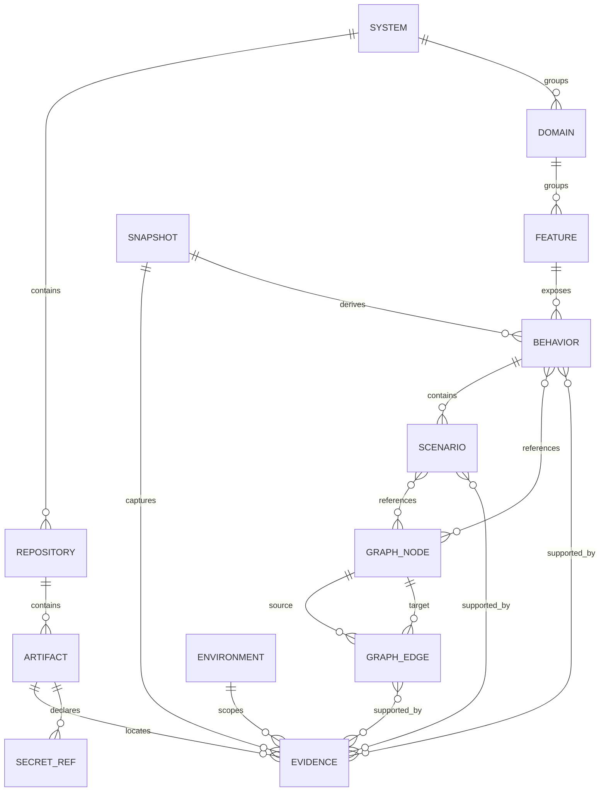
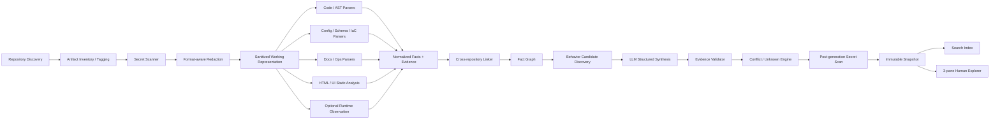
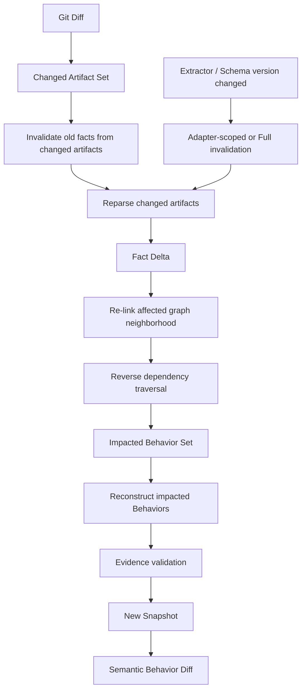
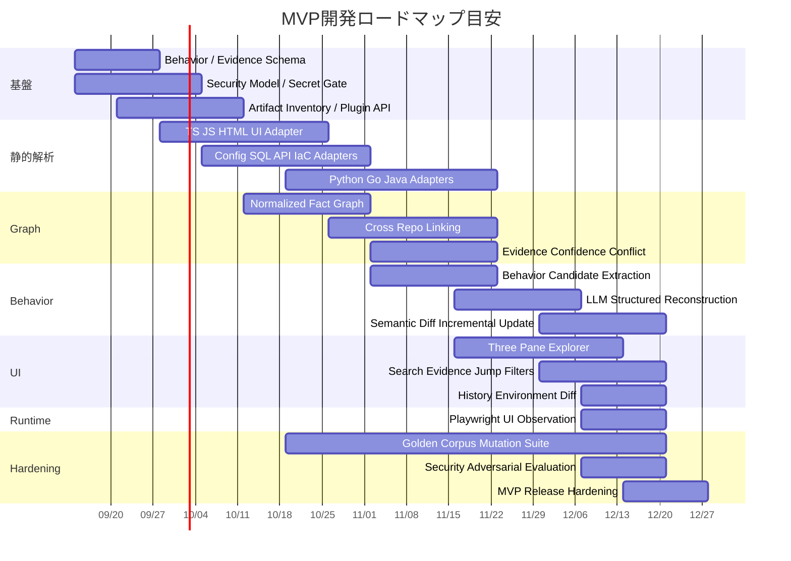

# 既存システム逆仕様化OSS 要件定義・調査報告書

## エグゼクティブサマリー

### 結論

本OSSの要件骨格は十分に成立している。実装上の中心思想は、**LLMにコードを読ませて仕様書を書かせることではなく、決定論的な解析器で既存システムから事実と関係を抽出し、そのEvidence付きFact Graphから人間向けBehavior Specificationを再構成すること**に置くべきである。

最終的なプロダクト定義は、次の一文に集約できる。

> **複数リポジトリ・複数技術・複数運用資産から、現在存在しているシステムの構造と振る舞いを復元し、人間が「このシステムは何を持ち、何をすると、どの条件で、どこへ流れ、何が起きるのか」を把握できるBehavior中心の仕様へ変換するOSS。**

これはUAT、QA、テスト生成、設計評価、要件生成を目的としない。対象システムが「正しいか」を判定するのではなく、**「実際にどうなっているか」を把握可能にする**ことだけを目的とする。

既存技術を見ると、基礎部品はかなり揃っている。JoernはAST・制御フロー・データフロー等をCode Property Graphへ統合する考え方を実用化しており、Tree-sitterは多数言語をインクリメンタルに構文解析できる。Kytheは生成コードを含むソース間の意味的リンクを扱い、Mooseはソフトウェア解析・メタモデル・可視化の先例になる。DoxygenやSourcetrailは「人間が既存コードを理解する」ための表示手法を示している。citeturn13search0turn13search1turn13search2turn14search0turn14search1turn14search2

特に2026年9月4日時点のEnolaは本構想にかなり近い。公開91 OSSリポジトリ、約44.8万の解析ファイル、約819万Fact、26言語タグでベンチマークし、91/91でcold/warmをまたいで同一`facts.jsonl`と`snapshot_id`を再現したと報告している。さらに複数リポジトリ間のルート解決や「解決できなかったリンク」自体をcoverageとして扱う設計を持つ。これは本OSSの**Fact Graph、snapshot、cross-repo linking、coverage accounting、determinism**に直接参考になる。citeturn13search3turn12search0

一方、本調査範囲で確認した既存ツールには、以下を一体として提供するものは見当たらない。これは各ツールの公式な対象範囲を比較した上での本調査の推論である。citeturn13search0turn13search3turn14search0turn14search1turn14search2turn16search6

**差別化の核は「Behavior + Evidence」である。**

```text
Existing System
    │
    ├─ Code
    ├─ Config
    ├─ Schema / Migration
    ├─ Tests
    ├─ IaC
    ├─ CI/CD
    ├─ HTML / UI
    ├─ API definitions
    ├─ Docs
    ├─ Runbook
    ├─ Monitoring
    └─ PR / Issue / History
          │
          ▼
   Secret Sanitization
          │
          ▼
 Deterministic Extraction
          │
          ▼
 Evidence-backed Fact Graph
          │
          ▼
 Cross-repository Linking
          │
          ▼
 Behavior Reconstruction
          │
          ▼
 System → Domain → Feature
        → Behavior → Scenario
          │
          ▼
 Human-readable Explorer
```

特に重要な設計判断は以下である。

| 原則 | 要件 |
|---|---|
| Executable Reality First | 現在の挙動はコード、実効Config、Schema、IaC等を一次情報とする |
| Evidence First | 原子的な仕様記述は必ずEvidence、またはINFERRED/UNKNOWN表示を持つ |
| Conflict Preserving | 不整合をLLMに丸めさせず、そのまま人間へ表示する |
| LLM Is Not Authority | LLMは分類・グルーピング・文章化に使うが、Factを創造する権限を持たない |
| Secret Before LLM | 秘密値はLLMへ渡る前に不可逆に取り除く |
| Coverage Is Explicit | 「読めなかったもの」を無かったことにしない |
| Snapshot Based | 同一入力から同一Fact Graphを再現し、変更はsnapshot間差分として扱う |
| Human Comprehension First | グラフそのものではなくBehavior仕様を主UIとする |

この構成は、1995年のSoftware Reflexion Modelsが示した「高レベルモデルと実ソースの一致・不一致を明示する」という思想とも整合する。同研究は、高レベルの理解モデルがソースと乖離する問題に対し、一致箇所と不一致箇所を明示することで既存システム理解を支援した。本OSSではこの思想を、コード対設計だけでなく、コード・UI・Config・DB・Ops・Docsを横断するBehavior単位まで拡張する。citeturn19search2turn19search3

**推奨MVPは「万能解析」を最初から目指さない。** 「全Artifactを必ずinventoryする」「対応できるものは深く解析する」「対応できないものはunsupportedとして明示する」の三段構成にする。Tier-1としてTypeScript/JavaScript、Python、Go、Javaと、HTML、SQL、YAML/JSON/TOML、Terraform/HCL、OpenAPI、GraphQL、Protocol Buffers、Markdownを推奨する。Tree-sitterやJoern、Enolaの既存エコシステムを見る限り、複数言語を共通Factへ正規化するアーキテクチャ自体は十分現実的である。citeturn13search0turn13search1turn13search3

## 類似OSSと研究動向

### 既存OSSの比較

本OSSを一つの既存製品のforkとして成立させるより、**Enola的Fact Graph、Joern的Program Graph、Kythe的provenance、Playwright的UI観測、Sourcetrail的探索UXを組み合わせ、Behavior層を独自に置く**方が設計として自然である。

| 候補 | License | 主な対象 | 強み | 弱み・本OSSとの差 | 関連度 |
|---|---|---|---|---|---|
| **Enola** | Apache-2.0 | multi-repo architecture intelligence / typed fact graph | 多言語Fact抽出、cross-repo解決、snapshot/diff、未解決linkのcoverage、再現性重視。本調査では最も近い。2026-09-04 benchmarkでは91 repo・約819万facts。citeturn13search3turn12search0 | 主眼はarchitecture/change intelligence。Behavior仕様、Evidence taxonomy、詳細なUI/Ops behavioral reconstructionは本OSSで追加が必要 | ★★★★★ |
| **Joern** | Apache-2.0 | 静的コード解析 / Code Property Graph | AST・control flow・data flow等を共通property graphへ統合し、複数言語に共通クエリを適用できる。citeturn13search0turn15search2 | セキュリティ/プログラム解析中心。Docs/Ops/UI/人間向けBehaviorは対象外 | ★★★★☆ |
| **Tree-sitter** | MIT | 構文解析 | concrete syntax treeを高速・incrementalに更新でき、構文エラーを含むソースにも強い。多数言語grammarが存在。citeturn13search1 | 構文木まで。call resolution、framework semantics、Behavior groupingは別途必要 | ★★★★★ |
| **Kythe** | Apache-2.0 | semantic code indexing / cross-reference | language-agnosticなindexing ecosystem。生成コードと生成元を`generates`等で関連付けるモデルが参考になる。citeturn13search2turn15search3 | build/extractor統合が重く、Behavior・Docs/Opsモデルではない | ★★★★☆ |
| **Moose** | MIT | software reverse engineering / analysis | import、parsing、modeling、measurement、querying、mining、interactive visualizationまで一体的に扱う。Famix系メタモデルも参考になる。citeturn14search0 | Pharo/Smalltalk系エコシステム色が強く、現代Web全体のBehavior reconstructionにはそのまま適用しにくい | ★★★☆☆ |
| **Doxygen** | GPL-2.0 | source documentation generator | 未documented codeからもentityを抽出し、cross-reference、call graph、dependency graph等を生成できる。citeturn14search1turn15search0turn15search1 | class/function/API構造中心。実行上の分岐、外部副作用、OpsなどBehavior全体は表現しない | ★★☆☆☆ |
| **Sourcetrail** | GPL-3.0、archived | interactive source explorer | 「知らないコードベースの探索」に特化したUX、オフライン動作、グラフとコードジャンプが参考になる。citeturn14search2 | 2021年にarchive。C/C++/Java/Python中心。仕様再構成はしない | ★★★☆☆ |
| **Semgrep CE** | LGPL-2.1 engine | pattern-based static analysis | 30以上の言語、決定論的rule engine、JSON/SARIF出力。framework-specific pattern extractorとして利用価値がある。citeturn14search3 | Behavior graphではない。ルールライセンスと製品機能の境界には注意が必要 | ★★★☆☆ |
| **Playwright** | Apache-2.0 | Web UI runtime observation | DOM/ARIA state、navigation、browser operation、network activity、traceを取得できる。UIの動的配線復元に強い。citeturn16search2turn16search5turn16search6turn16search9 | 実行可能Web環境が必要。探索操作には副作用・Credential露出のリスクがあるためoptional adapter向け | ★★★★☆ |
| **Daikon** | unrestricted/permissive | dynamic invariant detection | 実行時に値を観測し、「観測された実行で成立した性質」を抽出する。program understanding用途も明示されている。citeturn19search1 | 観測した経路しか証明できず、全システムの静的構造やUI/Opsを統合するものではない | ★★★☆☆ |

Enolaの最新benchmarkが示す設計上の重要なポイントは、**「解析成功数」だけでなく、何を見たか・何を読めなかったか・cross-repo linkの何件が解決できなかったかを測定対象にすること**である。同プロジェクトは入力をsnapshotとして扱い、同一入力に対するfactのbyte-level reproducibilityも検証している。本OSSも「解析器の賢さ」より先にこの再現性とcoverage accountingを採用すべきである。citeturn13search3

JoernのCode Property Graphも基礎設計として重要である。CPGはtyped node、labeled directed edge、key-value propertyから成るproperty graphであり、構文・制御フロー・データフローを単一表現に統合する。したがって本OSSではCPGをそのまま最終モデルにするのではなく、**CPG的な低層Fact Graphの上にUI、DB、Config、Queue、Infrastructure、Ops、Behaviorをoverlayとして追加する**のが自然である。citeturn13search0

### 学術研究から採用すべき考え方

Software Reflexion Modelsは、既存システムの高レベル理解において「不一致はノイズではなく情報である」とみなす思想を提供する。元研究では、エンジニアが高レベルモデルとソースのmappingを定義し、一致・不一致を計算した。後続研究では設計と実装のdriftを除去するのではなく、理解の材料として利用する点が強調された。これは今回の`CONFLICT`を消さない方針と極めて相性が良い。citeturn19search2turn19search3

GUI分野ではMemonらの「GUI Ripping」が、実行中GUIを自動巡回してwindow/widget/propertyを抽出し、GUI forestやevent-flow graphとして復元する方法を提示した。研究目的はテストだったが、**実行UIから画面要素と遷移可能性を復元する方法論そのもの**は今回の「HTMLだけでは見えない動的UI surface」を把握する上で有用である。UMDの研究ページでもWCRE 2003のGUI Ripping研究が確認できる。citeturn18search4turn18search6

Daikonの重要な教訓は、動的観測から得た情報を「一般的な真理」と混同しないことである。Daikon自身も、実行して値を観測し、**observed executionsにおいて真だったproperty**を報告するものとして説明している。したがって本OSSでPlaywright、trace、log、runtime instrumentationを導入しても、それは`OBSERVED`かつenvironment/path scopedなEvidenceとして扱い、未観測経路まで一般化してはならない。citeturn19search1

総じて、学術・OSSの既存研究から得られる設計原則は次である。

```text
Syntax/Program Analysis
        +
Semantic Cross-reference
        +
Runtime Observation
        +
Artifact Provenance
        +
Explicit Drift / Conflict
        ↓
Behavior Reconstruction
        ↓
Human Comprehension
```

本OSSの新規性は低層解析アルゴリズムそのものより、**この情報を「人間が現在のBehaviorを理解する」という一つの目的に統合するProduct ModelとUI**にある。

## プロダクト要件とデータモデル

### 規範的なプロダクト要件

「何でも解析する」は、実装上「何でも完全に理解する」にはできない。そのため要件は、**全Artifactをinventory対象とし、各Artifactについて`PARSED / PARTIAL / UNSUPPORTED / IGNORED / ERROR`の状態を必ず残す**と定義する。何も表示されないことと「解析対象外だったこと」を区別する。

| ID | 要件 |
|---|---|
| CORE-HUMAN | 本システムの唯一の最終目的は、既存プロダクトの現在の構造・機能・振る舞いを人間が把握できる状態にすることである |
| SCOPE-ALL | monorepo・複数repoの双方に対応し、code、test、config、schema、DB migration、IaC、CI/CD、HTML/UI、API schema、docs、ops、monitoring等をinventoryする |
| SOURCE-FIRST | 現行BehaviorはExecutable/Effective Sourceを一次資料とし、PR/Issue/docs/runbook等を二次資料、LLMをInferenceとする |
| CONFLICT-PRESERVE | Evidence間の矛盾を自動的に一つへ統合してはならない |
| COVERAGE-VISIBLE | 全artifactについて解析可否・coverage・error・unsupportedを明示する |
| SECRET-GATE | 秘密値はLLM、Fact Store、検索index、exportへ到達する前にredactする |
| UI-SURFACE | page、route、component、form、field、button、visibility、validation、API call、navigationを可能な限り復元する |
| DYNAMIC-INFER | DI、reflection、generated code、dynamic routing等の静的確定不能edgeは推論可能だがEvidenceとconfidenceを必須とする |
| SNAPSHOT | 解析結果はsnapshotとして保存し、同一input/config/extractor versionから再現可能でなければならない |
| INCREMENTAL | git diffから影響GraphとBehaviorを求め、局所的な変更では対象Behaviorのみ再解析できること |
| TRACEABILITY | 仕様の原子的claimはEvidenceRefまたは明示的`INFERRED`/`UNKNOWN`を持つ |
| NO-AUTHORITY-LLM | LLM出力だけを根拠にFACT/OBSERVEDを生成してはならない |
| NO-AUTO-DESIGN | 要求、設計、実装改善案を自動決定する機能を本体責務に含めない |
| NO-AUTO-WRITE | 解析結果を理由に自動的にソースコードや設定を変更しない |

Evidence provenanceの概念は、W3C PROVがEntity・Activity・Agentおよび`wasDerivedFrom`等の関係を標準化している思想が参考になる。また外部ツール連携を考えるなら、static analysis結果の交換形式として標準化されているSARIFをEvidence export adapterの候補にできる。citeturn17search1turn20search2turn20search4

### Behaviorの粒度

トップレベルの固定階層は以下とする。

```text
System
└── Domain
    └── Feature
        └── Behavior
            └── Scenario
                └── Evidence
```

`Behavior`は「ユーザーが押したボタン」に限定しない。

Behaviorの起点候補は、UI action、HTTP/gRPC/API request、CLI command、cron/job、queue/event、webhook、file watcher、startup event、internal scheduled taskなどである。

例えば、

```text
Feature: 注文
└── Behavior: 注文をキャンセルする
    ├── Scenario: 正常キャンセル
    ├── Scenario: 権限不足
    ├── Scenario: 既に発送済み
    ├── Scenario: 在庫戻し失敗
    └── Scenario: 外部決済refund timeout
```

のように分解する。

DomainやFeatureの名称は、コード上に明示されていない場合がある。その場合LLMによるgrouping/namingを許すが、**Domain名そのものを`INFERRED`として保持し、抽出したFactを書き換えない**ことが必要である。

### Behavior Schema

最も重要な構造上の要件は、**Behavior全体だけでなく、各field・各flow step・各branchにもEvidenceを付けること**である。

```yaml
Behavior:
  id: BehaviorId
  system_id: SystemId
  domain_id: DomainId
  feature_id: FeatureId

  title: string
  summary: Claim<string>

  trigger:
    - Claim<Trigger>

  actors:
    - Claim<Actor>

  preconditions:
    - Claim<Condition>

  inputs:
    - Claim<InputSpec>

  validation:
    - Claim<ValidationRule>

  authorization:
    - Claim<AuthorizationRule>

  main_flow:
    - FlowStep

  branches:
    - BranchSpec

  state_transitions:
    - Claim<StateTransition>

  outputs:
    - Claim<OutputSpec>

  side_effects:
    - Claim<SideEffect>

  external_calls:
    - Claim<ExternalCall>

  error_behavior:
    - Claim<ErrorBehavior>

  retry_timeout:
    - Claim<ResilienceRule>

  idempotency:
    - Claim<IdempotencyRule>

  concurrency:
    - Claim<ConcurrencyRule>

  persistence:
    - Claim<PersistenceOperation>

  observability:
    - Claim<ObservabilityRule>

  recovery:
    - Claim<RecoveryProcedure>

  environment_differences:
    - EnvironmentDiff

  scenario_ids:
    - ScenarioId

  evidence_refs:
    - EvidenceId

  status: NORMAL | PARTIAL | CONFLICT | UNKNOWN

  confidence:
    score: float | null
    band: HIGH | MEDIUM | LOW | VERY_LOW | UNKNOWN
    basis: string

  snapshot_id: SnapshotId
```

共通`Claim<T>`は次のようにする。

```yaml
Claim:
  value: T

  evidence_refs:
    - EvidenceId

  evidence_type:
    - FACT | DOC | OPS | INFERRED | CONFLICT | UNKNOWN

  observation_mode:
    OBSERVED | DECLARED | INFERRED

  confidence:
    score: float | null
    band: HIGH | MEDIUM | LOW | VERY_LOW | UNKNOWN

  environment_scope:
    - EnvironmentId

  status:
    NORMAL | CONFLICT | UNKNOWN
```

`FlowStep`は文章ではなく構造として持つ。

```yaml
FlowStep:
  id: FlowStepId
  order: integer

  kind:
    UI_ACTION |
    CALL |
    VALIDATE |
    AUTHORIZE |
    READ |
    WRITE |
    EMIT |
    CONSUME |
    WAIT |
    BRANCH |
    RETURN |
    ERROR |
    NAVIGATE

  subject_ref: GraphNodeId
  object_ref: GraphNodeId | null

  description: string

  evidence_refs:
    - EvidenceId

  confidence: Confidence
```

こうしておけば、

```text
「注文作成」
```

という一枚の文章ではなく、

```text
Button
  ↓
React handler
  ↓
POST /orders
  ↓
Controller
  ↓
Auth guard
  ↓
Service
  ├─ DB INSERT
  ├─ Event emit
  └─ Queue enqueue
```

をEvidence付きのBehaviorへ投影できる。

### EvidenceとArtifact

Evidenceにはソース本文全体を複製する必要はない。最低限、出所を再現できるpointerを保持する。

```yaml
Evidence:
  id: EvidenceId

  repository_id: RepositoryId
  artifact_id: ArtifactId
  commit: string

  path: string

  region:
    start_line: integer | null
    end_line: integer | null
    start_column: integer | null
    end_column: integer | null
    symbol: string | null

  source_priority:
    PRIMARY | SECONDARY | INFERENCE

  evidence_type:
    FACT | DOC | OPS | INFERRED

  observation_mode:
    OBSERVED | DECLARED | INFERRED

  environment_id: EnvironmentId | null

  extractor:
    name: string
    version: string

  sanitized: true

  sanitized_excerpt: string | null
```

Locationとartifact provenanceを第一級データとして扱う設計は、Kytheがsource anchorやgenerated-code mappingを位置情報として保持する考え方、W3C PROVのderivationモデルと整合する。citeturn13search2turn17search1

### Graph Schema

GraphはBehavior生成の中間表現であり、**最終UIの中心ではない**。

主要Nodeは以下とする。

```text
System
Repository
Artifact
Symbol
Module
UIPage
UIComponent
UIElement
Endpoint
Command
Job
Event
Queue
DataEntity
DataStore
ConfigKey
FeatureFlag
AuthorizationRule
ExternalSystem
Environment
Behavior
Scenario
Evidence
SecretRef
```

主要Edgeは以下とする。

```text
CONTAINS
DECLARES
IMPORTS
CALLS
HANDLES
ROUTES_TO
NAVIGATES_TO
READS
WRITES
VALIDATES_WITH
AUTH_GUARDED_BY
EMITS
CONSUMES
SENDS_TO
CONFIGURED_BY
DEPLOYED_AS
GENERATED_FROM
OBSERVED_IN
EVIDENCED_BY
DERIVED_FROM
CONFLICTS_WITH
AFFECTS
```

JoernのCPGがtyped nodes、directed labeled edges、propertiesを使って異なるprogram representationを統合しているため、本OSSでもproperty graph的構造を採用する合理性は高い。生成コードについてはKytheのsource/generated mappingが直接参考になる。citeturn13search0turn13search2

Edgeには必ず次のmetadataを持たせる。

```yaml
GraphEdge:
  id: EdgeId
  source: GraphNodeId
  target: GraphNodeId
  type: EdgeType

  resolution:
    DETERMINISTIC | RUNTIME_OBSERVED | HEURISTIC | LLM_INFERRED

  evidence_refs:
    - EvidenceId

  confidence: Confidence

  environment_ids:
    - EnvironmentId

  extractor:
    name: string
    version: string

  first_seen_snapshot: SnapshotId
  last_seen_snapshot: SnapshotId
```

ERの概念構造は以下になる。



GraphとBehaviorを分離する理由は、同一Fact Graphから異なる人間向けviewを生成できるからである。

```text
Fact Graph
   ├── Behavior View
   ├── UI Wiring View
   ├── Data View
   ├── API View
   ├── Environment View
   └── Change Impact View
```

これによって将来別用途が増えても、Behavior本体を破壊せずに済む。

## 解析パイプラインとEvidence設計

### 全体パイプライン

解析順は**LLM-firstではなくParser-first**とする。



Tree-sitterはsource editに応じてsyntax treeを効率的に更新するincremental parserとして設計されているため、言語横断の第一段parserに適する。一方、Tree-sitterだけではsemantic resolutionが足りないため、framework adapter・compiler API・Joernのようなprogram-analysis frontendを併用する。citeturn13search1turn13search0

### Artifact分類

全ファイルを最初に以下へ分類する。

| Tag | 例 |
|---|---|
| CODE | `.ts`, `.go`, `.py`, `.java`, `.cpp` |
| UI | HTML, JSX/TSX, Vue/Svelte templates, CSS |
| TEST | unit/integration/E2E |
| CONFIG | JSON/YAML/TOML/env schema |
| SCHEMA | SQL/schema/migration |
| INFRA | Terraform/HCL, Docker, Kubernetes |
| CI_CD | GitHub Actions等 |
| API_SPEC | OpenAPI, GraphQL, Proto |
| DOC | Markdown, AsciiDoc |
| OPS | runbook、operational procedure |
| MONITORING | alert、dashboard definition、metrics config |
| GENERATED | generated source |
| BINARY | binary artifact |
| UNKNOWN | 未分類 |

「任意のプロダクト」を対象にする以上、unsupported artifactが生じること自体を失敗とはしない。**黙って落とすことを失敗とする。**

例えば、

```text
Artifacts: 12,842

PARSED       11,972
PARTIAL         391
UNSUPPORTED     284
IGNORED         173
ERROR            22
```

を常に表示できるようにする。この方向性はEnolaがparsed/seen数やcross-repo missesを明示的にbenchmarkしている思想と一致する。citeturn13search3

### 初期対応言語・framework

製品仕様として対応言語を固定する必要はない。parser/plugin interfaceを第一級仕様とし、その上でMVPだけ以下を推奨する。

| Tier | 対応候補 | 理由 |
|---|---|---|
| Universal | Git、HTML、Markdown、JSON、YAML、TOML、XML、SQL、Shell、Dockerfile | システム横断で頻出する構造・設定情報を取れる |
| Tier-1 Code | TypeScript / JavaScript | FEとNode系Backendを一本で追跡しやすい |
| Tier-1 Code | Python | Web/API/automation系に対応 |
| Tier-1 Code | Go | API・service・infra tool群に対応 |
| Tier-1 Code | Java | Spring等の大規模Backendを対象化 |
| Tier-1 Contracts | OpenAPI / GraphQL / Protocol Buffers | repo間リンクの強いAnchorになる |
| Tier-1 Infra | Terraform/HCL、Kubernetes manifests | 実際の配線・environmentを理解するため |
| Tier-2 | C/C++、C#/.NET、Rust、Kotlin、Ruby、PHP、Swift、Dart等 | pluginとして段階投入 |

Tree-sitterは多数言語のparsing infrastructureを提供し、JoernもC/C++、Java、JavaScript、Python、Kotlin等をCPGへ変換する。Enolaの2026年benchmarkもC/C++、C#、Dart、Go、HCL、Java、Kotlin、Python、Rust、SQL、Swift、TypeScript、OpenAPI、gRPC等を含む26タグを扱っているため、多言語正規化自体を根本的リスクとみなす必要はない。ただし**各frameworkのsemantic adapter品質**が実際のボトルネックになる。citeturn15search2turn13search3turn13search1

### HTML/UI Surface解析

静的UI adapterは少なくとも次を抽出する。

```text
Page
├── Route
├── Component
├── Form
│   ├── Field
│   ├── Validation
│   └── Submit handler
├── Button
├── Link
├── Visible state
├── Hidden/conditional state
├── Authorization guard
├── API call
└── Navigation
```

具体的には、

```html
<form action="/api/orders" method="post">
  <input name="quantity" min="1" max="20" required>
  <button type="submit">注文する</button>
</form>
```

から、

```text
UIPage
  └─ contains → Form
       ├─ input → quantity
       ├─ validates → required
       ├─ validates → 1 <= quantity <= 20
       └─ submits → POST /api/orders
```

を生成する。

React等ではDOMだけでなくJSX conditional rendering、router definitions、event handler、fetch/Axios等のcall siteを結び、

```text
<Button onClick={handleCancel}>
        │
        ▼
handleCancel()
        │
        ▼
api.post("/orders/" + id + "/cancel")
        │
        ▼
POST /orders/:id/cancel
```

を構築する。

静的解析だけでは認証後の表示、runtime-generated component、remote config、client-side routing等を取り切れないため、optional dynamic adapterとしてPlaywrightを採用する価値が高い。PlaywrightはARIA snapshotでrole、attribute、accessible name等を構造化して取得でき、traceではDOM snapshotやnetwork activityを記録できる。citeturn16search2turn16search5turn16search6turn16search9

ただしruntime UIから得た情報には必ず、

```yaml
observation_mode: OBSERVED
environment: staging
visited_state: authenticated-user
```

のようなscopeを付ける。未訪問stateを「存在しない」と判定しない。この原則は、Daikonが動的解析結果を「observed executionsで成立した性質」と明確に限定していることとも整合する。citeturn19search1

### LLMを使ってよい場所

LLMは三箇所に限定するのが安全である。

**Behavior reconstruction**では、Fact Graphのsubgraphを入力し、

```text
Trigger
Actor
Preconditions
Main Flow
Branches
...
```

へ整理する。

**Domain / Feature grouping**では、package構造やroute、entity、docs等から人間向け分類名を生成する。ただし明示的domain metadataが存在しない場合は`INFERRED`。

**Behavior Query**では、

> 「注文キャンセル後に在庫はどこで戻される？」

をstructured graph queryへ変換する。

逆に、以下にはLLMを使わない。

```text
Raw source parsing
Secret removalの唯一の防御
Source authorityの決定
FACT認定
Git diff計算
Evidence location生成
Snapshot ID生成
Arbitrary code execution
```

LLM出力はJSON Schema等で拘束し、

```json
{
  "claim": "在庫が1件戻される",
  "evidenceRefs": ["ev_107", "ev_108"]
}
```

のように**claimとEvidenceを同時出力させる**。EvidenceRefが存在しないclaimは、validatorが`FACT`化を拒否する。

さらに安定性のため、

```text
sanitized evidence bundle hash
+ model identifier
+ prompt version
+ schema version
```

をcache keyとし、同一inputでは再生成せずcanonical outputを再利用する。

### Evidence Taxonomy

Evidenceには二つの独立軸を持たせる。

**「どんな根拠か」軸**

| Type | 意味 | 例 | 現行仕様への扱い |
|---|---|---|---|
| `FACT` | Primary/effective sourceまたは直接観測から抽出 | validator、route、DB constraint、effective config | 現行Behaviorの中心 |
| `DOC` | 文書・PR・Issue等の説明 | README、design doc、PR rationale | 補足・背景 |
| `OPS` | 人間向け運用情報 | runbook、manual recovery instruction | 運用Behaviorの補足 |
| `INFERRED` | heuristic/LLMによる推論 | DIの候補binding | 推論表示必須 |
| `CONFLICT` | 同一predicateに非互換なEvidenceが存在 | code=25 / README=30 | conflict meta-state |
| `UNKNOWN` | 必要な情報を確定できない | retry count不明 | 空欄ではなく明示 |

実行可能なmonitor rule、deployment config、IaCは「運用領域」でも`OPS`ではなく`FACT`でよい。`OPS`は主にrunbook等の**宣言的な人間向け運用資料**を指す。

**「どのように分かったか」軸**

| Mode | 意味 |
|---|---|
| `OBSERVED` | 実装・effective config・runtimeから直接観測した |
| `DECLARED` | test、schema contract、document等が「そうあるべき」と宣言している |
| `INFERRED` | relationまたは意味を解析器/LLMが推論した |

例えば、

```text
validator.ts:
MAX_WEIGHT = 25
```

なら、

```text
FACT + OBSERVED
```

である。

```text
expect(overweight(26)).toFail()
```

なら、

```text
FACT + DECLARED
```

とする。

```text
README:
最大30kg
```

なら、

```text
DOC + DECLARED
```

である。

### Code-first Authority

Source優先順位は次とする。

```text
P1: Executable / Effective Reality
    code
    effective config
    schema
    migration
    IaC
    authorization policy
    routes
    feature flags
    tests
    runtime observation

P2: Secondary Context
    README
    design docs
    runbook
    PR
    issue
    Git history

P3: Inference
    deterministic heuristic
    LLM inference
```

ただしP1内でも**「より実効的で具体的なもの」**を優先する。

例えば、

```text
source default:
TIMEOUT = 30

production:
TIMEOUT=120
```

でproduction bindingまで証明できたなら、

```text
Common/default: 30 sec
Production:     120 sec
```

と表示する。

これは矛盾ではなくenvironment differenceである。

一方、

| Evidence | 表示 |
|---|---|
| code = 25 / README = 30 | Current = 25。`CONFLICT`表示、README 30も残す |
| implementation = 25 / test expects 30 | Current = 25。Primary同士の不一致として強い`CONFLICT` |
| Service A code = 25 / Service B code = 30、同一env/path | `CONFLICT`。control flowが決められなければcurrentを断定しない |
| production env = 30 / default code = 25 | environment differenceとして分離 |
| code = 25 / LLM = 30 | 25。推論をcurrentへ採用しない |
| Evidenceなし | `UNKNOWN` |

Software Reflexion Modelsが一致と不一致の両方を理解材料として示したように、**Conflict BadgeはConfidenceが高くても消してはならない**。citeturn19search2turn19search3

### Confidence算定

LLM自身に「自信度を0〜1で出して」と頼む方式は採用しない。Confidenceは**Evidence構造から機械的に計算するEvidence Support Score**とする。

これは確率ではなく、

> 「このclaimを現在の挙動として表示するのに、どれほど直接的・高品質・環境一致したEvidenceが存在するか」

の指標と定義する。

各Evidence `e`について、

\[
p_e = B_e \times A_e \times D_e \times Q_e \times M_e
\]

とする。

推奨初期値は以下。

| Factor | 値の例 |
|---|---:|
| direct implementation / effective config | Base `0.98` |
| direct runtime observation | `0.95` |
| test assertion | `0.90` |
| executable monitoring / CI rule | `0.90` |
| runbook | `0.70` |
| README / design document | `0.65` |
| PR / Issue | `0.60` |
| LLM inference | `0.50` |

Authority multiplier `A`：

```text
P1 = 1.00
P2 = 0.65
P3 = 0.40
```

Directness `D`：

```text
direct extraction         1.00
deterministic cross-link  0.95
heuristic link            0.75
multi-hop inference       0.60
```

Extractor quality `Q`はgolden datasetから測定したparser精度を入れる。未評価adapterは安全側に`0.80`程度から開始する。

Environment match `M`：

```text
exact environment  1.00
common/global       0.90
environment unknown 0.80
different env       0.50
```

同じartifactから同じ事実を10箇所抽出してconfidenceを不当に上げないため、Evidence Family単位で最大値だけを採用する。

supportを、

\[
S = 1 - \prod_i (1-p_i)
\]

とする。

contradictory Evidenceについて、

\[
K = 1 - \prod_j (1-p_j)
\]

を求める。

最終scoreは、

\[
C = S(1-rK)
\]

とする。

`r`はcontradiction authorityに依存させる。

```text
Primary vs Primary     r = 0.80
Secondary vs Primary   r = 0.25
Inference vs Primary   r = 0.10
```

つまりREADMEがコードと違うだけでコード事実のconfidenceを壊滅させないが、**同一実行経路のPrimary Source同士が食い違った場合は大きく下げる**。

bandはMVPでは、

```text
HIGH       >= 0.90
MEDIUM     >= 0.75
LOW        >= 0.50
VERY_LOW   <  0.50
UNKNOWN    evidenceなし
```

を初期値とし、後述のgolden corpusでcalibrationする。

さらに、

> **Inferenceだけで成立するclaimは0.79を上限とする**

というhard capを設ける。

これによりLLMがどれほどもっともらしく説明しても`HIGH`にはならない。

### Incremental Update

差分更新は単純な「changed fileだけ再parse」では不十分である。route root、dependency injection config、path alias、schema等を変えると、変更されていない大量ファイルのlink結果が変わるからである。

更新処理は以下とする。



各adapterには、

```text
FILE
MODULE
REPOSITORY
CLUSTER
GLOBAL
```

の`invalidation_scope`を宣言させる。

例えば、

```text
関数本体変更       → FILE/MODULE
tsconfig path alias → REPOSITORY
root route mount    → REPOSITORY/CLUSTER
cluster mapping     → CLUSTER
Graph schema変更    → GLOBAL
```

とする。

Enolaがsnapshotを「比較可能なvalue」として扱い、cold/warmのcache状態が結果に影響しないことを検証している点は、ここで非常に良い参照になる。citeturn13search3

## UI/UX仕様

### UIの設計目的

成果物の中心はGraphではない。

ユーザーが知りたいのは、

> 「この処理はどう動く？」

であって、

> 「このgraphには2万個nodeがあります」

ではない。

したがって主画面は3ペインとする。

```text
┌────────────────────┬────────────────────────────────────┬────────────────────────┐
│ System Navigation  │ Behavior Specification             │ Evidence               │
│                    │                                    │                        │
│ Search             │ 注文キャンセル                     │ FACT / OBSERVED        │
│                    │                                    │                        │
│ System             │ Summary                            │ order_service.ts       │
│ ├─ Order           │ Trigger                            │ L182-L224               │
│ │  ├─ Create       │ Actor                              │                        │
│ │  ├─ Cancel ◀     │ Preconditions                      │ [Open source]          │
│ │  └─ Refund       │ Inputs                             │                        │
│ ├─ Inventory       │ Authorization                      │ Related evidence       │
│ └─ Payment         │ Main Flow                          │ test/...               │
│                    │ Branches                           │ docs/...               │
│ Filters            │ State transitions                 │                        │
│ ☑ Conflict         │ Side effects                      │ Confidence             │
│ ☑ Unknown          │ Retry / Timeout                   │ 0.96 HIGH              │
│ env: production    │ Observability                      │                        │
│                    │ Recovery                           │ Conflict               │
│ History            │ Environment differences           │ README says ...        │
└────────────────────┴────────────────────────────────────┴────────────────────────┘
```

中央は**静的で読むことに集中できる仕様書**とする。

アニメーションは背景、Graph、selection transition等に限定する。本文の文字、Evidence、diff内容を常時動かさない。

### Behavior Detail View

Behavior表示順は、人間が「何が起きるか」を追う認知順に合わせる。

```text
概要
  ├ Trigger
  ├ Actor
  └ Preconditions

入力とGuard
  ├ Inputs
  ├ Validation
  └ Authorization

処理
  ├ Main Flow
  ├ Branches
  └ State Transitions

結果
  ├ Outputs
  ├ Side Effects
  ├ Persistence
  └ External Calls

実行特性
  ├ Retry / Timeout
  ├ Idempotency
  └ Concurrency

運用
  ├ Observability
  └ Recovery

差分
  └ Environment Differences

根拠
  ├ Evidence
  ├ Conflict
  └ Unknown
```

Behaviorの冒頭では少なくとも、

```text
Current behavior: Code-first
Confidence: HIGH 0.94
Evidence: 17
Conflicts: 1
Unknowns: 2
Environment: production
Snapshot: abc123
```

を表示する。

### Evidence Panel

Evidenceクリック時は、

```text
order_service.ts
commit: a7c9...
lines: 183–196

Source class:
PRIMARY

Evidence:
FACT / OBSERVED

Extractor:
typescript-service-adapter@0.4.1

Environment:
common

Sanitized:
yes
```

と表示し、その下に秘密値を除去済みの最小snippetを置く。

```ts
if (order.status === "shipped") {
  throw new OrderCannotBeCancelledError();
}
```

さらに、

```text
Behavior
→ FlowStep 4
→ Service.cancel()
→ order.status guard
→ order_service.ts:183
```

という証拠経路を表示すると、人間が「AIが言っている」ではなく「なぜこの記述になったか」を確認しやすい。

### Search

検索は三層にする。

**Exact/Search**：

```text
cancelOrder
POST /orders/:id/cancel
orders.status
```

**Structured Search**：

```text
type:CONFLICT
env:production
repo:payment-service
actor:admin
evidence:INFERRED
unknown:true
```

**Behavior Query**：

```text
注文をキャンセルしたら在庫はどこで戻る？
```

この質問はLLMが直接回答を創作せず、

```text
question
  ↓
entity/intent extraction
  ↓
Behavior / Fact Graph retrieval
  ↓
evidence bundle
  ↓
answer generation
```

とする。

回答例：

```text
注文キャンセル後、InventoryService.restore() が呼ばれ、
inventory_items.reserved_count が更新されます。

ただし payment refund が失敗した場合にも在庫戻しが実行されるかは
静的解析のみでは確定できません。

[FACT] OrderService.cancel → InventoryService.restore
[FACT] InventoryService.restore → inventory_items UPDATE
[UNKNOWN] refund failure branch
```

この「答えられない箇所をそのままUNKNOWNにする」ことが主要UX要件である。

### Semantic Diff

diffは生成文章のword diffを主にしない。

```diff
Behavior: Cancel Order

Validation
- cancellable status: pending, paid
+ cancellable status: pending, paid, preparing

Retry
- Payment refund: 3 attempts
+ Payment refund: 5 attempts

Side Effects
+ Event: OrderCancellationRequested

Environment
+ production timeout: 15s
```

のように**Behavior Schemaのfield差分**を表示する。

その変更の右側に、

```text
Changed evidence:
refund_client.ts:81
production.yaml:44
```

を置く。

これによってLLMの言い回しが変わっただけのdiffを抑制できる。

### Environment Diff

環境差は別tableとする。

| Property | Common | Dev | Staging | Production |
|---|---|---|---|---|
| Retry | 3 | 3 | 3 | 5 |
| Timeout | 30s | 5s | 10s | 30s |
| feature `refund_v2` | — | on | on | off |
| Endpoint | `/refund` | local | staging API | production API |

Environmentが不明なFactを勝手にproductionへ帰属させない。

### Graph表示

Graphはsecondary viewとする。

Behaviorを開いた状態で、

```text
UI Button
   ↓
Frontend handler
   ↓
POST /orders/:id/cancel
   ↓
Controller
   ↓
Policy
   ↓
Service
   ├── DB
   ├── Inventory API
   └── Payment API
```

だけをcontextual graphとして出し、巨大な全システムgraphを最初から見せない。

React Flowはnode-based UIを構築するオープンソースのReact componentとして提供され、pan/zoom等のinteractive graph用途に向くため、本用途のGraph部にはThree.jsより適切である。citeturn16search3

推奨stackは、

```text
Next.js
React
Tailwind CSS
React Flow
React Three Fiber: optional
```

とする。Next.jsはReactベースでroutingやclient/server renderingを提供し、Tailwindはutility classでUIを構築できるため、explorer系アプリの実装速度を上げやすい。citeturn20search0turn20search1

React Three Fiberは**装飾のみ**とする。

```text
許可:
- 背景の粒子
- graph background
- loading visualization
- node focus transition

禁止:
- Behavior本文が常に動く
- Evidenceがfloatingする
- 読んでいるlineが移動する
- animationしないと情報が分からない
```

今回のプロダクトでは「おしゃれさ」より、**「どこを見れば事実と推論を区別できるか」がUI品質を決める**。

MVPのDOM構造はこれくらい単純でよい。

```html
<div class="grid h-screen grid-cols-[280px_minmax(0,1fr)_420px]">
  <aside aria-label="System navigation">
    <!-- System → Domain → Feature → Behavior -->
  </aside>

  <main class="overflow-y-auto">
    <article data-behavior-id="order.cancel">
      <!-- Static behavioral specification -->
    </article>
  </main>

  <aside aria-label="Evidence">
    <!-- Evidence / confidence / conflict -->
  </aside>
</div>
```

Tailwindはmarkup内でsingle-purpose utilityを組み合わせる設計を公式に採っており、このような固定explorer layoutを比較的直接的に表現できる。citeturn20search1

## セキュリティとプライバシー

### Security Goal

今回の目的は「解析結果が漏洩しても無害にする」ことではない。システム構造そのものが機密情報になり得るため、それは不可能である。

目的は明確に、

> **解析DB・Fact Graph・Behavior仕様・LLM cache・exportが漏洩しても、それ単体から即座に外部サービスへ認証可能なCredentialを取得できないようにし、攻撃者の利用開始までの摩擦を増やし、Blast Radiusを低減する。**

とする。

OWASPのSecrets Management guidanceも、秘密情報についてblast radiusを小さくし、secret extractionを監視し、不要に広い共有Credentialを避けることを推奨している。citeturn17search0

### Threat Model

| Threat | 例 | 必須Control |
|---|---|---|
| Raw source secret | API key、password、private key | LLM前redaction |
| Git history secret | 過去commitに削除済みkey | historyもredaction後のみ解析 |
| UI runtime secret | Authorization header、cookie、hidden field | network/DOM sanitizer |
| Prompt/cache leak | LLM prompt cacheにkey | sanitized representationのみcache |
| Output echo | LLMがsecret様文字列を生成 | post-generation scanner |
| Prompt Injection | READMEに「前の命令を無視して…」 | sourceをuntrusted dataとして扱う |
| Malicious build script | `npm install`等で任意code実行 | defaultではproject codeを実行しない |
| Runtime crawler side effect | 削除/支払いボタンを押す | dynamic explorationはexplicit opt-in |
| Graph leakage | internal endpoint/secret nameが露出 | derived DBをsensitive asset扱い |
| Plugin compromise | parser adapterが外部通信 | sandbox/egress control |

LLMに外部文書やWeb/ファイルを読み込ませる場合、OWASPはindirect prompt injectionを主要リスクとして挙げている。したがってREADME、コメント、HTML、Issueの文章は**命令ではなく解析対象data**として扱い、LLMにshell/network/write権限を与えない。citeturn16search1

### Secret Sanitization

処理順を以下から変更してはならない。

```text
RAW SOURCE
    ↓
Secret Detection
    ↓
Secret Classification
    ↓
Format-preserving Redaction
    ↓
SANITIZED SOURCE
    ↓
Parser / LLM / Graph
```

つまり、

```text
LLM
↓
「秘密らしいので後で消す」
```

は禁止である。

検出対象は最低限、

```text
API keys
Passwords
Access tokens
Refresh tokens
Private keys
Secret keys
Connection credentials
Authorization headers
Cookies / session tokens
Signed URLs / credentials
Cloud credentials
Database connection strings
```

とする。

Gitleaksはpassword、API key、token等をGit repository、file、stdinから検出するOSSであるため、一つのdetector候補になる。ただし同プロジェクトは現在「feature completeで今後はsecurity patches中心」と明記しているため、detector interfaceは抽象化し、Gitleaks固定依存にはしない方がよい。citeturn17search2

推奨方式は複数層である。

```text
Detector A: Known token formats
Detector B: Config-key semantics
Detector C: Entropy / heuristic
Detector D: PEM/private-key structure
Detector E: Framework-aware credentials
```

redactionは、

```text
PAYMENT_API_KEY="sk-actual-secret..."
```

を、

```text
PAYMENT_API_KEY="__SECRET_REF_sec_0193__"
```

へ変換する。

Graphには、

```yaml
SecretRef:
  id: sec_0193
  name: PAYMENT_API_KEY
  kind: API_KEY

  defined_at:
    artifact: deployment.yaml
    line: 42

  consumers:
    - payment-service
    - refund-worker

  environments:
    - production
```

まで保存できる。

**保存してはいけないもの：**

```yaml
value: prohibited
raw_hash_of_value: prohibited
encrypted_value: prohibited
llm_embedding_of_value: prohibited
```

特にraw secretのhashをIDとして利用しない。低entropy passwordではdictionary attackの補助情報になり得るため、SecretRef IDは**location + project-local random saltなどから作り、secret value由来にしない**。

### 保存ルール

| 対象 | 保存 |
|---|---|
| Secret名 | 可 |
| Secret種類 | 可 |
| 定義location | 可 |
| consumer | 可 |
| environment | 可 |
| secret literal | **不可** |
| secretのhash | **不可** |
| secretを含むraw snippet | **不可** |
| secretを含むLLM prompt | **不可** |
| secretを含むembedding | **不可** |
| sanitized excerpt | 可 |
| detector rule ID | 可 |

秘密情報がlogへ流れないようにする思想はOWASP Secrets Management guidanceとも一致する。citeturn17search0

### UI runtimeの追加対策

Playwrightのtraceはbrowser operation、DOM snapshot、network activityを保持できるため、理解には非常に強力な反面、Credentialを取得しやすい場所でもある。citeturn16search6turn16search9

そのため以下をredaction対象とする。

```text
Authorization
Proxy-Authorization
Cookie
Set-Cookie
query parameters
request/response bodies
localStorage
sessionStorage
hidden input
form values
DOM text matching secret rules
```

ScreenshotについてはMVPでは**persistent captureをデフォルトOFF**とする。画面上にtokenや個人情報が表示される可能性があり、pixel dataは通常のtext sanitizerでは確実に消せないからである。

dynamic analysis自体も、

```text
OFF by default
```

にする。

有効化する場合は、

```text
isolated container
read-only source mount
no production credentials
restricted filesystem
egress deny-by-default
explicit environment
```

を推奨する。

Playwright自体はnetwork activityやDOM/ARIA stateを豊富に取得できるため、ここは「解析能力不足」ではなく「どこまで実行するか」のsecurity boundaryである。citeturn16search5turn16search6

### 二重Secret Gate

生成直前にももう一度scannerを通す。

```text
Sanitized Input
   ↓
LLM
   ↓
Generated Behavior
   ↓
Secret Scanner 2
   ↓
PASS → storage/UI/export
FAIL → block + security event
```

つまり安全条件は、

> **秘密を見つけたら隠す**

ではなく、

> **秘密らしい値が最終境界を越えたら処理をfail closedする**

とする。

### PR・Issue・Git History

初回Discovery時のみ、PR/Issue/Git historyを設計意図理解の補助資料として取得できる。

ただし、

```text
PR/Issue/History
     ↓
Secret Sanitizer
     ↓
Secondary Evidence Store
```

の順序は他sourceと同じ。

PRの説明から、

```text
「なぜretryを3→5へ増やしたか」
```

を取得するのは有益だが、

```text
Current retry count = 5
```

という現行仕様をPR単独から確定しない。

通常のincremental updateではPR/Issue/historyを毎回更新しなくてよく、**明示的context refresh時のみ再取得**とする。一方、repository内README/runbook/docsは通常のartifactとしてdiff対象にする。

## 受入基準とロードマップ

### Quality Gateの考え方

ここでのAcceptance Criteriaは対象プロダクトに対するUATではない。

評価対象は唯一、

> **「この解析OSSが、対象システムをどれだけ忠実・追跡可能・安定的に人間へ提示できるか」**

である。

したがって、

```text
対象製品の仕様が良いか？       → 評価しない
対象製品にbugがあるか？        → 評価しない
要求を満たしているか？         → 評価しない

解析したFactが正しいか？       → 評価する
Behaviorの因果関係が正しいか？ → 評価する
根拠へ戻れるか？               → 評価する
不明点が不明と表示されるか？   → 評価する
Secretが漏れないか？           → 評価する
```

となる。

### Parser・Behavior Extraction受入基準

以下は「達成可能性が証明済みの業界標準値」ではなく、**本OSSのMVP release gateとして推奨する初期目標値**である。実際の値はgolden corpusでcalibrationする。

| Metric | 定義 | MVP Release Gate | 評価方法 |
|---|---|---:|---|
| **Traceability** | 原子的claimにEvidenceRefまたはINFERRED/UNKNOWNがある割合 | **100%** | schema validator |
| **Unsupported FACT hallucination** | EvidenceなしFACT/OBSERVED | **0件** | golden behavior comparison |
| **Artifact accounting** | inventoryしたartifactに状態がある割合 | **100%** | repository inventory diff |
| **Parser precision** | 抽出node/edgeの正解率 | **≥98%** Tier-1 | hand-labeled fixtures |
| **Parser recall** | 存在するnode/edgeの抽出率 | **≥95%** Tier-1 | hand-labeled fixtures |
| **Behavior field precision** | 生成Behavior fieldが正しい割合 | **≥95%** | human-gold spec |
| **Behavior field recall** | 必要fieldを回収できた割合 | **≥90%** | human-gold spec |
| **Critical wiring precision** | UI→API→handler→data/event relation | **≥97%** | controlled full-stack fixtures |
| **Critical wiring recall** | 同relationの回収率 | **≥93%** | controlled full-stack fixtures |
| **Conflict precision** | 正しくCONFLICTと判定 | **≥95%** | seeded contradictions |
| **Conflict recall** | 存在するCONFLICTを検出 | **≥95%** | seeded contradictions |
| **Auto-resolution of conflict** | conflictを黙って統合 | **0件** | mutation suite |
| **Secret literal leakage** | planted secretがLLM/store/UI/exportへ到達 | **0件** | canary secret corpus |
| **Supported secret fixture recall** | 対応対象fixture secret検出 | **100%** | deterministic fixtures |
| **Mixed secret corpus recall** | 多様なsecret検出 | **≥99%目標** | adversarial corpus |
| **Deterministic Fact Graph** | 同commit/config/versionで同一Fact | **100%** | repeated cold/warm runs |
| **Stable Behavior IDs** | 入力不変でIDが変化しない | **100%** | snapshot regression |
| **Incremental equivalence** | incremental結果とfull rebuildの意味差分 | **0件** golden suite | differential comparison |
| **Impacted Behavior recall** | 実際に影響されたBehaviorをinvalidate | **100%** fixture set | mutation testing |
| **Environment separation** | env overrideを誤ってcommonへ統合 | **0件** fixtures | environment matrix tests |

Enolaが同一snapshotで91/91の`facts.jsonl`と`snapshot_id`をcold/warm across cache stateで再現している例からも、**Fact extractionのdeterminismを高いrelease gateに置くことは非現実的要求ではない**。Behavior生成にはLLMが入るため、ここはさらにcacheとstructured outputで安定性を作る必要がある。citeturn13search3

### Hallucinationの定義

曖昧に「hallucination rate」を測ると評価不能になるため、以下に分ける。

```text
H1: Unsupported FACT
    Evidenceが存在しないのにFACTとして表示
    → 許容 0

H2: Evidence mismatch
    Evidenceはあるがclaimを支持していない
    → release blocker級

H3: Invalid relation
    実際には繋がっていないedgeを確定表示
    → parser/behavior precisionへ計上

H4: Over-generalized observation
    stagingで観測したBehaviorをglobalとして表示
    → environment correctnessへ計上

H5: Unmarked inference
    推論なのにINFERRED表示がない
    → 許容 0
```

重要なのは、

```text
正解できない
```

ことを失敗にしすぎないことである。

```text
UNKNOWN
```

と正しく表示できるなら、それは**成功**である。

失敗は、

```text
知らないのに知っているように表示した
```

場合である。

### Coverage

Coverageは一つの数字にしない。

```text
Artifact Coverage
Parser Coverage
Symbol Coverage
Cross-repo Link Coverage
UI Surface Coverage
Behavior Field Coverage
Evidence Coverage
Environment Coverage
```

に分ける。

例えば、

```text
Artifact coverage:       100% inventoried
Parsed artifacts:         94%
Cross-repo resolved:      81%
Behavior evidence:       100%
UI dynamic coverage:      37%
```

と出す。

この設計により、「95%解析済み」という誤解を招くaggregate scoreを避けられる。Enolaもbenchmarkでfiles seen/parsedやcross-repo resolutionを個別に扱っているため、この方式には良い先行例がある。citeturn13search3

### Evaluation Dataset

Evalは四種類必要である。

**Synthetic fixtures**では各parser/framework featureを一つずつ制御する。

```text
DI
reflection
route nesting
middleware
auth guards
feature flags
async queue
retry
timeout
transaction
idempotency
generated code
environment override
conditional UI
dynamic route
```

**Full-stack controlled repos**では、

```text
React
  ↓
REST
  ↓
Backend
  ↓
DB
  ↓
Queue
  ↓
Worker
```

を自前で作り、Ground Truthを100%把握した状態でend-to-end extractionを測る。

**Public OSS corpus**では実世界の複雑さを測る。Enolaのように公開OSS corpusを固定し、tool versionごとにbenchmarkを回す方式が有効である。citeturn13search3

**Mutation suite**では既存fixtureへ機械的に、

```text
retry 3 → 5
permission added
endpoint path changed
DB field removed
new event emitted
README intentionally stale
secret injected
environment override added
```

を加え、

```text
diff detection
impact analysis
conflict detection
secret protection
incremental/full equivalence
```

を評価する。

Behavior correctnessについては、代表repoごとに人間が10〜20程度のBehaviorを手でgold specification化し、field-level comparisonを行う。

### MVP優先順位

MVPは以下の順にする。

| Priority | 内容 | MVP判断 |
|---|---|---|
| P0 | multi-repo discovery / artifact inventory | 必須 |
| P0 | secret-pre-LLM gate | 必須 |
| P0 | normalized Fact + Evidence model | 必須 |
| P0 | TypeScript/JavaScript + HTML/UI static | 必須 |
| P0 | JSON/YAML/SQL/OpenAPI/Terraform等 | 必須 |
| P0 | cross-repo endpoint linking | 必須 |
| P0 | Behavior Schema生成 | 必須 |
| P0 | FACT/DOC/OPS/INFERRED/CONFLICT/UNKNOWN | 必須 |
| P0 | OBSERVED/DECLARED/INFERRED | 必須 |
| P0 | 3-pane UI + Evidence jump | 必須 |
| P0 | full snapshot | 必須 |
| P1 | Python / Go / Java adapters | 早期追加 |
| P1 | incremental git diff | 早期追加 |
| P1 | semantic Behavior diff | 早期追加 |
| P1 | natural-language Behavior Query | 早期追加 |
| P1 | environment matrix | 早期追加 |
| P1 | PR/Issue/history initial context | 追加 |
| P2 | Playwright runtime UI adapter | optional |
| P2 | dynamic trace/log adapters | optional |
| P2 | C/C++/C#/Rust/Kotlin等 | plugin expansion |
| P2 | decorative R3F background | 最後 |

ここで重要なのは、**Playwrightや派手なGraph animationよりEvidence jumpを先に作ること**である。

MVPが成立したと判断できる最小vertical sliceは、

```text
Frontend button
    ↓
API call
    ↓
Backend route
    ↓
Service branch
    ↓
DB mutation
    ↓
Event emission
```

を複数repoから見つけ、

```text
Behavior: Cancel Order
```

という一枚の人間向け仕様へまとめ、その各lineから元ソースへ戻れる状態である。

これができれば、このプロダクトの核は成立している。

### 開発ロードマップ

以下は**一人または小規模OSS開発を想定した工数目安**であり、確定スケジュールではない。解析対象のframework数より、semantic adapterとgolden eval作成量で大きく変動する。



Evalを最後にまとめて作るのではなく、parser開発開始とほぼ同時にfixtureを作るべきである。そうしないと「LLMがなんとなく良い仕様を書いた」で開発が進み、後から抽出精度を測れなくなる。

### 最終要件ベースライン

以上を統合すると、このOSSの要求・要件ベースラインは次になる。

```text
PURPOSE

既存システムの現在の構造・機能・振る舞いを
人間が把握するために復元する。
評価・改善・要件生成はしない。


SOURCE MODEL

Primary
  Executable / Effective Reality
  ├ Code
  ├ Config
  ├ Schema / Migration
  ├ IaC
  ├ Tests
  ├ CI/CD
  └ Runtime Observation

Secondary
  ├ Docs
  ├ README
  ├ Runbook
  ├ PR
  ├ Issue
  └ Git History

Inference
  ├ Static heuristic
  └ LLM


PIPELINE

All Artifacts
    ↓
Inventory
    ↓
Secret Sanitization
    ↓
Deterministic Parsing
    ↓
Facts + Evidence
    ↓
Cross-Repo Graph
    ↓
Behavior Reconstruction
    ↓
Evidence Validation
    ↓
Conflict / Unknown
    ↓
Snapshot
    ↓
Human Explorer


OUTPUT

System
└ Domain
  └ Feature
    └ Behavior
      ├ Trigger
      ├ Actor
      ├ Preconditions
      ├ Inputs
      ├ Validation
      ├ Authorization
      ├ Main Flow
      ├ Branches
      ├ State Transitions
      ├ Outputs
      ├ Side Effects
      ├ External Calls
      ├ Error Behavior
      ├ Retry / Timeout
      ├ Idempotency
      ├ Concurrency
      ├ Persistence
      ├ Observability
      ├ Recovery
      ├ Environment Differences
      └ Scenario
          └ Evidence


TRUST MODEL

FACT
DOC
OPS
INFERRED
CONFLICT
UNKNOWN

×

OBSERVED
DECLARED
INFERRED

×

Confidence


UX

Navigation
│
├──────── Behavior Specification ─────── Evidence
│
Search / Query
Filters
History
Semantic Diff
Environment Diff
Conflict
Unknown


SECURITY

Secret Value
    ↓
Never enters LLM
Never stored
Never indexed
Never embedded
Never exported

Secret Metadata
    ↓
Name
Type
Location
Consumer
Environment
のみ保持


UPDATE

Initial:
Full Discovery

Subsequent:
Git Diff
  ↓
Fact Delta
  ↓
Graph Impact
  ↓
Impacted Behaviors
  ↓
Selective Reconstruction
  ↓
Semantic Diff


SUCCESS CONDITION

「このシステム、結局どう動いてるの？」

に対して、

人間がBehaviorを読み、
必要ならEvidenceまで降り、
確定している部分・矛盾している部分・
分からない部分を区別しながら理解できること。
```

技術的には、Tree-sitter/Joern/Kythe型の解析基盤、Enola型のdeterministic multi-repo Fact Graph、Playwright型のUI runtime observationという既存の強い部品・先行例が既に存在する。citeturn13search0turn13search1turn13search2turn13search3turn16search6

したがってこのOSSで最も難しく、かつ最も価値が出る部分は「さらに新しいparserを書くこと」そのものではない。**異種Evidenceから一つのBehaviorを正しく束ねること、分からないものをUNKNOWNのまま保つこと、Conflictを人間に分かりやすく見せること、そして巨大なSystem Graphを人間が読める仕様へ圧縮すること**である。

設計判断としては、最初に固定すべき順序も明確である。

```text
Behavior Schema
      ↓
Evidence Schema
      ↓
Fact / Graph Schema
      ↓
Golden Evaluation Corpus
      ↓
Parser / Linker
      ↓
Behavior Reconstruction
      ↓
3-pane UI
      ↓
Incremental Update
      ↓
Dynamic Observation
```

この順序なら、DGXによる大きなLLM compute/token budgetを「大量に読めるから全部LLMへ投げる」方向ではなく、**決定論的に集めた巨大なEvidence bundleを高精度に意味圧縮するために使える**。

最終的なプロダクトカテゴリとしては、単なる「AI documentation generator」より、**Evidence-backed System Comprehension / Reverse Behavioral Specification Engine**と定義するのが最も要件に忠実である。